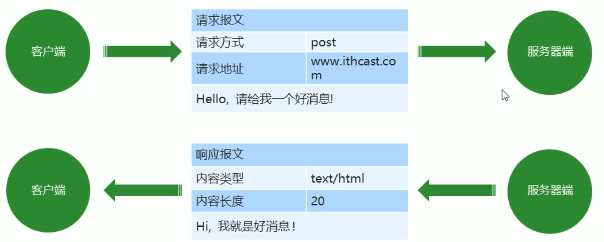

# URL-统一资源定位符

1. URL详细格式

   `Schema://host[:port]/path/…/[?query-string][#anchor]`

   > Shame：底层传输协议，如http、https、ftp
   >
   > host：服务器域名或IP
   >
   > port：服务器端口，采用默认端口时不显示。http默认端口是80或8080，https默认445
   >
   > path：访问资源的路径
   >
   > ?query-string：发送给服务器的数据
   >
   > anchor：锚点，以井号快开始，一般表示页面中的特定位置

## HTTP 协议

超文本传输协议（HyperText Transfer Protocol）HTTP，规定了如何从网站服务器传输超文本到本地浏览器，它基于C/S(客户端/服务器)架构工作，是客户端（用户）和服务器（网站）端请求和应答的标准

作用：用户在地址栏输入URL(统一资源定位符)通过HTTP协议向目标服务器发起请求，服务器再将请求的数据传回客户端(浏览器端)

> 超文本：不仅包括普通文本还包括视频、音频、图片等的html文件

HTTP协议请求前的域名解析流程：

> 域名 --> 本地hosts文件 --> 路由器的hosts文件 --> 域名解析服务器(DNS服务器) --> 目标网站
>
> 因为浏览器访问服务器首先需要将域名解析为IP地址，而hosts文件中记录的就是域名对应的ip地址，所以才会有这样的一个流程
>
> 以上的请求是在上一级中未找到的情况下才会去下一级找，如果上一级文件中有域名对应的IP，则不会往下寻找了

### 报文

在 HTTP 请求和响应过程中传递的数据块就叫报文，包括要传输的数据和一些附件信息，并且要遵守规定好的格式

#### 请求报文

1. 请求方式（Request Method）：
   + `GET`：请求数据
   + `POST`：发送数据
