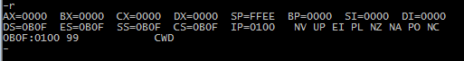
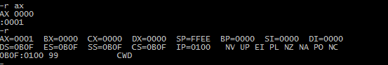
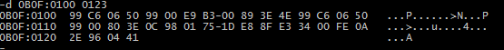
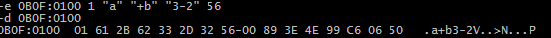
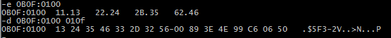
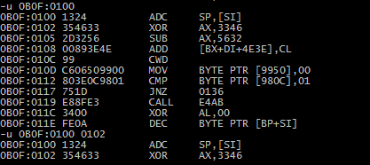
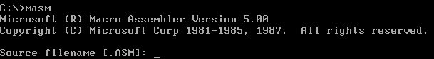
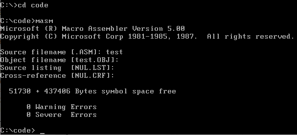

## 简介

Debug是DOS、Windows都提供的实模式(8086方式)程序的调试工具，使用Debug可以查看CPU中各种寄存器中的内容、内存的情况和在机器码级跟踪程序的运行。Win7 32位以后windows不再自带Debug

## 环境搭建

准备工具：

1. MS-DOS7.1.ISO或者msdos71f.zip(解压出来的有两个软盘文件，后缀为1的时系统镜像，后缀为2的时附加插件)
2. MASM5.0.zip(编译器和链接器)
3. vim71d16.zip和vim71rt.zip
4. csdpmi4b.zip
5. UltraISO

环境搭建：

1. vmware新建虚拟机，类型选择MS-DOS。编辑设置添加虚拟软驱，软盘文件选择msdos71f.zip解压出来的DOS71_1.IMG文件
2. 创建一个文件夹(英文)，将csdpmi4b.zip、masm5.0.zip、vim71d16.zip和vim71rt.zip解压到新建的文件夹
3. 使用UltraISO打开刚刚新建的文件夹，选择保存，会保存为一个ISO文件，名字自己设置(英文)
4. 开机安装后，关机，编辑设置，移除软盘，添加虚拟光驱，文件选择刚刚使用UltraISO创建的ISO文件，开机
5. 进入DOS后输入`A:`，跳转到挂载的ISO文件(如果不是就ABCD一个一个试)
6. 将A盘下的vim文件夹复制到`C:\DOS71\`。将masm5.0文件夹下的`masm.exe`和`link.exe`复制到`C:\dos71\`文件夹下，编译器和链接器就安装好了。这是dos下的主文件夹，默认是`DOS71`，在安装时可以自定义
7. 运行`C:\DOS71\vim\vim71\install.exe`，vim就安装好了
8. 删除掉`C:\DOS71\vim`下面的`_vimrc`文件，自己重新写一个vim配置文件，不然一直报错还无法编辑自动生成的这个配置文件

## 操作系统外壳

操作系统是由多个功能模块组成的庞大、复杂的软件系统。任何一个通用的操作系统，都要提供一个**Shell(壳)**程序，而用户就是使用shell来操作计算机系统进行工作的

而`DOS`中的**shell**叫做**command.com**，中文译为**命令解释器**

当`DOS`启动时，完成其他的初始化工作后就会运行`command.com`。然后执行其他相关任务，最后在屏幕上显示当前盘符和当前路径组成的提示符，等待用户输入

而用户输入的每一个命令都时执行了相应的程序，`command.com`会向根据用户的输入找到对应的可执行文件，将该可执行文件中的程序加载到内存中，设置`cs:ip`指向程序的入口。`command.com`暂停运行，将CPU的控制权交给程序。程序运行结束后，再将CPU控制权返回给`command.com`。`command.com`显示当前盘符和当前路径组成的提示符，等待用户输入

## Debug常用命令

| 命令 |                        作用                        |
| :--: | :------------------------------------------------: |
|  R   |            查看、改变CPU寄存器中的内容             |
|  D   |                  查看内存中的内容                  |
|  E   |                  修改内存中的内容                  |
|  U   | 将内存中的内容解释为机器指令和对应的汇编指令并显示 |
|  T   |          执行CS:IP指向的内存单元处的指令           |
|  A   |      以汇编指令的形式在内存中写入一条机器指令      |

## Debug使用方式

在DOS或Windows7 32位中打开的CMD中直接输入`debug`。如果显示为窗口模式，可以按Alt+Enter变为全屏

### R

直接输入后回车：查看当前各个寄存器中的值

输入r+空格+reg后回车：在显示的冒号后面输入值，用来对指定的寄存器进行修改

### D

查看指定地址处的内存单元中的内容：`d 段地址:偏移地址 [偏移地址]`

默认显示从指定地址处开始的128个内存单元中的内容，显示内容分为三份，左边是物理地址，中间是内存单元中的内容以十六进制表示，每一行显示16个内存单元。右边是每个内存单元中的数据对应的可显示的ASCII码字符。当继续使用d命令将继续输出后面地址中的内容

还可以指定显示到哪一个地址结束，可以超过128

### E

改写内存中的机器码：`e 起始地址 数据 数据 数据 ... ...`，如果数据是ASCII码字符必须用引号包起来，不使用引号的则被当成十六进制的机器码写入到对应的内存单元中

每改写完一个内存单元中的数据，按空格键自动进入下一个内存单元的改写。当所有改写完成后按Enter键结束E命令。交互式改写只能输入十六进制的机器码，不能使用ASCII码字符

### U

查看指定物理地址的内存单元中的机器码的含义：`u 段地址:偏移地址 [偏移地址]`

可以指定显示的起始地址和结束地址之间的所有内存单元中的机器码的含义，默认只显示16个内存单元中的机器码的含义。显示内容为三部分，左边是物理地址，中间是机器码(机器指令)，右边是对应的汇编指令。如下：`0B0F:0100`处的机器指令是`1324`对应的汇编指令为`ADC SP,[SI]`

### T

执行当前`CS:IP`指向的内存单元中的机器码

**Tips:**一般情况下，T命令执行一条指令后，会停止继续执行，显示当前CPU中各个寄存器状态和下一步要执行的指令，但是当T命令执行修改寄存器SS的指令时，下一条指令也紧接着执行了。

### A

以汇编语言向指定的物理地址的内存单元写入指令：`a 段地址:偏移地址`

没写完一条指令，回车会自动给出连续的下一个地址。直接在给出的地址后回车表示操作结束

## 编译器

要向汇编代码得到执行需要将源代码文件变成可执行文件，首先就需要先使用编译器将源码文件，编译为目标文件。使用微软masm5.0汇编编译器

1. 使用此命令会先显示版本信息，然后提示输入要进行编译的源文件
   > Tips：如果在当前路径下可以直接输入文件名，如果在其他路径下，需要输入路径，支持绝对路径和相对路径。如果文件后缀为asm可以省略，如果为其他后缀则必须输入输入后缀

2. 回车后会提示输入生成的obj文件的文件名，回车为使用默认原文件名，生成的位置在当前目录，也可以指定路径
3. 然后会要求输入列表文件的名称，这是编译器将源程序编译为目标文件的过程中产生的中间结果，不输入文件名，则默认跳过不生成列表文件

4. 忽略列表文件后会提示输入交叉引用文件的名称，这也是编译过程中产生的中间结果，不输入文件名，则默认跳过不生成交叉引用文件

5. 然后编译器对源文件进行编译，如果报错或警告会打印报错信息，若没有，则编译成功，在指定目录生成以obj为后缀的目标文件

   

6. 直接输入`masm filename;`可以直接编译指定路径文件名的`.asm`结尾的源文件，并自动忽略中间文件的生成

## 连接器

将源文件生成目标文件后，需要对目标文件进行连接才能得到可执行文件。使用的Linker3.6连接器(大部分规则参考编译器)

1. 连接器命令为`link`，运行后先显示版本信息，然后提示输入需要连接的文件。
2. 提示输入生成的可执行文件名
3. 提示输入映像文件名，这是连接程序将目标文件连接为可执行文件过程中产生的中间结果
4. 提示输入库文件名，库文件是包含了一些可以调用的子程序，如果程序中调用了某个库文件中的子程序，在生成可执行文件时就需要将这个库文件和目标文件连接到一起，否则直接跳过
5. 如果报错则不会生成可执行文件，但只是警告则会生成
6. 直接输入`link filename;`可以直接连接指定路径文件名的`.obj`结尾的目标文件，并自动忽略中间文件的生成

## 汇编程序从写出到执行的流程

