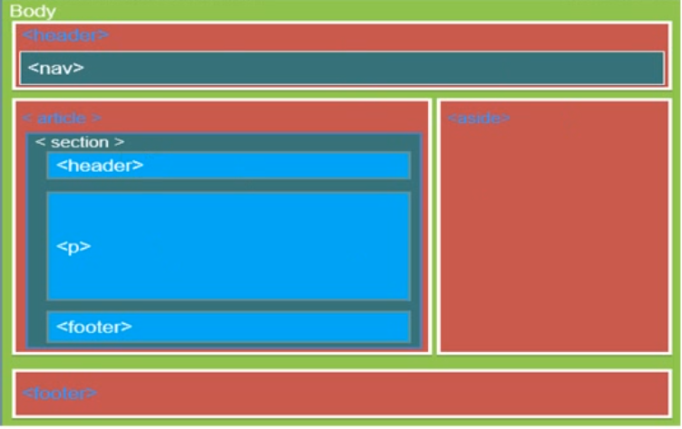

# HTML 基础

## 简介

HTML 超文本标记语言

HTML5 特点：

1. 语法更简单

   ```html
   <!-- 头部声明 -->
   <!DOCTYPE HTML>

   <!-- 简化了字符集声明 -->
   <meta charset="utf-8">
   ```

2. 语法更宽松

   ```html
   <!-- 可以省略某些标签的结束符 -->
   <li> <dt> <dd> <p> <optgroup> <option> <tr> <td> <th>

   <!-- 可以完全省略某些标签 -->
   <html> <head> <body>
   ```

3. 标签语义化

   ```html
   <!-- header：定义一个页面或一个区域的头部 -->
   <header></header>

   <!-- nav：定义导航链接 -->
   <nav></nav>

   <!-- article：定义一篇文章的内容 -->
   <article></article>

   <!-- section：定义网页中的一块区域 -->
   <section></section>

   <!-- aside：定义页面内容的侧边栏 -->
   <aside></aside>

   <!-- footer：定义一个页面或一个区域的底部 -->
   <footer></footer>
   ```

   

4. 表单增添常用属性

   ```html
   <!-- placeholder：文本框和密码框提示内容属性 -->
   <input type="text" placeholder="请输入账号">

   <!-- required：限制输入框不能为空（设置必填）。值也为 required -->
   <input type="password" placeholder="请输入密码" required="required">

   <!-- autofocus：自动获取焦点，自动将光标点进输入框 -->
   <textarea autofocus="autofocus"></textarea>
   ```

5. input 新增 type 属性的值

   ```html
   <input type="email"> <!-- 限制输入内容为邮箱 -->
   <input type="date"> <!-- 日期控件 -->
   <input type="week"> <!-- 周数控件 -->
   <input type="month"> <!-- 月份控件 -->
   <input type="time"> <!-- 时间控件 -->
   <input type="color"> <!-- 颜色控件 -->
   <input type="range"> <!-- 滑块控件 -->
   <input type="number"> <!-- 限制输入的内容为数字 -->
   ```

## 分类

1. 双标签：成对出现的标签叫双标签，内容写在标签中间
2. 单标签：单个的标签叫单标签，没有内容只有属性

## 基本结构

```html
<!-- 第一句是用于声明文档遵循的规范，告知浏览器通过此规范来解析页面中的代码 -->
<!doctype html>
<html>
    <head>
        <meta charset="utf-8">
        <title>页面的标题</title>
    </head>
    <body>
        正文内容
    </body>
</html>
```

html 由标签对组成，`<html></htnl>`为根标签，`<head></head>`和`<body></body>`为最主要的两个部分

## 文档类型声明

```html
<!-- HTML5 的 DOCTYPR 声明 -->
<!DOCTYPE HTML>

<!-- XHTML 1.0 的严格型 DOCTYPE 声明：Strict -->
<!DOCTYPE html PUBLIC "-//W3C//DTD XHTML 1.0 Strict//EN" "http://www.w3.org/TR/xhtml1/DTD/xhtml1-strict.dtd">
<!-- 该 DTD 包含所有 HTML 元素和属性，但不包括展示性和弃用的元素（如：font）。不允许框架集（Frameset） -->

<!-- XHTML 1.0 的过渡型 DOCTYPE 声明：Transitional -->
<!DOCTYPE html PUBLIC "-//W3C//DTD XHTML 1.0 Transitional//EN"
"http://www.w3.org/TR/xhtml1/DTD/xhtml1-transitional.dtd">
<!-- 使用最多的就是 HTML5 声明和过渡型声明 -->


<!-- XHTML 1.0 的框架集型 DOCTYPE 声明：Frameset -->
<!DOCTYPE html PUBLIC "-//W3C//DTD XHTML 1.0 Frameset//EN"
"http://www.w3.org/TR/xhtml1/DTD/xhtml1-frameset.dtd">

<!-- XHTML 1.0 的手机浏览器 DOCTYPE 声明：Mobile -->
<!DOCTYPE html PUBLIC "-//WAPFORUM//DTD XHTML Mobile 1.0//EN"
"http://www.wapforum.org/DTD/xhtml-mobile10.dtd">
```

XHTML 是满足 W3C 标准的 HTML

## 注释

```html
<!--注释-->
```

## 元素(element)

元素 = 起始标记(begin tag) + 结束标记(end tag) + 元素内容 + 元素属性(非必须)

> 官方叫法：元素
>
> 其他叫法：标签、标记

某些元素没有结束标记，这样的元素叫做：**空元素**

空元素的两种写法：

```html
<meta charset="UTF-8">      # 新版HTML5支持
<meta charset=UTF-8 />     # 老版HTML
```

## 属性

* 每个标签都有自己的属性，单标签和双标签都有属性
* 一个标签可以有多个属性
* 每个属性有对应的值，值要用引号引起来（单引号和双引号都可以）
* 属性之间用空格隔开
* 属性没有顺序

属性的分类：

* 局部属性：某些元素特有的属性
* 全局属性：所有元素通用
* 自定义属性：为了保存并使用数据，而有些数据可以保存到页面中不用保存到数据库中，H5 规定以`data-`开头作为属性名并赋值

### 通用属性（全局属性）

1. `id`：是标签的唯一标识，一个页面可以有多个 id 属性，单每个标签的 id 属性的值必须是唯一的，通常用作 JS 写动态效果
2. `class`：通常结合 JS 给标签设置样式，样式一样的标签可以设置同样的 class。一个标签也可以有多个 class 的值，用空格隔开，一个引号将所有 class 值包裹
3. `name`：用来设置标签的名字，一个页面中的可以有多个同样名字的标签，做表单时 name 用于后端接收
4. `style`：用于标签设置样式，用于个每个标签单独设置样式

## 元素的嵌套

元素不能相互嵌套

父元素、子元素、祖先元素、后代元素、兄弟元素(拥有同一个父元素的两个元素)

## 标准的文档结构

HTML：页面、HTML文档

```html
<!DOCTYPE html>
# 文档声明，告诉浏览器当前文档使用的HTML标准是HTML5.不写文档声明将导致浏览器进入怪异渲染模式
```

## 颜色

1. 单词：`color:red;`
2. rgb：`color:rgb(255,0,0);` 在颜色魔方中的坐标
3. 十六进制：`color:#FF0000;` 将 rgb 坐标转换为十六进制前面加井号

## 标签的显示模式

在CSS中使用模式转换属性可以改变标签的显示模式

### 块元素

宽度默认是100%，高度默认是0，可以设置宽度和高度，会继承父级宽度，换行显示。如：div、ul、li、p、h1

### 行元素

宽高默认都是0，不能设置宽和高，不换行显示。如：span、b、i、u、a

### 行内块元素

只能设置宽高，但不会换行显示。如：img、input
