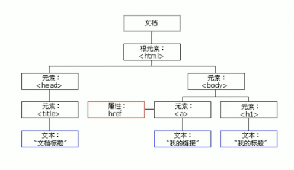
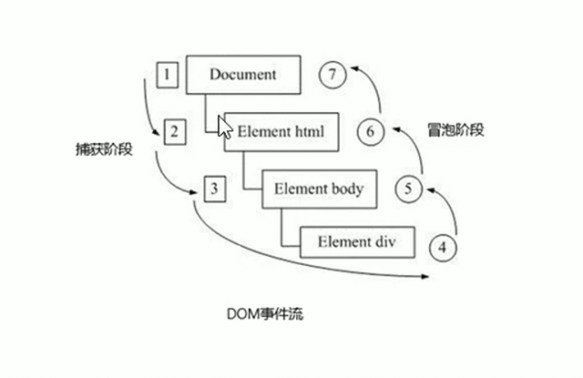
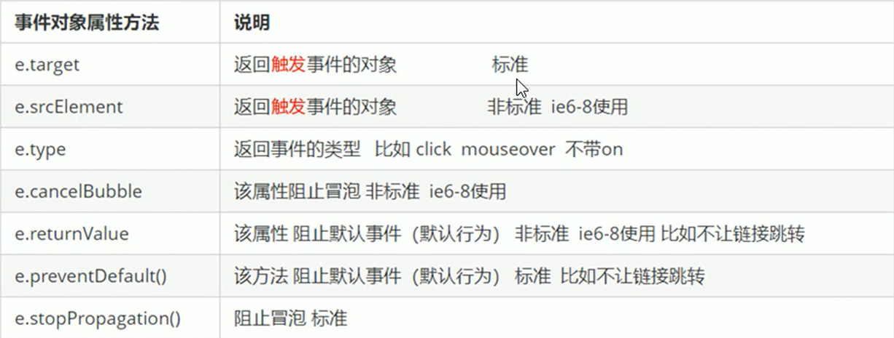
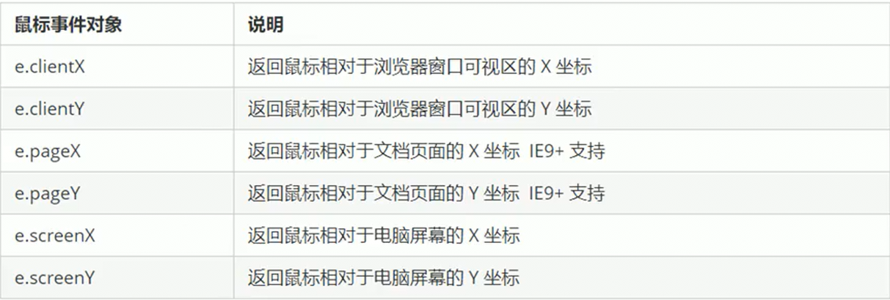

# DOM

## 文档对象模型

文档对象模型（Document Object Model）简称`DOM`，是**W3C组织**推荐的处理可扩展标记语言（HTML和XML）的标准编程接口。通过`DOM`提供的接口可以对页面上的各种元素进行操作做（大小、位置、颜色等）

DOM树：



文档：一个页面就是一个文档，DOM 中用`document`表示

元素：页面中的所有标签都是元素，DOM 中用`element`表示

节点：网页中所有内容都是节点（标签、属性、文本、注释等），DOM 中用`node`表示

**Tips：DOM 把以上内容都看做对象**。

## DOM 重点核心

关于 DOM 操作，主要针对元素的操作，主要是创建、增、删、改、查、属性操作、事件操作等

### 改

主要修改 DOM 的元素属性，DOM 元素的内容、属性、表单的值等

1. 修改元素属性：`src、href、title等`
2. 修改普通元素内容：`innerHTML、innerText`
3. 修改表单元素：`value、type、disabled等`
4. 修改元素样式 ：`style、className`

### 查

主要获取查询 DOM 的元素

1. DOM 提供的 API 方法：`getElementById、getElementsByTagName`不推荐使用（古老）
2. H5 提供的新方法：`querySelector、querySelectorAll`推荐
3. 利用节点操作获取元素：`parentNode(父)、children(子)、preiousElementSibling 和 nexElementSiling(兄)`推荐

### 属性操作

`classList`属性是 HTML5 新增的一个属性,用于返回元素的类名,但只有 IE10 以上才支持(所以常用于移动端),通过该属性可以在元素中获取、添加、移除、切换`CSS`类

- `element.classList[index];`：用于访问元素的类名，classList返回的是一个由该元素所有类名组成的伪数组，通过 index 访问指定的类名
- `element.classList.add('className');`：用于添加类名（追加的方式），同时不会覆盖原有类名
- `element.classList.remove('className');`：用于删除元素的指定类名
- `element.classList.toggle('className');`：用于切换元素的指定类名，如果元素存在指定的类名则删除该类名，如果元素不存在指定的类名则添加该类名

以下主要针对自定义属性

1. `setAttribute`：设置 DOM 的属性值
2. `getAttribute`：得到 DOM 的属性值
3. `removeAttribute`：移除属性

### 事件操作

给元素注册事件，采取`eventSource.eventType = eventHandler`

## 获取元素

- 根据`ID`获取
- 根据标签名获取
- 通过`HTML5`新增的方法获取
- 特殊元素获取

### 通过 ID 获取

语法：`getElementById(id)`参数`id`是大小写敏感的字符串，最终返回的是一个元素对象`Element Object`

```html
<!DOCTYPE html>
<html lang="en">
<head>
    <meta charset="UTF-8">
    <meta name="viewport" content="width=device-width, initial-scale=1.0">
    <title>Document</title>
</head>
<body>
    <div id="timer">2019-01-01</div>
    <!-- 页面从上往下加载，所以Script标签要在要操作元素的下方 -->
    <script>

        var timeEle = document.getElementById('timer');
        console.log(timeEle); // <div id="timer">2019-01-01</div>
        console.log(typeof timeEle);  // Object
        console.dir(timer); // 打印返回的元素对象，更方便查看里面的属性和方法
    </script>
</body>
</html>
```

### 通过标签名获取

语法：`getElementsByTagName()`返回带有指定标签名的对象的集合

```html
<!DOCTYPE html>
<html lang="en">
<head>
    <meta charset="UTF-8">
    <meta name="viewport" content="width=device-width, initial-scale=1.0">
    <title>Document</title>
</head>
<body>
    <ul>
        <li>知否知否，应是绿肥红瘦</li>
        <li>知否知否，应是绿肥红瘦</li>
        <li>知否知否，应是绿肥红瘦</li>
        <li>知否知否，应是绿肥红瘦</li>
        <li>知否知否，应是绿肥红瘦</li>
    </ul>
    <ul id="nav">
        <li>生僻字</li>
        <li>生僻字</li>
        <li>生僻字</li>
        <li>生僻字</li>
        <li>生僻字</li>
    </ul>
    <script>
        // 返回是获取的元素对象的集合，以伪数组的形式存储
        var lis = document.getElementsByTagName('li');
        console.dir(lis);
        // 遍历打印：因为得到的是一个对象的集合，所以要操作里面的元素就需要遍历，且得到的元素对象是动态的
        for(var i = 0; i < lis.length; i++){
            console.log(lis[i]);
        }
        // 通过元素获取指定元素内的子标签 element.getElementsByTagName()
        var nav = document.getElementById('nav');
        var navLis = nav.getElementsByTagName('li');
        console.log(navLis);
    </script>
</body>
</html>
```

### HTML5 中新增的方法

通过类名获取：`getElementByClassName(className)`

根据指定选择器返回第一个元素对象：`querySelector(selector)`

根据指定选择器返回所有元素对象：`querySelectorAll(selector)`

```html
<!DOCTYPE html>
<html lang="en">
<head>
    <meta charset="UTF-8">
    <meta name="viewport" content="width=device-width, initial-scale=1.0">
    <title>Document</title>
</head>
<body>
    <div class="box">盒子1</div>
    <div class="box">盒子2</div>
    <div id="nav">
        <ul>
            <li>首页</li>
            <li>产品</li>
        </ul>
    </div>
    <script>
        // 使用类名获取元素，返回是该类名的元素的集合
        var boxs = document.getElementsByClassName('box');
        console.log(boxs);
        // 使用 querySeletor 返回指定选择器的第一个元素，选择器必须加符号
        // 获取第一个 box 类名的元素
        var firstBox = document.querySelector('.box');
        console.log(firstBox);
        // 获取第一个 nav ID名的元素
        var nav = document.querySelector('#nav');
        console.log(nav);
        // 获取第一个 li 标签的元素
        var li = document.querySelector('li');
        console.log(li);
        // 使用 querySelectorAll 获取指定选择器所有元素
        var allBox = document.querySelectorAll('.box');
        console.log(allBox);
    </script>
</body>
</html>
```

### 特殊元素获取

`body`元素：`document.body`返回`body`标签

`html`元素：`document.documentElement`返回`html`标签

## 事件

`JavaScript`使我们能创建动态页面，而事件是可以被`JavaScript`侦测到的行为，整个事件就是**触发–响应机制**

网页中每个元素都可以产生某些可以触发`JavaScript`的事件

事件由三部分组成（事件三要素）：

- 事件源：事件被触发的对象
- 事件类型：如何触发，如：鼠标点击`onclick`、鼠标经过、键盘按下
- 事件处理程序：当触发对象发生触发动作时做什么，一般通过函数赋值的方式完成

执行事件步骤：

1. 获取事件源
2. 注册事件（绑定事件）
3. 添加事件处理程序（采用函数赋值的形式）

```html
<!DOCTYPE html>
<html lang="en">
<head>
    <meta charset="UTF-8">
    <meta name="viewport" content="width=device-width, initial-scale=1.0">
    <title>Document</title>
</head>
<body>
    <input type="button" value="点我一下">
    <script>
        // 获取事件源
        var but = document.querySelector('input');
        // 注册事件（绑定事件）
        // but.onclick
        // 添加事件处理程序
        but.onclick = function(){
            alert('干嘛点我');
        }
    </script>
</body>
</html>
```

### 事件类型

#### 常见鼠标事件

|   鼠标事件   |   触发条件   |
| :----------: | :----------: |
|   onclick    | 鼠标点击左键 |
| onmouseover  |   鼠标经过   |
|  onmouseout  |   鼠标离开   |
|   onfocus    | 获取鼠标焦点 |
|    onblur    | 失去鼠标焦点 |
| onmousemove  |   鼠标移动   |
|  onmouseup   |   鼠标弹起   |
| onmousedown  |   鼠标按下   |
| onmouseenter | 鼠标经过元素 |
| onmouseleave |   鼠标离开   |

**Tips：**

- `mousemove`和`mouseenter`类似，但`mouseover`在鼠标经过自身会触发，经过子元素也会触发（事件冒泡），`mouseenter`只有鼠标经过自身才会触发，经过子元素不触发（禁止事件冒泡）

- 使用`mouseleave`配合`mouseenter`（也不存在事件冒泡）

- 在移动端`click`事件会有 300ms 的延时，因为移动端屏幕双击会缩放(double tap to zoom)页面。解决方法如下：

  1. 禁用缩放：`<meta name="viewport" content="user-scalable=no">`

  2. 利用触摸事件封装这个事件解决延迟问题：

     - 当手指触摸屏幕，记录当前触摸的时间
     - 当手指离开 屏幕，用离开的时间减去触摸的时间
     - 如果时间小于 150ms，且没有滑动屏幕，就定义为点击

     ```js
     // 封装 tap，解决 click 300ms 延迟问题
     function tap(obj,callback){
         var isMove = false;
         var startTime = 0; // 记录触摸时的时间的变量
         obj.addEventListener('touchstart',function(e){
             startTime = Date.now();//记录触摸时间
         });
         obj.addEventListener('touchmove',function(e){
             isMove = true; // 监听是否存在滑动，存在则不算点击
         });
         obj.addEventListener('touchend',function(e){
             // 触摸间隔时间小于150ms且不存在滑动则算点击，执行 回调函数
             if(!isMove && (Date.now() - startTime) < 150){
                 callback && callback();  // 如果存在回调函数就执行回调函数
             }
             isMove = false;  // 重置
             startTime = 0;
         });
     }
     // 调用
     tap(div,function(){ codeBody });
     ```

  3. 使用插件：[fastclick插件](https://github.com/ftlabs/fastclick "用于解决移动端点击延迟问题的插件")解决 300ms 延迟

#### 常见键盘事件

|  键盘事件  |                                        触发条件                                         |
| :--------: | :-------------------------------------------------------------------------------------: |
|  onkeyup   |                                 某个键盘按键松开时触发                                  |
| onkeydown  |        某个键盘按键被按下时触发，当按住不松开会一直触发 ，执行优先级比keypress高        |
| onkeypress | 某个键盘按键被按下时触发，但它不识别功能键(ctrl、shift、箭头等)，当按住不松开会一直触发 |

#### 常见触摸事件

移动端独有的触摸事件,安卓和 IOS 都有

|  触摸事件  |        触发条件        |
| :--------: | :--------------------: |
| touchstart |   手指触摸元素时触发   |
| touchmove  | 手指在元素上移动时触发 |
|  touchend  |   手指离开元素时触发   |

#### 其他常见事件

|    事件     |                    触发条件                    |
| :---------: | :--------------------------------------------: |
| contextment | 显示右键菜单（配合阻止事件，可以禁用右键菜单） |
| selectstart |     鼠标选中（配合阻止事件，可以禁止选中）     |

## 事件高级

### 注册事件

注册事件：给元素添加事件被称为**注册事件**或者**绑定事件**

注册事件有两种方式：**传统方式和方法监听注册方式**

传统注册方式：

- 利用 on 开头的事件
- `<button onclick="alert('hi')"></button>`
- `btn.onclick = function(){}`
- 特点：注册事件的 唯一性，同一个元素同一个事件只能设置一个处理函数，最后注册的处理函数会覆盖前面注册的处理函数

方法监听注册方式：

- W3C 标准，IE9之前使用的`eventTarget.attachEvent()`代替
- 使用`eventTarget.addEventListener(type, listener[, useCapture])`
- 特点：同一元素同一事件可以注册多个监听器，按照注册顺序依次执行

`eventTarget.addEventListener(type, listener[, useCapture])`会将指定的监听器注册到`eventTarget`(目标对象)上，当该对象触发指定的事件时，就好执行事件处理函数

该方法接受三个参数：

1. type：事件类型字符串，比如`click、mouseover`**用引号包裹，但不带 on**

2. listener：事件处理函数，事件发生时会调用该监听函数

   ```js
   var btn = document.querySelector('button');
   // 同一个元素同一个事件可以添加多个侦听器，根据先后顺序依次执行
   btn.addEventListener('click',function(){
       alert('1');
   })
   btn.addEventListener('click',function(){
       alert('2');
   })
   ```

3. useCapture：可选参数是一个布尔值，默认`false`，用于决定 DOM 事件流是在捕获阶段执行（true）还是在冒泡阶段执行（false）

注册事件兼容性解决方案：

```js
function addEventListener(element,eventName,fn){
    if(element.addEventListener){
        element.addEventListener(eventName,fn);
    }else if(element.attachEvent){
        element.attachEvent('on'+eventName,fn);
    }else{
        // 相当于 element.onclick = fn;
        element['on'+eventName] = fn;
    }
}
```

### 删除事件

删除事件：将元素绑定的事件解绑(移除)被称为**删除事件**或**解绑事件**

传统方式：

- 将指定元素绑定的事件指向一个为空的事件处理程序
- `eventTarget.onclick = null;`

方法监听注册方式：

- 使用`eventTarget.removeEventListener(type, listener[, useCapture])`

- IE9 之前的使用`eventTarget.detachEvent()`

  ```js
  var btn = document.querySelector('button');
  // 注册事件
  btn.addEventListener('click',fn);
  // 因为移除事件中传入的函数不能是匿名函数，所以将函数单独定义后传参
  function fn(){
    alert('1');
    // 移除事件
    btn.removeEventListener('click',fn);
  }
  ```

### DOM 事件流

事件流是指从页面中接收事件的顺序，事件发生时会在元素节点之间按照特点顺序传播，这个**传播过程**即**DOM 事件流**



DOM 事件流分为 3 个阶段：

1. 捕获阶段：当事件被加载到 DOM 中时，首先由`Document`捕获到该事件，因为`Document`未绑定此事件，则转交下一层，由`Element html`捕获到该事件，如此一层层传递直到`div`捕获到该事件，`div`绑定了此事件，进入目标阶段，执行绑定的事件处理程序，不再向下传递
2. 当前目标阶段：执行该元素绑定事件的事件处理程序
3. 冒泡阶段：当执行完成后，事件向上传递，因上层元素为绑定此事件，将依次传递至最外层`Document`，`Document`也为绑定此事件，事件流执行完毕

**Tips:**

- 事件冒泡：IE最早提出，事件开始时由最具体的元素接收，然后逐级向上传播到 DOM 最顶层节点的过程
- 事件捕获：网景最早提出，由 DOM 最顶层节点开始，然后逐级向下传播到最具体的元素接收的过程
- JS 代码中只能执行捕获或者冒泡其中一个阶段
- `onclick`和`attachEvent`只能得到冒泡阶段
- 有些事件是没有冒泡的，比如`onblur、onfocus、onmoueenter、onmouseleave`

```html
<!DOCTYPE html>
<html lang="en">
  <head>
    <meta charset="UTF-8" />
    <meta name="viewport" content="width=device-width, initial-scale=1.0" />
    <style>
      .father{
        width: 400px;
        height: 300px;
        margin: 100px auto;
        padding-top: 100px;
        background-color: pink;
      }
      .son{
        width: 200px;
        height: 200px;
        background-color: skyblue;
        margin:0 auto;
        text-align: center;
        line-height: 200px;
      }
    </style>
    <title>Document</title>
  </head>
  <body>
    <div class="father">
      <div class="son">son</div>
    </div>
    <script>
      var father = document.querySelector('.father');
      var son = document.querySelector('.son');
      son.addEventListener('click',function(){
        alert('son');
      })
      // 设置在捕获阶段执行，当点击 son 后会先弹出 father，再弹出 son
      // 如果设置为 false，则在冒泡阶段执行，点击 son 后先弹出 son，再弹出 father
      father.addEventListener('click',function(){
        alert('father');
      },true)
    </script>
  </body>
</html>
```

### 事件对象

事件对象写到侦听函数中，当作形参来看`div.onclick = function(event){};`

事件对象只有有了事件后才会存在，它是系统自动创建的，不需要手动传递参数

事件对象是我们事件的一系列相关数据的集合，跟事件相关，如：鼠标点击包含鼠标相关信息，如鼠标坐标。键盘事件包含键盘事件的信息，如判断用户按下哪个键

事件对象可以自定义命名，常用`event`、`evt`、`e`

事件对象也存在兼容性问题，IE678通过`window.event`兼容性写法`e = e || window.event`（添加到事件处理函数中）

**事件对象常见属性和方法**：



**Tips:**

- target 是指向触发事件对象， this 是指向绑定事件对象

  ```js
  var ul = document.querySelector('ul');
  ul.addEventListener('click',function(e){
      // 当点击 ul 中的 li 时，this 打印 ul 而 target 打印 li
      console.log(this);
      console.log(e.currentTarget); // 返回绑定对象，兼容性问题
      console.log(e.target);
  })
  ```

- 阻止默认行为，`return false;`没有兼容性问题

  ```js
  var a = document.querySelector('a');
  // 低版本浏览器（IE678）不支持事件监听注册，只能使用传统注册
  a.onclick = function(e){
      // 普通浏览器阻止默认行为，这是一个方法
      e.preventDefault();
      // 低版本浏览器阻止默认行为，这是一个属性
      e.returnValue;
      // 通用型阻止默认行为，但会导致return后的代码不执行，且仅限于传统注册方式
      return false;
  }
  ```

- 阻止冒泡传播

  ```js
  var father = document.querySelector('.father');
  var son = document.querySelector('.son');
  son.addEventListener('click',function(e){
    alert('son');
      // 取消冒泡，在此元素后不再进行冒泡传播
      // 标准方法，存在兼容问题
      // e.stopPropagation();
      // 非标准，但不存在兼容问题
      e.cancelBubble = true;
  })
  father.addEventListener('click',function(){
    alert('father');
  })
  ```

### 常用鼠标事件对象



### 常用键盘事件对象

| 键盘事件对象、属性 |          说明           |
| :----------------: | :---------------------: |
|     e.keyCode      | 返回按下的键的 ASCII 值 |

**Tips：**

- onkeydown 和 onkeyup 返回的 keyCode 不区分大小写，onkeypress 返回的 keyCode 区分大小写

```js
// 当按下 s 键，搜索框获取焦点
var search = document.querySelector('input');
// 全局生效所以对 document 绑定事件，keydown 按下后会一直触发 ，所以使用keyup
document.addEventListener('keyup',function(){
    // s 的 ASCII 为 83（不区分大小写）
    if(e.keyCode == 83){
        // focus()方法用于获取焦点
        search.focus();
    }
})
```

### 常见触摸事件对象(TouchEvent)

TouchEvent 是一类描述手指在触摸平面(触摸屏、触摸板等)的状态变化的事件,这类事件用于描述一个或多个触点(每根手指和触摸平面接触的点为一个触点),使开发者可以检测触点的移动、增加和减少等。

`touchstart、touchmove、touchend`三个事件都会有各自的事件对象

重点的三个常见对象列表：

|    触摸列表    |                     说明                     |
| :------------: | :------------------------------------------: |
|    touches     |         正在触摸屏幕的所有手指的列表         |
| targetTouches  |       正在触摸当前元素的所有手指的列表       |
| changedTouches | 手指状态发生改变的列表（从无到有或从有到无） |

**Tips:**

- `touchend`事件没有`touches`和`targetTouches`列表

### 窗口加载事件

`DOMConteentLoaded`当 DOM 加载完毕（不包括样式表、图片、flash等）才会触发事件，加载速度比 `window.onload`快，适合在页面有大量资源时使用，不用等待过长时间

### 事件委托

事件委托也称为事件代理，在 jQurey 中称为事件委派

原理：不用给每个子节点单独设置事件监听器，而是将事件监听器设置在其父节点上，然后利用冒泡原理影响设置每个子节点

作用：只操作一次 DOM，提高程序运行效率

```html
<body>
    <ul>
        <li>知否知否</li>
        <li>知否知否</li>
        <li>知否知否</li>
        <li>知否知否</li>
        <li>知否知否</li>
    </ul>
</body>
<script>
  var ul = document.querySelector('ul');
    ul.addEventListener('click',function(e){
        // 利用事件委托，当点击 ul 中的 li 元素时，获取到当前点击的 li（事件触发的对象），将当前点击的 li 背景颜色改为粉色
        e.target.style.backgroundColor = 'pink';
    })
</script>
```

## 操作元素

`JavaScript`的`DOM`操作可以改变网页内容、结构和样式，利用`DOM`操作元素来改变元素里面的内容属性

### 改变元素内容

`element.innerText`：从起始位到终止位的内容，但不包括标签，同时空格和换行也会去掉

`element.innerHTML`：从起始位到终止位的内容，包括标签，同时保留空格和换行

区别：

- `innerText`是非正式的，firefox不支持，无论读取还是插入都不会识别`HTML`标签、空格和换行
- `innerHTML`是W3C组织推荐的，无论读取还是插入都能识别`HTML`标签、空格和换行

`document.write`：直接将内容写入到页面的内容流，但当文档流执行完毕，会导致页面全部重绘**不推荐使用**

```html
<!DOCTYPE html>
<html lang="en">
<head>
    <meta charset="UTF-8">
    <meta name="viewport" content="width=device-width, initial-scale=1.0">
    <style>
        button{
            margin-left: 50px;
        }
        div,p{
            background: #be6060;
            height: 30px;
            width: 200px;
            text-align: center;
            line-height: 30px;
        }
    </style>
    <title>Document</title>
</head>
<body>
    <button>显示当前时间</button>
    <div>现在时</div>
    <p>123</p>
    <script>
        // 获取事件源
        var btn = document.querySelector('button');
        var box = document.querySelector('div');
        // 注册事件并添加处理程序
        btn.onclick = function(){
            box.innerHTML = getData();
        }
        // 获取当前时间
        function getData(){
            var nowDate = new Date();
            var year = nowDate.getFullYear();
            var month = nowDate.getMonth() + 1;
            var dates = nowDate.getDate();
            var day = nowDate.getDay();
            var dateArr = ['星期天','星期一','星期二','星期三','星期四','星期五','星期六'];
            return '今天是：'+year+'年'+month+'月'+dates+'日'+dateArr[day];
        }
        // 不添加事件直接操作页面元素
        var p = document.querySelector('p');
        p.innerHTML = getData();
    </script>
</body>
</html>
```

### 改变元素属性

```html
<!DOCTYPE html>
<html lang="en">
  <head>
    <meta charset="UTF-8" />
    <meta name="viewport" content="width=device-width, initial-scale=1.0" />
    <style>
      img {
        width: 300px;
      }
    </style>
    <title>Document</title>
  </head>
  <body>
    
    <div id="text">上午好呀！</div>
    <script>
      var img = document.querySelector("img");
      var text = document.getElementById("text");
      var dateNow = new Date();
      var hours = dateNow.getHours();
      if (hours < 12) {
          // 改变元素的属性值
          img.src = 'img/s.png';
          img.title = '上午好';
          img.alt = '上午';
          // 改变元素中的内容
          text.innerHTML = '上午好呀！';
      }else if(hours < 18){
          img.src = 'img/x.png';
          img.title = '下午好';
          img.alt = '下午';
          text.innerHTML = '下午好呀！';
      }else{
          img.src = 'img/w.png';
          img.title = '晚上好';
          img.alt = '晚上';
          text.innerHTML = '晚上好呀！';
      }
    </script>
  </body>
</html>

```

### 表单元素

常见表单元素属性：`type、value、checked、selected、disabled`

```html
<!DOCTYPE html>
<html lang="en">
  <head>
    <meta charset="UTF-8" />
    <meta name="viewport" content="width=device-width, initial-scale=1.0" />
    <title>Document</title>
  </head>
  <body>
    <button>按钮</button>
    <input type="text" value="我没被点击" />
    <script>
      // 获取事件源（元素）
      var btn = document.querySelector("button");
      var input = document.querySelector("input");
      // 绑定事件，添加处理程序
      btn.onclick = function () {
        // 更改表单中的属性
        input.value = "我被点击了";
        // this 指向的是事件函数的调用者（即当前绑定事件的元素）
        // 点击后禁用按钮
        this.disabled = true;
      };
    </script>
  </body>
</html>
```

## 操作自定义属性

使用`element.getAttribute('attributeName')`获取自定义属性

使用`element.setAttribute('attributeName','attributeValue')`添加或设置自定义属性

使用`element.dataset.attributeName`来获取以`data-`开头的自定义属性

```html
<!DOCTYPE html>
<html lang="en">
<head>
  <meta charset="UTF-8">
  <meta name="viewport" content="width=device-width, initial-scale=1.0">
  <title>Document</title>
</head>
<body>
  <div id="demo" index="1" data-list-name="leon"></div>
  <script>
    // 使用 .attributeName 获取元素的内置属性
    var div = document.querySelector('div');
    console.log(div.id);
    // 使用 element.getAttribute('attributeName') 获取自定义属性或内置属性
    console.log(div.getAttribute('index'));
    console.log(div.getAttribute('id'));

    // 使用 element.setAttribute()设置或添加自定义属性的值或内置属性的值
    div.setAttribute('data-time','20');
    div.setAttribute('index','2');
    div.setAttribute('id','test');

    // 使用 element.removeAttribute()移除属性
    div.removeAttribute('index');

    // H5 新增的获取 data- 开头的自定义属性的方法 IE11 才支持
    // dataset 时一个集合，里面存放了所有以 data- 开头的自定义属性
    console.log(div.dataset.time);
    console.log(div.dataset['time']);
    // 如果自定义属性由多个 - 连接进行命名，则获取时需要使用驼峰命名法获取
    console.log(div.dataset.listName);
    console.log(div.dataset['listName']);
  </script>
</body>
</html>
```

## 节点操作

节点至少拥有`nodeType`(节点类型)、`nodeName`(节点名称)、`nodeValue`(节点值)这三个基本属性

- 元素节点 nodeType 为 1
- 属性节点 nodeType 为 2
- 文本节点 nodeType 为 3（文本节点 包含文字、空格、换行等）

实际开发中，节点操作主要是操作**元素节点**

### 利用节点关系获取元素

利用父子兄节点关系获取元素，逻辑性更强，但兼容性稍差

- 父级节点：`node.parentNode`获取的是节点的直系父级节点

- 子节点：`node.childNodes`获取的是节点的所有子节点，包含元素节点和文本节点(换行)等

  + 如果想要只获取元素节点需要专门处理，所有一般不使用此方法

    ```js
    var ul = document.querySelector('ul');
    for(var i = 0; i < ul.childNodes.length; i++){
        if(ul.childNodes[i].nodeType == 1){
            console.log(ul.childNodes[i]);
        }
    }
    ```

- 子元素节点：`node.children`非标准，获取的是节点的所有子元素节点，但得到各个浏览器支持，重点掌握

- 第一个子节点：`node.firstChild`获取节点的第一个子节点（一般是换行，不推荐使用）

- 最后一个子节点：`node.lastChild`获取节点的最后一个子节点（一般是换行，不推荐使用）

- 第一个子元素节点：`node.firstElementChild`获取节点的第一个子元素节点（推荐）找不到则返回 null，IE9以上支持

- 最后一个子元素节点：`node.lastElementChild`获取节点的最后一个子元素节点（推荐）找不到则返回 null，IE9以上支持

  ```js
  // 实际使用中常用方法
  var ul = document.querySelector('ul');
  // 获取第一个子元素节点
  var firstLi = ul.children[0];
  // 获取最后一个子元素节点
  var lastLi = ul.children[ul.children.length - 1];
  ```

- 下一个兄弟节点：`node.nextSibling`获取节点的下一个兄弟节点（一般是换行，不推荐）

- 上一个兄弟节点：`node.previousSibling`获取节点的上一个兄弟节点（一般是换行，不推荐）

- 下一个兄弟元素节点：`node.nextElementSibling`获取节点的下一个兄弟元素节点，找不到则返回 null，IE9以上支持

- 上一个兄弟元素节点：`node.previousElementSibling`获取节点的上一个兄弟元素节点，找不到返回 null，IE9以上支持

  ```js
  // 封装兼容性函数，来获取元素节点，用来解决兼容性问题
  function getNextElementSibling(element){
      var el = element;
      while(el = el.nextSibling){
          if(el.nodeTye === 1){
              return el;
          }
      }
  }
  ```

### 创建节点

`document.createElement('tagName')`：用来创建`tagName`指定的 HTML 元素。因元素原来是不存在的，是根据需要动态生成的，所以也称为**动态创建元素节点**

### 添加节点

- 末尾添加子节点：`node.appendChild(child)`将一个节点添加到指定父节点的子节点列表末尾，类似 CSS 里的 after 伪元素

- 前面插入子节点：`node.insertBefore(child,childElement)`在父元素的一个指定的子元素前面插入节点，类似 CSS 里的 before 伪元素

```js
// 创建一个元素
var li = document.createElement('li');
var ul = document.querySelector('ul');
// 在子元素末尾添加元素
ul.appendChild(li);
// 在指定子元素的前面插入子元素
ul.insertBefore(li,ul.children[0]);
```

### 删除节点

`node.removeChild(child)`删除指定节点的指定子节点

### 克隆节点（复制节点）

浅拷贝：`node.cloneNode()`返回调用该方法的节点的一个副本，也称为克隆节点/拷贝节点。只克隆标签，不会克隆内容

深拷贝：`node.cloneNode(true)`既拷贝标签，同时拷贝标签 中的内容

## 常用示例写法

### 密码框切换显示

```html
<!DOCTYPE html>
<html lang="en">
  <head>
    <meta charset="UTF-8" />
    <meta name="viewport" content="width=device-width, initial-scale=1.0" />
    <!-- 引入的字体图标（阿里巴巴图标库） -->
    <link rel="stylesheet" type="text/css" href="http://at.alicdn.com/t/font_1760019_73ykacu6tgx.css"/>
    <!-- 设置样式 -->
    <style>
      .box {
        position: relative;
        width: 400px;
        margin: 120px auto;
        border-bottom: 1px solid #cccccc;
      }
      div > input {
        outline: none;
        border: none;
        width: 380px;
      }
      div>i{
        position: absolute;
        right: 2px;
      }
    </style>
    <title>Document</title>
  </head>
  <body>
      <!-- 密码输入框和小眼睛 -->
    <div class="box">
      <i class="iconfont icon-eye1" id="eye"></i>
      <input type="password" id="pwd" />
      <script>
        // 获取事件源
        var eye = document.getElementById('eye')
        var pwd = document.getElementById("pwd")
        // 绑定事件，和处理程序
        eye.onclick = function(){
            // 判断并切换
          if(pwd.type == "password"){
            pwd.type = "text";
            // 修改类名 className 会覆盖原本的类名，要想保留使用多类名
            this.className = "iconfont icon-eye";
          }else{
            pwd.type = "password";
            this.className = "iconfont icon-eye1";
          }
        }
      </script>
    </div>
  </body>
</html>
```

### 获取焦点`onfocus`和失去焦点`onblur`

```html
<!DOCTYPE html>
<html lang="en">
  <head>
    <meta charset="UTF-8" />
    <meta name="viewport" content="width=device-width, initial-scale=1.0" />
    <style>
      input{
        color: #999999;
        outline: none;
        margin: 100px 400px;
      }
    </style>
    <title>Document</title>
  </head>
  <body>
    <input type="text" value="手机">
      <script>
        var text = document.querySelector("input");
        // 注册获取焦点事件，并绑定处理程序
        text.onfocus = function(){
          if(this.value == "手机"){
            this.value = "";
          }
          this.style.color = "#333333";
        }
        // 注册失去焦点事件，并绑定处理程序
        text.onblur = function(){
          if(this.value == ""){
            this.value = "手机";
          }
          // 通过 style 修改行内样式
          this.style.color = "#999999";
        }
      </script>
    </div>
  </body>
</html>
```

### 点击切换背景

```html
<!DOCTYPE html>
<html lang="en">
  <head>
    <meta charset="UTF-8" />
    <meta name="viewport" content="width=device-width, initial-scale=1.0" />
    <style>
      *{
        margin: 0;
        padding: 0;
      }
      body{
        background: url(img/1.jpg) no-repeat center top/1920px 1080px;
      }
      ul{
        display: block;
        list-style-type: none;
        height: 80px;
        width: 420px;
        margin: 100px auto;
      }
      li{
        float: left;
        border: 2px solid #dddddd;
        background-color: aliceblue;
      }
      img{
        width: 100px;
        height: 80px;
      }

    </style>
    <title>Document</title>
  </head>
  <body>
    <ul>
      <li></li>
      <li></li>
      <li></li>
      <li></li>
    </ul>
      <script>
        // 获取所有的 img 元素
        var lis = document.querySelector("ul").querySelectorAll("img");
        // 通过循环注册多个事件
        for(i = 0; i < lis.length; i++){
          lis[i].onclick = function(){
            // 使用对应的图片切换背景
            document.body.style.backgroundImage = 'url('+this.src+')';
          }
        }
      </script>
    </div>
  </body>
</html>
```

### 鼠标经过和移开事件，使行背景颜色改变

```html
<!DOCTYPE html>
<html lang="en">
  <head>
    <meta charset="UTF-8" />
    <meta name="viewport" content="width=device-width, initial-scale=1.0" />
    <style>
      table{
        height: 150px;
        width: 800px;
        margin: 100px auto;
        border-collapse: collapse;
      }
      th,td{
        line-height: 20px;
        border-bottom: 1px solid #cccccc;
        color: rgb(65, 57, 47);
      }
      th{
        background-color: aqua;
        color: blue;
      }
      .bg{
        background-color: pink;
      }

    </style>
    <title>Document</title>
  </head>
  <body>
    <table>
      <thead>
        <tr>
          <th>代码</th>
          <th>名称</th>
          <th>最新公布净值</th>
          <th>累计净值</th>
          <th>前单位净值</th>
          <th>净值增长率</th>
        </tr>
      </thead>
      <tbody>
        <tr>
          <td>003526</td>
          <td>农银金穗3个月定期开放债券</td>
          <td>1.075</td>
          <td>1.079</td>
          <td>1.074</td>
          <td>+0.047%</td>
        </tr>
        <tr>
          <td>003746</td>
          <td>广发理财30天债券B</td>
          <td>0.903</td>
          <td>3.386</td>
          <td>1.034</td>
          <td>-0.382%</td>
        </tr>
        <tr>
          <td>003746</td>
          <td>广发理财30天债券B</td>
          <td>0.903</td>
          <td>3.386</td>
          <td>1.034</td>
          <td>-0.382%</td>
        </tr>
        <tr>
          <td>003746</td>
          <td>广发理财30天债券B</td>
          <td>0.903</td>
          <td>3.386</td>
          <td>1.034</td>
          <td>-0.382%</td>
        </tr>
        <tr>
          <td>003746</td>
          <td>广发理财30天债券B</td>
          <td>0.903</td>
          <td>3.386</td>
          <td>1.034</td>
          <td>-0.382%</td>
        </tr>
        <tr>
          <td>003746</td>
          <td>广发理财30天债券B</td>
          <td>0.903</td>
          <td>3.386</td>
          <td>1.034</td>
          <td>-0.382%</td>
        </tr>
      </tbody>
    </table>
      <script>
        // 获取表格体每一行
        var trs = document.querySelector("tbody").querySelectorAll("tr");
        for(i = 0; i < trs.length; i++){
          // 鼠标移动到当前行背景粉色，绑定事件和处理程序
          trs[i].onmouseover = function(){
            this.className = "bg";
          }
          // 鼠标离开当前行背景色清空，绑定事件和处理程序
          trs[i].onmouseout = function(){
            this.className = "";
          }
        }
      </script>
    </div>
  </body>
</html>
```

### 全选按钮和单选按钮

```html
<!DOCTYPE html>
<html lang="en">
  <head>
    <meta charset="UTF-8" />
    <meta name="viewport" content="width=device-width, initial-scale=1.0" />
    <style>
      table {
        margin: 100px auto;
        width: 300px;
        height: 150px;
        border-collapse: collapse;
      }
      thead {
        background-color: blue;
        color: aliceblue;
      }
      th,
      td {
        border: 1px solid #cccccc;
      }
      td {
        text-align: center;
        background-color: aliceblue;
      }
    </style>
    <title>Document</title>
  </head>
  <body>
    <table>
      <thead>
        <tr>
          <th>
            <input type="checkbox"/>
          </th>
          <th>商品</th>
          <th>价钱</th>
        </tr>
      </thead>
      <tbody id="s_box">
        <tr>
          <td>
            <input type="checkbox" />
          </td>
          <td>iPhone 8</td>
          <td>8000</td>
        </tr>
        <tr>
          <td>
            <input type="checkbox" />
          </td>
          <td>iPhone 8</td>
          <td>8000</td>
        </tr>
        <tr>
          <td >
            <input type="checkbox" />
          </td>
          <td>iPhone 8</td>
          <td>8000</td>
        </tr>
        <tr>
          <td>
            <input type="checkbox" />
          </td>
          <td>iPhone 8</td>
          <td>8000</td>
        </tr>
      </tbody>
    </table>
    <script>
      var mainBox = document.querySelector("th").querySelector("input");
      var boxs = document.getElementById("s_box").getElementsByTagName("input");
      // 为全选按钮绑定事件
      mainBox.onclick = function(){
        for(i = 0; i < boxs.length; i++){
          boxs[i].checked = mainBox.checked;
        }
      }
      for(i = 0; i < boxs.length; i++){
        boxs[i].onclick = function(){
          // 使用标志来确定全选按钮状态
          var flag = true;
          for(i = 0; i < boxs.length; i++){
            // 此处不能使用 this，this是检查当前绑定事件的这一个按钮，而此处检查的是所有
            if(!boxs[i].checked){
              // 如检查时有任意一个没选中则将 flag 设为false
              flag = false;
              // 只要有一个为 false 就跳出循环，节省运行时间
              break;
            }
          }
          // 循环检查完毕，将全选按钮设置为 flag
          mainBox.checked = flag;
        }
      }
      console.log(mainBox.checked)
    </script>
  </body>
</html>
```

### Tab 栏切换显示相应的介绍

```html
<!DOCTYPE html>
<html lang="en">
  <head>
    <meta charset="UTF-8" />
    <meta name="viewport" content="width=device-width, initial-scale=1.0" />
    <style>
      * {
        margin: 0;
        padding: 0;
      }
      .tab_list {
        height: 30px;
        width: 500px;
        border-bottom: 1px solid red;
        margin: 0 auto;
        margin-top: 100px;
        background-color: #cccccc;
      }
      ul {
        list-style-type: none;
      }
      li {
        float: left;
        height: 30px;
        width: 60px;
        line-height: 30px;
        padding: 0px 20px;
        cursor: pointer;
      }
      .tab_con {
        width: 500px;
        margin: 0 auto;
      }
      .item {
        display: none;
      }
      .current {
        background-color: red;
      }
    </style>
    <title>Document</title>
  </head>
  <body>
    <div class="tab">
      <div class="tab_list">
        <ul>
          <li class="current">商品介绍</li>
          <li>规格与包装</li>
          <li>售后保障</li>
          <li>商品评价</li>
          <li>手机社区</li>
        </ul>
      </div>
      <div class="tab_con">
        <div class="item" style="display: block;">
          商品介绍模块
        </div>
        <div class="item">
          规格包装模块
        </div>
        <div class="item">
          售后保障模块
        </div>
        <div class="item">
          商品评价模块
        </div>
        <div class="item">
          手机社区模块
        </div>
      </div>
    </div>
    <script>
      // 获取所有的Tab
      var lis = document.querySelectorAll("li");
      // 获取所有的介绍
      var items = document.querySelectorAll(".item");
      for (i = 0; i < lis.length; i++) {
        // 给每个 Tab 设置索引号，这样当切换 Tab 时用索引号去匹配对应的介绍模块
        lis[i].setAttribute("index", i);
        // 给每个Tab 绑定点击事件，点击后当前 Tab 背景变为红色，其他的取消背景（排他思想）
        lis[i].onclick = function () {
          // 将所有 Tab 背景颜色取消
          for (i = 0; i < lis.length; i++) {
            lis[i].className = "";
          }
          // 给当前 Tab 设置背景颜色
          this.className = "current";
          // 隐藏所有的介绍模块
          for (i = 0; i < items.length; i++) {
            items[i].style.display = "none";
          }
          // 获取当前点击的 Tab 的索引号
          var index = this.getAttribute("index");
          // 显示当前点击的 Tab 的介绍模块
          items[index].style.display = "block";
        };
      }
    </script>
  </body>
</html>
```

### 鼠标经过显示下拉菜单

```html
<!DOCTYPE html>
<html lang="en">
  <head>
    <meta charset="UTF-8" />
    <meta name="viewport" content="width=device-width, initial-scale=1.0" />
    <style>
      * {
        margin: 0;
        padding: 0;
      }
      ul{
        list-style-type: none;
      }
      a{
        display: block;
        text-decoration: none;
        color: #000000;
        height: 30px;
        width: 60px;
      }
      .nav{
        width: 200px;
        height: auto;
        margin-top: 40px;
      }
      .nav>li{
        float: left;
        position: relative;
        top: 0;
        left: 100px;
        width: 60px;
        line-height: 30px;
        text-align: center;
      }
      .nav>li>a:hover{
        background-color: #eeeeee;
      }
      .nav ul{
        display: none;
        position:absolute;
        top: 30px;
        left: 0;
        width: 100%;
        border-left: 1px solid #FECC5B;
        border-right: 1px solid #FECC5B;
      }
      .nav ul li{
        border-bottom: 1px solid #FECC5B;
      }
      .nav ul li a:hover{
        background-color: #FFF5DA;
      }
    </style>
    <title>Document</title>
  </head>
  <body>
    <div>
      <div>
        <ul class="nav">
          <li>
            <a href="#">微博</a>
            <ul>
              <li>
                <a href="#">私信</a>
              </li>
              <li>
                <a href="#">评论</a>
              </li>
              <li>
                <a href="#">@我</a>
              </li>
            </ul>
          </li>
          <li>
            <a href="#">微博</a>
            <ul>
              <li>
                <a href="#">私信</a>
              </li>
              <li>
                <a href="#">评论</a>
              </li>
              <li>
                <a href="#">@我</a>
              </li>
            </ul>
          </li>
          <li>
            <a href="#">微博</a>
            <ul>
              <li>
                <a href="#">私信</a>
              </li>
              <li>
                <a href="#">评论</a>
              </li>
              <li>
                <a href="#">@我</a>
              </li>
            </ul>
          </li>
        </ul>
      </div>
    </div>
    <script>
      var nav = document.querySelector(".nav");
      var lis =  nav.children;
      for(i = 0; i < lis.length; i++){
        console.dir(lis[i]);
        lis[i].onmouseover = function(){
          this.children[1].style.display = "block";
        }
        lis[i].onmouseout = function(){
          this.children[1].style.display = "none";
        }
      }
    </script>
  </body>
</html>
```

### 留言板（节点创建、插入、删除）

```html
<!DOCTYPE html>
<html lang="en">
  <head>
    <meta charset="UTF-8" />
    <meta name="viewport" content="width=device-width, initial-scale=1.0" />
    <style>
      * {
        margin: 0;
        padding: 0;
      }
      textarea{
        resize: none;
        outline: none;
        margin-left: 50px;
        margin-top: 50px;
      }
      ul{
        width: 300px;
        background-color: #b97272;
        margin: 50px;
      }
      li{
        height: 20px;
        line-height: 20px;
        padding-left: 10px;
      }
      a{
      float: right;
      }
    </style>
    <title>Document</title>
  </head>
  <body>
    <textarea name="" id="" cols="30" rows="10"></textarea>
    <button>提交</button>
    <ul>

    </ul>
    <script>
      var textarea = document.querySelector('textarea');
      var btm = document.querySelector('button');
      var ul = document.querySelector('ul');
      btm.onclick = function(){
        if(textarea.value == ''){
          alert('您没有输入内容')
        }else{
          var li = document.createElement('li');
          li.innerHTML = textarea.value;
          // 末尾插入
          // ul.appendChild(li);
          ul.insertBefore(li,ul.children[0]);
          // 获取删除链接元素
          var as = document.querySelectorAll('a');
          // 绑定点击事件
          for(var i = 0; i < as.length; i++){
            as[i].onclick = function(){
              // a 是当前留言 li 的子元素，ul 是当前留言 li 的父节点，删除 a 的父节点，则使用 ul
              ul.removeChild(this.parentNode);
            }
          }
        }
      }
    </script>
  </body>
</html>
```

### 动态创建表格和删除

```html
<!DOCTYPE html>
<html lang="en">
  <head>
    <meta charset="UTF-8" />
    <meta name="viewport" content="width=device-width, initial-scale=1.0" />
    <style>
      * {
        margin: 0;
        padding: 0;
      }
      table{
        width: 500px;
        margin: 100px auto;
        border-collapse: collapse;
        text-align: center;
      }
      td,th{
        border:1px solid #333;
      }
      thead tr{
        height: 40px;
        background-color: #ccc;
      }
    </style>
    <title>Document</title>
  </head>
  <body>
    <table>
      <thead>
        <tr>
          <th>姓名</th>
          <th>科目</th>
          <th>成绩</th>
          <th>操作</th>
        </tr>
      </thead>
      <tbody>

      </tbody>
    </table>
    <script>
      var dates = [{
        name: '魏璎珞',
        subject: 'JavaScript',
        score: 100
      },{
        name: '弘历',
        subject: 'JavaScript',
        score: 91
      },{
        name: '傅恒',
        subject: 'JavaScript',
        score: 88
      },{
        name: '明玉',
        subject: 'JavaScript',
        score: 60
      }
      ]
      var tbody = document.querySelector('tbody');
      for(var i = 0; i < dates.length;  i++){
        // 根据数据创建表格中的行数，并插入
        var tr = document.createElement('tr');
        tbody.appendChild(tr);
        for(var k in dates[i]){
          // 根据数据创建单元格，并添加数据、插入
          var td = document.createElement('td');
          td.innerHTML = dates[i][k];
          tr.appendChild(td);
        }
        // 创建删除单元格、插入数据、并添加到单元行
        var td = document.createElement('td');
        td.innerHTML = "<a href='javascript:;'>删除</a>";
        tr.appendChild(td);
        // 获取删除链接
        var as = document.querySelectorAll('a');
        // 循环绑定点击事件
        for(var i = 0; i < as.length; i++){
          as[i].onclick = function(){
            // 删除当前行
            tbody.removeChild(this.parentNode.parentNode);
          }
        }
      }
    </script>
  </body>
</html>
```

### 京东快递查询框

```html
<!DOCTYPE html>
<html lang="en">
  <head>
    <meta charset="UTF-8" />
    <meta name="viewport" content="width=device-width, initial-scale=1.0" />
    <style>
      .nav{
        position: relative;
        width: 178px;
        height: 100px;
        top: 100px;
        left: 100px;
      }
      .con{
        position: absolute;
        top: -40px;
        width: 171px;
        display: none;
        height: 30px;
        width: 200px;
        border: 1px solid rgba(0,0,0,.2);
        box-shadow: 0 2px 4px rgba(0,0,0,.2);
        padding: 5px 0;
        font-size: 18px;
        line-height: 20px;
        color: #333333;
      }
      .jd{
        position: absolute;
        top: 8px;
        width: 194px;
        outline: none;
      }
      .con::before{
        content: '';
        width: 0;
        height: 0;
        position: absolute;
        top: 37px;
        left: 18px;
        border: 8px solid #333333;
        border-style: solid dashed dashed;
        border-color: #ffffff transparent transparent;
      }
    </style>
    <title>Document</title>
  </head>
  <body>
    <div class="nav">
      <div class="con">123</div>
      <input type="text" class="jd"/>
    </div>
    <script>
      var con = document.querySelector('.con');
      var jd = document.querySelector('.jd');
      // 此处不使用 keydown或keypress 是因为，他们在文本框里有一个特点，当这两个事件触发时，文字还没有落入文本框中
      // keyup 事件触发时，文字已经落入文本框中
      jd.addEventListener('keyup',function(){
        if( this.value == ''){
          con.style.display = 'none';
        }else{
          con.innerText = this.value;
          con.style.display = 'block';
        }
      })
      // 失去焦点，显示的盒子隐藏
      jd.addEventListener('blur',function(){
        con.style.display = 'none';
      })
      // 获取焦点时且文本框中有输入内容，显示盒子显示出来
      jd.addEventListener('focus',function(){
        if(this.value != ''){
          con.style.display = 'block';
          }
      })
    </script>
  </body>
</html>
```
