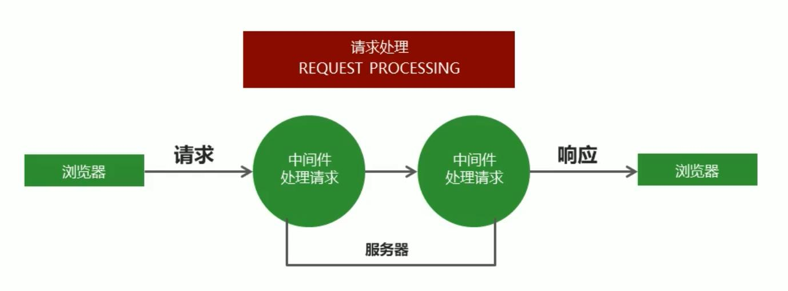

# nodejs 基础

## nodejs 组成

nodejs 由 ECMAScript 及 node 环境提供的一些附加 API 组成，包括文件、网络、路径等 一些更加强大的 API

## 模块化开发

nodejs 将每一个 js 文件作为一个模块，整个 nodejs 的开发过程就是利用各种模块组成完整的程序

JS 模块化编程分为两种规范：CommonJS 模块规范和 ES6 模块规范。**node 中的模块都遵循 CommonJS 模块规范**

JavaScript 在使用时存在两大问题：

- 文件依赖：在 JS 中后引入文件可能依赖于先引入文件，如果人为的维护文件依赖十分繁琐和麻烦
- 命名冲突：在先引入的文件声明的变量在之后的文件中都可以访问到，容易造成变量覆盖，

模块化开发就可以解决这些问题

- 文件依赖：由程序自动管理，不用人为的维护文件依赖关系
- 命名冲突：模块化开发，代码处于半封闭状态。只有开放的代码才能在后续文件中使用
- 模块化开发中每一个功能就是一个模块，多个模块组成了完整的功能，当修改或删除功能时只需要对相应的模块进行修改

模块化开发规范

- Node.js 规定一个 JavaScript 文件就是一个模块，模块内部定义的变量和函数，默认清空下在外部无法得到

## 模块的导出和导入

### 导出

nodeJS 模块导出原理：

- 每一个 node.js 执行文件，都自动创建一个`module`对象，同时，`module`对象会创建一个叫`exports`的属性，初始化的值是`{}`
- `exports`是对`module.exports`对象的引用
- 模块内部可以使用`exports`对象进行成员导出，在其他文件中使用`require`方法导入模块。导入时后缀可以省略
- nodeJS 中有一个全局方法`require()`，用于在文件中加载其他模块

`module.exports = class;`将定义的类或构造函数生成的类赋值给`module.exports`，在类中的方法和属性都会导出到`module.exports`中

`module.exports.functionName = functionName;`将定义的方法导出到 exports 对象中，

`exports.functionName = functionName;`将定义的方法导出到 exports 对象中。因为`exports`只是对`module.exports`地址的引用，所以最终结果还是以`module.exports`为准

```js
// 第一个文件 a.js
const add = (num1, num2) => num1 + num2;
// 将函数导出，实际就是将函数作为 exports 对象的一个方法
exports.add = add;

// 第二个文件 b.js
// 导入时后缀名可以省略
let a = require("./b.js");
console.log(a.add(10, 20));

// 使用 module.exports 导出，导出对象最终以`module.exports`为准
// 第一个文件 a.js
const uname = "leon";
module.exports.name = uname;
exports = {
  name: "bob",
};

// 第二个文件 b.js
// 导入时后缀名可以省略
let a = require("./a");
console.log(a); // {name:"leon"}
```

### 导入

`const varName = require(path);`导入模块，如果是系统模块或第三方模块可以直接写模块名就行，如果是自定义的模块需要写入完整路径（相对路径即可）

模块导入时`require`的查找规则：

- 完整路径：`require()`方法根据模块路径查找模块，如果是完整路径就直接引入模块
- 有路径但后缀省略：引入自定义模块
  + 如果模块后缀省略，先查找同名 JS 文件。
  + 如果没有再查找同名文件夹，找到同名文件夹中的 index.js 文件。
  + 如果同名文件夹下没有 index.js 文件会去同名文件夹（将此文件夹当做一个第三方包）中的 package.js 文件中查找 main 选项指定的入口文件。否则，报错模块未找到
- 没有路径且没有后缀：引入第三方模块
  + Node.js 会假设它是系统模块，先去 node_modules 文件夹中查看是否有同名的 JS 文件
  + 如果没有再查找同名文件夹，找到同名文件夹中的 index.js 文件。
  + 如果同名文件夹下没有 index.js 文件，再查看该文件夹中的 package.json 中的 main 选项确定模块入口文件。否则报错

## 系统模块

由 node 运行环境提供的 API，因为这些 API 都是以模块化的方式进行开发的，所以将 Node 运行环境提供的 API 为系统模块

### 文件操作

包名：`fs`

#### 读取文件

语法：`fs.readFile(path[,encode],callback)`

- `path`：文件路径，支持相对路径
- `encode`：编码格式，用引号包裹
- `callback`：回调函数，包含两个参数`err`和`doc`
  + `err`：返回的错误对象，如果文件读取发生错误可以获取错误信息，否则 err 值为 null
  + `doc`：文件内容

```js
const fs = require("fs");
fs.readFile("./test.txt", "utf-8", (err, doc) => {
  if (err) {
    console.log(err);
  } else {
    console.log(doc);
  }
});
```

#### 写入文件

语法：`fs.writeFile(path,data,callback);`

- `path`：文件路径，支持相对路径
- `data`：要写入的数据
- `callback`：回调函数，包含一个参数`err`
  + `err`：返回的错误对象，如果文件写入时发生错误可以获取错误信息，否则 err 值为 null
- 当文件不存在时，会自动创建文件

```js
const fs = require("fs");
const content = "要写入的内容";
fs.writeFile("./test.txt", content, (err) => {
  if (err) {
    console.log(err);
  } else {
    console.log("写入成功");
  }
});
```

### 路径操作

包名：`path`

#### 路径拼接

语法：`path.join(path,path,...)`

- 因为不同系统下路径分隔符不同，使用路径拼接会自动根据当前系统选择合适的路径分隔符
- linux 下路径分隔符是`/`，windows 下`\`和`/`都行

```js
const path = require("path");

let finalPath = path.join("a", "b", "c.txt");

console.log(finalPath); // Windows 下是 a\b\c.txt Linux 下是 a/b/c.txt
```

**Tips**：

1. 大多数情况都使用绝对路径，因为相对路径有时候相对的是**命令行工具的当前工作目录**
2. 读取文件或设置文件路径时一般都选择绝对路径
3. 使用`__dirname`获取当前文件所在的绝对路径

```js
const fs = require("fs");
const path = require("path");

fs.readFile(path.join(__dirname, "test.txt"), "utf8", (err, doc) => {
  if (err) {
    console.log(err);
  } else {
    console.log(doc);
  }
});
```

### HTTP 服务器

包名：`http`

#### 创建 HTTP 服务器

语法：`http.createServer(callback)`，返回的是一个 web 服务器对象，该对象中存在许多方法，在创建时可以传入一个回调函数，回调函数中有两个参数，也可以不设置，创建后使用`on`监听`resquest`事件，效果一样

- `requests`：即`http.ServerRequest`请求参数，用于获取客户端的请求信息
- `response`：即`http.ServerResponse`响应参数，用于设置服务端传递给客户端的各种响应信息

```js
// 导入 http 模块
const http = require("http");
// 创建 web 服务器
const app = http.createServer((req, res) => {
  res.end('<h1>hello world!</h1>);
});
// 设置 web 服务器监听的端口
app.listen(3000);
```

#### 监听事件

语法：`on(event,callback);`

##### 请求事件

`request`：请求事件，当客户端请求到来时触发，后跟的回调函数和创建 http 服务器时的回调函数一样

- 请求事件后的回调函数中有两个参数，一个是请求参数，获取客户端向服务器端请求时的请求信息
- 一个是响应参数，通过响应参数设置服务器端发送给客户端的各种数据

###### 请求参数

在 web 服务器监听中的回调函数默认有两个参数，通过请求参数可以获取客户端向服务器端请求时的请求信息

常用请求信息：

1. 请求方式(Request Method)：`req.method`
   + `GET`：请求数据
   + `POST`：发送数据
2. 请求地址(Request URL)：`req.url`
   + 可以根据请求地址响应不同的内容
3. 请求报文：`req.headers`
   + 获取的报文是一个对象，使用中括号访问报文中的某个属性的具体值

###### 响应参数

在 web 服务器监听中的回调函数默认有两个参数，通过响应参数服务器端可以向客户端发送信息

使用`res.writeHead(statusCode,obj);`可以写入响应头信息

- `statusCode`：状态码，默认 200
- `obj`：第二个参数是一个对象，对象中以键值对形式存放

1. HTTP 状态码(statusCode)：
   + 200：请求成功
   + 400：客户端请求有语法错误
   + 404：请求的资源未找到
   + 500：服务器端错误
2. 内容类型：`content-type`存放在第二个对象参数中，默认是纯文本`text/plain`
   + text/plain
   + text/html
   + text/css
   + application/javascript
   + image/jpeg
   + application/json
3. 编码格式：`charset=utf8`，跟在内容类型后面用分号分隔

##### 连接事件

`connection`：连接事件，当客户端与服务的建立 TCP 连接时触发，后跟的回调函数有一个参数

- `socket`：为`net.socket`（底层协议对象）对象的实例

##### 关闭事件

`close`：关闭事件，当服务器关闭时会触发

### URL 模块

### responseString 模块

用于处理

## 第三方模块

由别人封装好的、具有特定功能的、可以直接调用的模块即第三方模块，由于第三方模块通常由多个文件组成并被放置在一个文件夹中，所以又称为**包**

第三方模块有两种：

1. 以 JS 文件形式存在，提供实现项目具体功能的 API 接口
2. 以命令行工具形式存在，辅助项目开发

### 包管理工具

`npm`：node package manager，node 的第三方模块管理工具。安装 node 时默认安装

- 初始化项目：`npm init -y`用于初始化当前文件夹为项目根文件夹，生成项目描述文件 package.json 用于记录当前项目信息。如：项目名称、版本、作者、github 地址、当前 项目依赖的第三方模块及模块版本
- 下载第三方模块：`npm install moduleName`下载的第三方模块，默认在当前目录下的`node_modules`文件夹下。下载多个模块用空格隔开。`-g`：此参数表示全局安装，全局安装会将第三方模块下载到公共的模块文件夹中
- 卸载第三方模块：`npm uninstall moduleName`卸载安装的第三方模块，如果`node_modules`文件夹下没有其他文件夹，则也会删除

> 本地安装会将第三方模块下载到当前目录的 node_modules，默认就是本地安装
>
> 全局安装的所有项目都可以使用，本地安装的只在当前项目有用。所以一般将命令行工具用全局安装，项目依赖的库文件用本地安装
>
> npm 安装包时会生成 package-lock.json 文件，用于锁定包的版本，确保再次下载时不会因为包的版本不同而产生问题。同时因为该文件已经记录了项目所依赖第三方包的树状结构和包的下载地址，当重新下载时不需要做额外的解析，可以加快下载速度

#### 项目依赖

在项目的开发阶段和线上运营阶段，都需要依赖第三方包，称为项目依赖。npm 也可以管理这些依赖

##### 开发依赖

在项目的开发阶段需要的依赖，但线上运营阶段不需要依赖的第三方包，称为**开发依赖**

使用`npm install packageName --save-dev`命令安装开发依赖，会将包信息添加到 package.json 文件的 devDependencies 字段中

- 生成的 node_modules 文件夹在迁移项目时直接删除，只需要将 package.json 文件一起打包迁移，用`npm install`会自动查找目录下的 package.json 文件安装所需依赖包
- `npm install`下载时会将 dependencies 字段和 devDependencies 字段的依赖包都下载下来

##### 生产依赖

在项目的线上运营阶段需要的依赖，称为**生产依赖**

使用`npm install packageName`命令安装生产依赖，会将包信息添加到 package.json 文件的 dependencies 字段中

- `npm install --production`下载时只下载 dependencies 字段中的依赖包

### 一些常用的第三方命令行工具模块

1. `nodemon`：当文件修改后往往需要手动执行，使用此模块在执行后会继续监听文件状态，如果文件被修改后保存就自动执行文件。使用`ctrl+c`退出监听
2. `nrm`：npm 下载地址切换工具。使用`nrm ls`打印可用的下载地址列表。`nrm use npmName`切换 npm 包下载地址。推荐国内使用 taobao
3. `gulp-cli`：gulp 提供的命令行工具，用于执行`gulpfile.js`中编写的 gulp 任务`gulp taskName`

### Gulp

基于 node 平台开发的前端构建工具：将机械化操作编写成任务，使用命令自动执行一系列的机械化操作，提高开发效率

作用：

- HTML、CSS、JS 文件的压缩合并
- 语法转换（如：es6、less）
- 公共文件抽离
- 修改文件时浏览器自动刷新

使用步骤：

1. 将 gulp 库文件下载到本地
2. 在项目根目录建立`gulpfile.js`文件用于编写任务，名字不可更改
3. 重构项目的文件夹结构，src 目录放置源代码文件，dist 目录放置构建后文件
4. 在`gulpfile.js`中编写任务
5. 执行 gulp 任务

gulp 文件的编写：

```js
const path = require("path");
const gulp = require("gulp");
// 使用 gulp.task(taskName,callback) 因为获取要处理的文件需要时间，所以采用回调函数的方式读取完毕才执行操作
gulp.task("first", () => {
  // 获取要处理的文件
  gulp
    .src(path.jion(__dirname, "src", "css", "base.css"))
    // 将处理后的文件输出到 dist 目录
    .pipe(gulp.dest(path.jion(__dirname, "dist", "css")));
});
```

gulp 中提供的方法：

- `gulp.task(taskName,callback);`：创建 gulp 任务
  + taskName 使用 default，后面跟一个数组，将每个任务名作为数组中的值，可以一次执行多个任务
- `gulp.src(path);`：获取要处理的文件
- `gulp.dest(path)`：输出文件
- `gulp.watch()`：监控文件的变化

gulp 插件：

- [gulp-htmlmin](https://www.npmjs.com/package/gulp-htmlmin)：html 文件压缩
- [gulp-csso](https://www.npmjs.com/package/gulp-csso)：css 文件压缩
- [gulp-babel](https://www.npmjs.com/package/gulp-babel)：JavaScript 语法转化
- [gulp-less](https://www.npmjs.com/package/gulp-less)：less 语法转化
- [gulp-uglify](https://www.npmjs.com/package/gulp-uglify)：压缩混淆 JavaScript 文件
- [gulp-file-include](https://www.npmjs.com/package/gulp-file-include)：公共文件包含
- browsersync：浏览器实时同步

```js
const path = require("path");
const gulp = require("gulp");
const htmlmin = require("gulp-htmlmin");
const csso = require("gulp-csso");
const babel = require("gulp-babel");
const less = require("gulp-less");
const uglify = require("gulp-uglify");
const fileinclude = require("gulp-file-inclde");
// 将图片及资源文件复制到dist下面
gulp.task("copy", () => {
  gulp
    .src(path.join(__dirname, "src", "image", "*"))
    .pipe(gulp.dest(path.join(__dirname, "dist", "image")));
  gulp
    .src(path.join(__dirname, "src", "lib", "*"))
    .pipe(gulp.dest(path.join(__dirname, "dist", "lib")));
});

gulp.task("htmlmin", () => {
  gulp
    .src(path.join(__dirname, "src", "*.html"))
    // 将公共的 html 代码放到 common 文件夹下，在需要引入的文件中用 @@include('./common/common.html') 引入
    // 将公共 html 文件包含到指定的文件中。详细资料看官方文档
    .pipe(fileinclude())
    // 压缩 html 文件，里面的选项代表是否压缩空格
    .pipe(htmlmin({ collapseWhitespace: true }))
    // 将处理完的文件输出到指定目录
    .pipe(gulp.dest(__dirname, "dist"));
});
gulp.task("cssmin", () => {
  // 选择当前目录下的 css 目录中的所有 less 文件以及 css 文件
  gulp
    .src(
      path.join(__dirname, "src", "css", "*.less"),
      path.join(__dirname, "src", "css", "*.css")
    )
    // 将 less 文件转为 css 文件
    .pipe(less())
    // 压缩 css 文件
    .pipe(csso())
    .pipe(gulp.dest(__dirname, "dist"));
});
gulp.task("jsmin", () => {
  gulp
    .src(path.join(__dirname, "src", "js", "*.js"))
    .pipe(
      babel({
        // 判断当前代码运行环境，将代码转换为当前代码环境所支持的代码
        presets: ["@babel/env"],
      })
    )
    // 压缩 js 文件
    .pipe(uglify())
    .pipe(gulp.dest(__dirname, "dist"));
});
// 构建一个任务执行所有任务，在命令行中只输入 gulp 会默认找到 default 任务并执行
gulp.task("default", ["copy", "htmlmin", "cssmin", "jsmin"]);
```

### mongoose

使用 Node.js 操作 MongoDB 数据库需要依赖第三方包  mongoose

#### 连接和创建数据库

连接数据库：`connect(address,obj)`，此方法返回的是一个`Promise`对象

- `address`：数据库地址，以`mongodb://`开头后接地址、端口号和数据库名，默认端口号 27017 可以不写。`connect('mongodb://localhost:27017/databaseName')`
- `obj`：一个传入的对象，最新版中要求对象值为`{useNewUrlParser: true,useUnifiedTopology: true}`

创建数据库：mongoDB 不用显式的创建数据库，在使用数据库时，如果有就使用，如果没有就创建

```js
// 导入 mongoose 模块
const mongoose = require('mongoose');
// 连接数据库
const databaseName = mongoose.connect('mongodb://localhost:27017/databaseName',{
  useNewUrlParser: true,
  useUnifiedTopology: true
});
// 使用 Promise 对象中的 then()和 catch() 方法测试是否连接成功
databaseName.then(() => {console.log('数据库连接成功');})
            .catch(err => {console.log('数据库连接失败',err)});
```

#### 增删改查

##### 增

MongoDB 中的数据是以文档的方式存储的，而文档是以集合为模板的，

1. 向数据库中存放数据时，需要先定义集合规则（即存放的文档的模板），再创建集合（由模板创建的文档组）
2. 使用`mongoose.Schema({key:valueType,key:valueType});`构造函数创建的实例就是集合规则，
3. 通过`mongoose.model(setName,setSchema);`使用模板创建集合。
4. 插入文档的两种方式
   1. 最后通过集合来创建文档（集合的实例）。
      * `const documentName = new setName(documentObj);`：通过实例化的方式创建文档
      * 使用文档中的`documentName.save()`方法将创建的文档存放到数据库中
   2. `setName.create(documentObj,callback)`：通过集合中的 create 方法插入文档
      * 此方法回调函数中有两个参数，第一个参数用于获取插入出错时的错误信息，第二个参数用于获取插入的文档内容
      * 此方法会返回一个`Promise`对象，因此也可以使用`then()`和`catch()`方法

```js
// 定义集合规则
const courseSchema = new mongoose.Schema({
  name:String,
  author:String,
  isPublished:Boolean
});
// 创建集合并应用规则
// mongoose.model(setName,setSchema); 返回一个构造函数，代表当前集合
// mongoose 在创建集合时集合名应用大写开头，但创建出来的集合在数据库中集合名是小写，且是复数
const Course = mongoose.model('Course',courseSchema); // 创建出的集合名在数据库中为 courses
// 向数据库插入文档的两种方式
// 第一种方式：使用实例化的方式创建文档
const course = new Course({
  name:'NodeJS',
  author:'leon',
  isPublished:true
});
// 向数据库插入文档
course.save()
// 第二种方式
Course.create({
  name:'PHP',
  author:'Bob',
  isPublished:false
},(err,doc) => {
  if(err){
    console.log(err);
  }else{
    console.log(doc);
  }
});
// 第二种方式的 Promise 用法
Course.create({
  name:'PHP',
  author:'Bob',
  isPublished:false
},(err,doc) => {
  if(err){
    console.log(err);
  }else{
    console.log(doc);
  }
});Course.create({name:'C++',author:'lily',isPublished:true})
         .then(doc => {console.log(doc)})
         .catch(err => {console.log(err)});
```

##### 查

### 路由模块

`router`：用于实现请求的路由

使用步骤：

1. 获取路由对象
2. 调用路由对象提供的方法创建路由
3. 启用路由，使路由生效

```js
const getRouter = require("router");
// 创建路由对象
const router = getRouter();
// 获取 get 请求，也可以获取 post 请求
router.get('/add',(req,res) => {
  res.end('Hello World!');
});
// 在服务器中启用路由，router有三个参数，请求参数、响应参数、回调函数（必选项，不写回报错）
server.on('request',(req,res) => {
  router(req,res,()=>{});
});
```

### 模板引擎

`art-template`

### 静态资源访问服务

`serve-static`：用于实现静态资源的访问服务

步骤：

1. 引入`serve-static`模块获取创建静态资源服务功能的方法
2. 调用方法创建静态资源服务并指定静态资源服务目录
3. 启用静态资源服务功能

```js
const http = require("http");
// 引入模块
const serveStatic = require('serve-static');
// 创建静态资源服务，指定静态资源目录
const serve = serveStatic('public');

const server = http.creatServer();

server.on('request',()=>{
  // 启用静态资源服务，第三个参数也是函数，必填项
  serve(req,res,()=>{});
});
server.listen(80);
```

**Tips**：静态资源访问服务开启后，设置的目录为静态资源根目录，例如 CSS 文件，此时模板文件引入此目录下的 CSS 文件时，应该以静态资源根目录为起始目录进行引用

## 框架

### Express 框架

Express 是一个基于 Node 平台的 web 应用开发框架，提供了一系列强大的特性，帮助创建各种 Web 应用

特性：

- 方便简洁的路由定义方式
- 对获取 HTTP 请求参数进行了简化处理
- 对模板引擎支持程度高，方便渲染 HTMP 页面
- 提供了中间件机制，有效控制 HTTP 请求
- 拥有大量第三方中间件对功能进行扩展】】

#### 中间件

中间件中封装了一堆方法，可以接收客户端发来的请求，可以对请求做出响应，也可以将请求交给下一个中间件继续处理



中间件由两部分构成：

- 中间件方法：由 Express 提供，负责拦截请求
- 请求处理函数：由开发人员提供，负责处理请求

> `app.get('requestPath',（req,res) => {})` 接收并处理 get 请求
> `app.post('requestPath',(req,res) => {})` 接收并处理 post 请求
> `app.use(['requestPath'],(req,res,next){})`匹配所有请求方式，不带请求路径的表示匹配所有请求路径，带请求路径的表示匹配该路径的所有请求方式

中间件应用：

1. 路由保护：如某个页面需要登陆才能访问，则可以先在前一个中间件中进行判断是否登录，登录就使用`next()`将请求传递下去，如果没有登录，就拦截请求，响应禁止登陆
2. 网站维护公告：在所有路由最上面定义接收所有请求的中间件，直接为客户端响应网站正在维护
3. 自定义 404 页面，当用户访问页面不存在，则重定向到 404 页面，要将中间件定义在所有中间件最后面

错误处理中间件：在程序执行过程中，不可避免的会出现一些无法预料的错误，比如文件读取失败、数据库连接失败。错误处理中间件就是一个集中处理错误的地方

`app.use((err,req,res,next) => {res.status(500).send(err.message)});`

但此方法只能获取到同步执行代码的错误信息，如果是异步代码出错需要手动在异步API中的回调函数中使用`next(err)`将错误传递下去

捕获错误：在 Node.js 中，异步 API 的错误信息都是通过回调函数获取的，支持 Promise 对象的异步 API 发生错误可以通过`try{}catch(err){}`方法捕获错误。

构建模块化路由：

> 创建多级路由：通过`express.Router();`创建一个路由对象，然后用此路由创建 二级路由，实现多层目录的访问

```js
const express = require('express');
const app = express();
// 创建路由对象
const home = express.Router();
// 将路径和路由对象进行匹配
app.use('/home',home);
// 创建二级路由
home.get('/index',(req,res) => {
  res.send('欢迎来到首页');
});
app.listen(80);
```

> 创建模块化路由：将不同的路由放在不同的文件中，利用模块导出该路由，在主文件中引入模块，并将路径和对应的模块相绑定

```js
// 路由模块文件 1 home.js
const express = require('express');
const home = express.Router();
home.get('/index',(req,res) => {
  res.send('欢迎来到主页');
});
module.exports = home;

// 路由模块文件 2 admin.js
const express = require('express');
const admin = express.Router();
admin.get('/index',(req,res) => {
  res.send('欢迎来到主页');
});
module.exports = admin;

// 主文件
const express = require('express');
const home = require('./router/home');
const admin = require('./router/admin');
const app = express();
app.use('/home',home);
app.use('/admin',admin);
```
