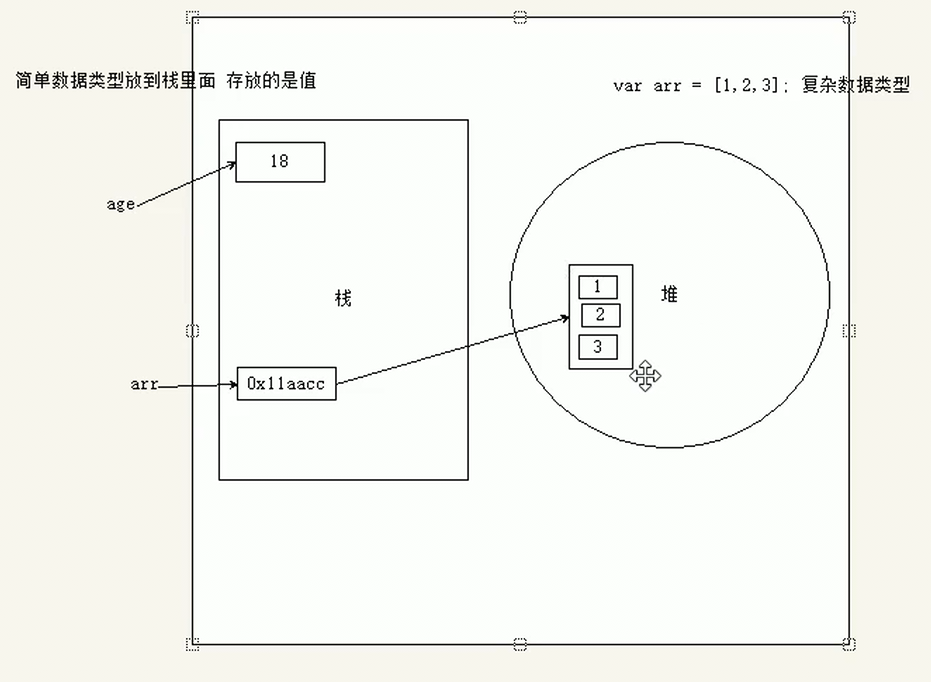
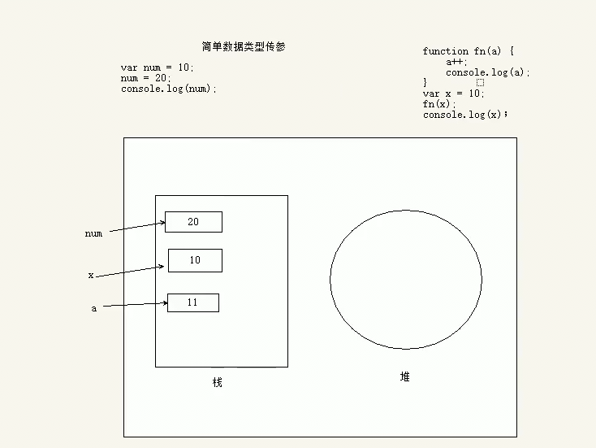
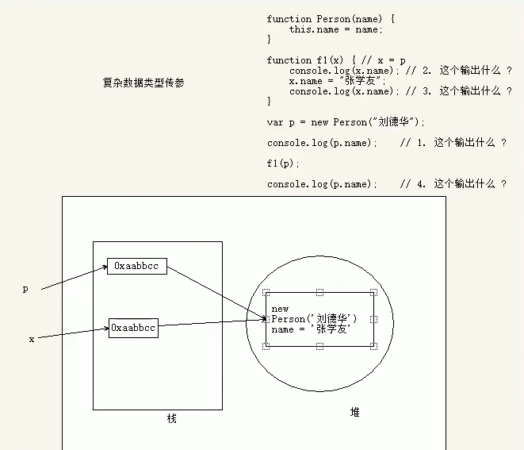
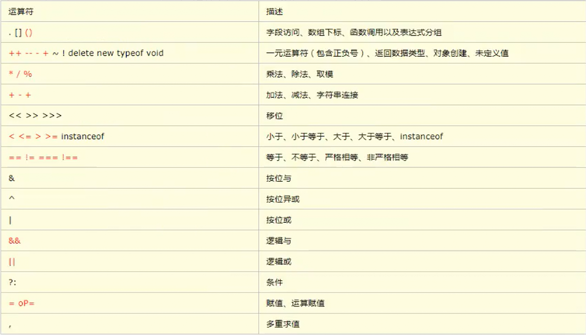
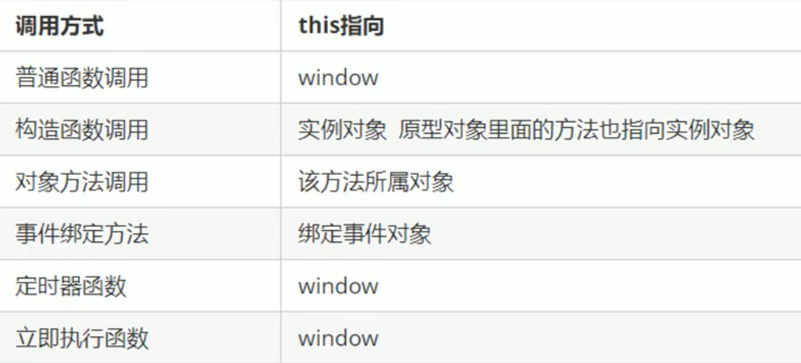
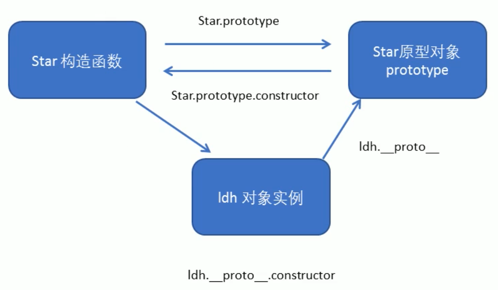
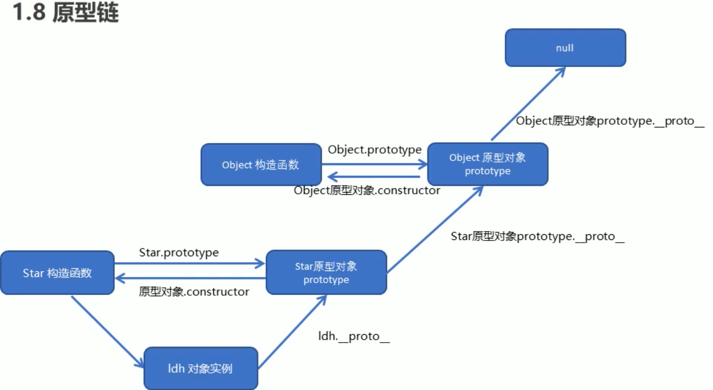

## 编程思想

### 面向过程

POP(Process-oriented programming)：面向过程就是分析解决问题所需要的步骤，然后用函数将步骤实现，使用时依次调用

### 面向对象

OOP(Object Oriented Programming)：面向对象是将事务分解为一个个对象，然后由对象之间分工合作

面向对象三大特性：

1. 封装性
2. 继承性
3. 多态性

思维特点：

1. 抽取对象共用的属性和方法，封装为一个类
2. 对类进行实例化，获取类的对象

### 对比

面向过程：

优点：

> 性能更高，适合和硬件紧密联系的程序，如单片机开发

缺点：

> 不如面向对象易维护、易复用、易扩展

面向过程：

优点：

> 易维护、易复用、易扩展，由于面向对象有封装、继承、多态性的特性，可以设计出低耦合的程序，使程序更加灵活、更加易于维护

缺点：

> 性能低于面向过程

## JavaScript 的组成

- ECMAScript：ECMA是欧洲计算机制造联合会，这是由他们制定的一套语言标准，规定了基本语法、数据类型、关键字、具体API的设计规范、解析引擎设计的参考标准，但与具体实现无关。
- DOM：文档对象模型（Document Object Model）一套用于操作页面元素的 API，DOM 将 HTML 看作文档树，通过 DOM 提供的 API 可以对树上的节点进行操作
- BOM：浏览器对象模型（Brower Object Model）一套用于操作浏览器功能的 API，通过 BOM 操作浏览器窗口，如：弹框、控制跳转、获取分辨率、缓存、历史

学习 JS 主要分为学习语言结构和宿主环境：

- 语言结构：主要是语言规则和内置标准库对象
- 宿主环境：主要宿主环境的 API，不同宿主环境其 API不同
  1. 浏览器：浏览器控制类（BOM）、DOM操作类（DOM）、网络控制类（HTTP、WebSocket）
  2. 服务器：
  3. 操作系统：

## JS 三种写法

```html
<!DOCTYPE html>
<html>
 <head>
     <meta charset="utf-8">
        <title></title>
        <!-- 引入式（外部式）：不要在标签中写任何代码，引入文件会覆盖掉 -->
        <scritp type="text/javascript" src="path"></scritp>
        <!-- 内嵌式：由单独的标签包裹的方式：type可以不写，如果将值写错了标签失效 -->
        <script type="text/javascript">alert('hello')</script>
    </head>
    <body>
        <!-- 行内式 -->
        <input type="button" value="提交" onclick="alert('hello')">
    </body>
</html>
```

## JS执行流程

浏览器分为两部分：渲染引擎和JS引擎

渲染引擎：用来解析`HTML`和`CSS`，俗称内核，如 chrome 浏览器的`blink`，老版本的`webkit`

JS引擎：也称为 JS 解析器。用来读取网页中的`JavaScript`代码，对其处理后运行，如`chrome`的**V8引擎**

1. 预编译：语法检查，如果出现**编译错误**，当前整个`script`中的代码不执行（如果是在HTML 的 script 标签中，则只是当前标签中的 JS 代码不执行，其他标签中依然执行）
2. 预解析：在当前作用域中先做**变量提升**再做**函数预加载**
   + 变量提升：只提升了变量定义，不提升**赋值操作**
   + 函数预加载：只针对关键字定义的函数，匿名函数是以变量的方式定义所以以变量提升的方式处理
3. 执行：代码的执行过程，如果出现**执行错误**，在当前`script`中的代码，执行错误之前的代码正常执行，之后的代码不执行。

```js
// 根据 JS 执行流程，最终打印结果为 100
var f1 = 100;
function f1(){
    console.log('leon');
}
console.log(f1);
/*
*  JS 执行流程
*  var f1;      // 先定义变量名（变量提升）
*  function f1(){    // 将函数赋值给 f1（函数预加载）
*      console.log('leon');  // 函数预加载实际上也是先做变量提升
*  }       // 再将函数赋值给定义的变量
*  f1 = 100;     // 将 100 赋值给 f1（赋值操作）
*  console.log(f1)    // 执行代码
*/

// 匿名函数做变量提升不做函数预加载
fun();  // 报错：fun is not a function
var fun = function(){
    console.log(1);
}

// 变量提升在函数预加载之前
function f1(){
    console.log('leon');
}
var f1;
console.log(f1);
// 此时打印的是函数代码，如果变量提升不在函数预加载之前应该打印 undefined
```

## 变量

变量的本质是去内存中申请空间

使用`var`关键字声明变量，不使用`var`也可以直接定义变量（**不推荐**）

```js
// 声明明再赋值
var age;
age =30;
// 声明时赋值
var age = 30;
// 集体声明：一个 var 声明多个变量并赋值
var age=10, name='leon'; // 相当于：var age=10; var name='leon';

// 容易混淆的声明方式
var a = b = c = 10;  // 相当于：var a=10; b=10; c=10;
```

变量命令规范和规则

- 由字母、数字、下划线、`$`组成，但不能用数字开头
- 区分大小写
- 不能使用关键字和保留字
- 建议使用驼峰命名法
- 变量名必须有意义

调试时打印结果的三种方法

- `alter(variable)`：弹窗
- `console.log(variable)`：在控制台输出
- `document.write(variable)`：写入到页面中

字面量：源代码中一个固定值的表示方法，即字面量表示如何表达这个值

- 数字字面量：1、2、3
- 字符字面量：‘Leon’、‘Bob’
- 布尔字面量：true、false

### 关键字

`break、case、catch、continue、default、delete、do、else、finally、for、function、if、in、instanceof、new、return、switch、this、throw、try、typeof、var、void、while、with`等

### 保留字

`boolean、byte、char、class、const、debugger、double、enum、export、extends、fimal、float、goto、implements、import、int、interface、long、mative、package、private、protected、public、short、static、super、synchronized、throws、transient、volatile`等

## 数据类型

`JavaScript`是一种弱类型语言（动态语言），意味这不用提前声明变量类型，在程序运行过程中，变量的类型会自动确定。在代码运行时，变量的数据类型是由**JS引擎**根据赋值符号右边的变量的值来判断的。`JavaScript`拥有动态类型，同时意味着相同的变量可用作不同的类型

1. 简单数据类型
   + `Number`：数值型
   + `String`：字符串型，所有引号包裹的都是字符串型
   + `Boolean`：布尔型，只能使用小写
   + `Undefined`：未定义，声明了变量但未赋值，默认就是`Undefined`
   + `Null`：空，本身是一种数据类型，但使用`typeof`返回的是`Object`

2. 复杂数据类型

   + `Object`：对象

3. 基本包装类型

   + **基本包装类型**就是将简单数据类型包装为复杂数据类型，这样基本数据类型就有了方法和属性

   + 被包装为复杂数据类型的有：`String`、`Number`、`Boolean`

     ```js
     // 基本数据类型是没有属性和方法的，而对象才有属性和方法，但str.length 是可以执行的，就是因为 JS 会将基本数据类型包装成复杂数据类型
     var str = 'leon';
     console.log(str.length);
     // 执行过程如下：
     var temp = new String('leon'); // 生成临时变量将简单类型包装成复杂类型
     str = temp; // 赋值给声明的字符变量
     temp = null; // 销毁临时变量
     ```

```js
// 判断数据类型使用typeof()
var age=10;
var name='leon';
var result=true;
var teshu;
var kong=Null;
console.log(typeof(age))
console.log(typeof(name))
console.log(typeof(result))
console.log(typeof(teshu))
// 这里返回的类型为 Object，但 Null 单独算一个类型
console.log(typeof(kong))
```

简单数据类型又叫基本数据类型或者**值类型**，复杂数据类型又叫**引用类型**

- 值类型：在存储时变量中存储的是值本身（直接存放在**栈**），因此叫**值类型**
- 引用类型：在存储时变量中存放的是地址（本体保存在**堆**，地址存放在**栈**）通过`new`创建的对象都是**引用数据类型**



简单类型传参是将栈空间的值复制了一份给形参，所以在方法内部对形参进行修改时，不会影响到外部变量



复杂类型传参是将变量在栈空间中保存的堆地址复制给了形参，形参和实参保存的是同一个堆地址，所以操作的是同一个对象



### 数值型

```js
// 数值字面量：数值的固定值的表示法（数值直接量）
var num = 100;

// 八进制 数字前加 0
var num1 = 010;
// 十六进制 数字前加 0x
var num2 = 0xa;

// 浮点数：浮点数直接参与运算会出现精度丢失问题，且直接判断两个浮点数是否相等，也会出现精度问题
var result = 0.1 + 0.2; //结果不是0.3，而是0.30000000000000004

// 数值范围
Number.MIN_VALUE // 最小值：5e-324
Number.MAX_VALUE // 最大值：1.7976931348623157e+308
Infinity  // 无穷大
-Infinity  // 无穷小
NaN    // 非数字：Not a Number

// 判断是否是非数字 isNaN()
// 如果是数字返回 false，如果是非数字返回true
var num4 = 100;
console.log(isNaN(num4));
```

### 字符串型

字符串的不可变性：指字符串中的值是不可变的，当你更改一个字符串变量时，是将改变量名指向了新开辟的内存空间，而原内存空间中存储的值是不可变的

```js
// 字符串字面量：由单双引号包裹的一连串字符串，当字符串中存在引号时，使用不同的引号包裹
var name="leon";

// 获取字符串长度 str.length
console.log(name.length)

// 字符串拼接，使用 + 号。只要有字符串参与 + 运算都是字符串拼接
console.log("leon" + Undefined)

// 字符串和变量拼接时，变量名不加引号
console.log("my name is" + name);
```

|  字面量  |                                     含义                                      |
| :------: | :---------------------------------------------------------------------------: |
|   `\n`   |                                     换行                                      |
|   `\t`   |                                    制表符                                     |
|   `\b`   |                                     退格                                      |
|   `\v`   |                                   竖向跳格                                    |
|   `\r`   |                                     回车                                      |
|   `\f`   |                              换页符（走纸换页）                               |
|   `\\`   |                                     斜杠                                      |
|   `\'`   |                                    单引号                                     |
|   `\"`   |                                    双引号                                     |
|  `\xnn`  |          以十六进制代码nn表示一个字符（0~F之间），如：`\x41`表示`A`           |
| `\unnnn` | 以十六进制代码nnnn表示一个Unicode字符（0~F之间），如：`\u03a3`表示希腊字符`∑` |

**Tips：**转义后的引号只能就近和转移后的引号配对

### 布尔类型

`Boolean`字面量：`true`和`false`，区分大小写

计算机内部存储：`true`为 1，`false`为 0

```js
// 当布尔值和数值型相加时，true 的值为 1，false 的值为 0
console.log(true + 1); // 2
console.log(false + 1); // 1
```

### Undefined 和 Null 类型

1. `Undefined`：表示一个声明了但没有赋值的变量，变量只声明未赋值时时默认为`Undefined`
2. `Null`：表示空，必须手动设置

```js
// 当 undefined 与数值相加时，结果为 NaN
var variable = undefined;
console.log(variable + 1); // NaN
// 当 undefined 与布尔值相加时，布尔值按数值 0 和 1 算
console.log(variable + true); // NaN

// 当 null 和数值相加时，结果为原数值
var var1 = null;
console.log(var1 + 1); // 1
// 当 null 和布尔值相加时，结果为布尔值的数值表现形式
console.log(var1 + false); //
```

### Object 对象类型

## 注释

单行注释：用`//`开头，其后的同一行内容都为注释

多行注释：和`CSS`一样，以`/*`开头，以`*/`结尾

## 数据类型转换

1. 转为字符串类型

   ```js
   // .toString()方法
   var num = 100;
   console.log(num.toString())

   // String()函数：此函数主要是为某些没有 .toString()方法的值使用，如：Undefined、Null
   console.llog(String(num))

   // +：和字符串拼接的结果都是字符串(隐式转换)
   console.log(num + '')
   ```

2. 转为数值类型

   ```js
   // Number() 可以将任意值转换成数值，如果要转换的字符串中存在不是数值的字符，则返回 NaN
   var a=1;
   var b='100';
   var c=true;
   var d=undefined;
   var e=null;
   var f='leon';

   console.log(a)
   console.log(b)
   console.log(c) // true 转换为 1，false 转换为 0
   console.log(d) // Undefined 转换为 NaN
   console.log(e) // Null 转换为 0
   console.log(f) // NaN

   // NaN 和任何值都不相等，包括本身。使用 isNaN() 可以判断一个值是否是 NaN
   console.log(NaN == NaN);

   // parseInt()：取整，先将值转换为数值型，再只取整数部分，丢掉小数部分，如果不是 数字则转化为 NaN
   console.log(parseInt('100.23')); // 100
   console.log(parseInt(100.23));  // 100
   console.log(parseInt('123adf')); // 123
   console.log(parseInt('asd123')); // NaN

   //parseFloat()：转换为小数。这两个转换函数在遇到字符串中存在数字的会先从头读取，直到不是数字的部分全部丢掉
   console.log(parseFloat('100.23')); // 100.23
   console.log(parseFloat('123asdf')); // 123
   console.log(parseFloat(ad3f));  // NaN

   // 使用运算将字符串转换为数值型(隐式转换)
   var number1 = '100';
   console.log(+number1); // + 只能用于这种情况，直接参加运算是拼接
   console.log(-number1);
   console.log(number1 - 0);
   console.log(number1 * 1);
   console.log(number1 / 1);
   ```

3. 转换为布尔类型

   使用`Boolean()`

   + 不为空的字符串都为`true`
   + 数值型 0 为`false`其他都是`true`
   + `Null`、`Undefined`、`NaN`都为`false`

## 运算符

### 一元运算符

```js
// 自增 ++ 和自减 --
// 前置：先进行一元运算，再执行整个表达式
var num = 10;
var result = ++num + ++num;
console.log(result); // 23

/* 后置：以下两种情况，
1. 整个表达式执行结束，再进行一元运算
2. 整个表达式未结束但又被使用了，则先进行一元运算
*/
var num = 10;
var result = num-- + num--;
console.log(result); // 19

var num = 10;
var result = num++ + num--;
console.log(result); // 21
```

### 逻辑运算符

```js
// 逻辑与 && 逻辑或 ||
// 逻辑与 &&（短路运算）：从左向右，左边为真，直接取右边；左边为假，直接取左边
var a=1, b='1.23', c=true, d=false, e=undefined, f=null;
console.log(a&&b); // 1.23
console.log(a&&c); // true
console.log(a&&d); // false
console.log(a&&e); // undefined
console.log(a&&f); // null

console.log(d&&a); // false
console.log(d&&f); // false
console.log(f&&d); // null

// 逻辑或 ||（短路运算）：从左向右，左边为真，直接取左边；左边为假，直接取右边
var a=1, b='1.23', c=true, d=false, e=undefined, f=null;
console.log(a||b); // 1
console.log(a||c); // 1
console.log(a||d); // 1
console.log(a||e); // 1
console.log(a||f); // 1

console.log(d||a); // 1
console.log(f||a); // 1
condole.log(f||d); // false

// 取反 !：运算结果为布尔值（为一元运算符）
console.log( !a ); // false

```

### 关系运算符

```js
// < > <= >= == != === !==：运算结果为布尔值
console.log('1' < 2); // true
console.log(1 > 2);  // false
console.log(1 <= '2'); // true
console.log('1' >= 2); // false
console.log('1' == 2); // false
console.log('1' != 2); // true

// 全等：必须值和数据类型都一致才返回 true
// 非全等：值和数据有任意一个不相同就返回 true
console.log('1' === 1); // false
console.log(1 === 1); // true
console.log(1 !== '1'); // true
console.log(1 !== 2); // true

// 特殊的几个
console.log(0 == false); // true

// Boolean()函数对字符串'0'转换为true，但当使用 == 判断时字符串'0'会转换为 false
console.log('0' == false); // true
/*
== 是值判断，null、undefined 和布尔类型的值 本身就是一个特殊的值，所以使用 == 对 null、undefined 和布尔值进行判断时，始终返回false
*/
console.log(null == false); // false
console.log(undefined == false); // false

console.log('' == false); // true
console.log('fas' == false); // false
console.log('1' == false); // false
console.log(1 == false); // false
```

### 赋值运算符

```js
// 赋值运算符 =
var num = 100; // 声明变量并赋值
num = 200;     // 直接重新赋值

// 和一元运算符组合使用 += -= *= /= %=
// 先进行运算再赋值
num += 100;
num -= 100;
num *= 100;
num /= 100;
num %= 100;
```

### 运算符优先级

下表按照从高到低的优先级排列，具有同优先级的运算符从左至右的顺序求值



## 流程控制

- 顺序结构：代码从上到下，一行一行顺序执行
- 分支结构：只能选择多个分支代码中的一个分支执行
- 循环结构：相同的代码执行多次

### 分支结构

```js
// 分支结构中表达式的判断方式：先将表达式的值通过 Boolean() 转换为布尔值后再进行判断
// 语法：如果小括号里表达式为真，则执行大括号中的分支代码，否则跳过大括号中的代码
if(expression){
   Branch code;
   }

// 双分支：如果表达式为真，执行分支代码1，跳过分支代码2。否则，跳过分支代码1，执行分支代码2
if(expression){
   Branch code1;
   }else{
    Branch code2;
}

// 双分支：三元运算符 ?:
// 语法：如果表达式 1 结果为真，执行表达式 2，如果为假，则执行表达式 3
var variableName = expression1 ? expression2 : expression3;
var num = 9 > 7 ? 1 : 2; // num为 1
1 == '1' ? alert('gogogo') : alert("sorry"); // 弹出 gogogo

// 多分支：如果表达式1为真，执行分支代码1，跳过其他分支，如果表达式1为假，则跳过分支1，判断下一个...
if(expression1){
   Branch code1;
}else if(expression2){
   Branch code2;
}

// 多分支：将表达式的值挨个与 case 的值相匹配，如果符合就执行对应的分支代码，break跳出循环。
// 如果都没有匹配上则执行 default 中的分支代码，break 跳出循环。default 分支可以不写
// case 判断时表达式的值和 case 的值必须全等
switch(expression){
       case value1:
        Branch code1;
        break;
       case value2:
        Branch code2;
        break;
       default:
        Branch code3;
        break;
       }
```

### 循环结构

```js
// while 循环：while(循环条件){循环体--执行代码 计数+1}
var i = 0;
while(i < 10){
    console.log(i);
    i++;
}

// do...while 循环：do{循环体--执行代码 计数+1}while(循环条件)
do{
    console.log(i);
    i++;
}while(i < 10);

// for 循环：for(计数初始值;循环条件;计数+1){循环体--执行代码}
for(var i = 0; i < 10; i++){
    console.log(i);
}

// for...in循环：一般用于遍历对象
var obj = {
    uname:'leon';
    age:20;
}
for(var k in obj){
    console.log(k);
    console.log(obj[k]);
    // 只能使用[]访问对象中的成员，用 . 访问输出undefined
}
```

### 跳出和终止循环

```js
// 使用 continue 可以跳过循环
for(var i = 1; i <= 100; i++){
    if(i % 3 == 0){
        // 当 i 是 3 的倍数的时候，跳过此次循环，继续下一次循环
        continue;
    }
    console.log(i);
}

// 使用 break 可以终止循环
for(var i = 1; i <= 10; i++){
    if(i %3 == 0){
        // 当 i 是 3 的倍数的时候，跳出（终止）此循环
        break;
    }
    console.log(i);
}

// 跳出和终止多重循环，通过给循环设置标识，contiune 和 break 跳出或终止时指定标识的循环
a:for(var i = 1; i <= 5; i++){
    b:for(var j = 1; j <= i; j++){
        if( j == 3){
            break a;
        }
        document.write('#');
    }
    document.write('<br>');
}
```

## 数组

数组的本质是一个特殊对象

含义：数组是一个变量中一次存储多个值的数据结构，其中的值有先后顺序（有序的数据）

定义：中括号是数组的字面量

- `var arr = [value1, value2, value3];`
- `var arr = new Array();`

数组中的每一个值可以是任何类型的值（number、string、Boolean、undefined、null、Object、array、function）

每一个数组都有`length`属性，表示数组中的元素个数

数组由下标（键、索引：表示对应的值在数组中的位置，从0开始计数）和值（元素：数组中的具体数据，和下标相对应）组成

### 下标

作用：用来读取或设置数组中的值

```js
var arrTest = [1, 'leon', true, undefined, null]
// 获取数组长度（数组中值的个数）
console.log(arrTest.length);
// 通过修改 length 属性的值可以将数组中多余的值丢弃
arrTest.length = 2; // 此时数组中只有两个元素了 arrTest = [ 1, 'leon']
// 获取数组中指定下标的值
console.log(arrTest[1]);
// 修改数组中指定下标的值，可以将任意类型的值改为其他任意类型
arrTest[3] = 5;
// 为数组新增元素
arrTest[5] = 'test';
// 跳过下标增加新的值，被跳过的下标（6、7、8）还是会在数组中占据位置，他对应的值为 undefined
arrTest[9] = 123;
```

### 添加删除数组元素

```js
var arr = [1,2,3]
// 在数组开头添加一个或多个元素，修改原数组，并返回新的长度
arr.unshift(parameter1,parameter2);
// 在数组末尾添加一个或多个元素，修改原数组，并返回新的长度
arr.push(parameter1,parameter2);

// 删除数组最后一个元素，数组长度减1，修改原数组，并返回删除的元素的值
arr.pop()
// 删除数组的第一个元素，数组长度减1，修改原数组，并返回删除的元素的值
arr.shift()
```

## 函数

- 函数本身是一个特殊的值，数据类型属于`Object`对象类型，但使用`typeof`返回的是`function`
- 函数可以作为参数传递给另一个函数，也可以作为`return`的返回值。

### 声明方式

1. 使用`function`关键字声明函数(命名函数)

   语法：`function funName(){function body};`

2. 使用表达式声明函数(匿名函数，variableName 是变量名)

   语法：`var variableName = function(){function body};`

3. 匿名函数：只能调用一次，在创建时调用

   语法：`function(){function body}`

   调用：`(function(){function body})();`

   **Tips：**这种调用方式也可以将函数称为**立即执行函数**，如果有多个匿名函数要用分号隔开，否则会报错

   + 立即执行函数的写法 1：`(function(){})()`
   + 立即执行函数的写法 2：`(function(){}())`
   + 立即函数最大的作用就是独立创建了一个作用域，里面的所有变量都是局部变量，避免命名冲突

   ```js
   // 匿名函数自调用，用于隔离代码，防止对全局变量的污染
   var num = 10;
   // 立即执行函数
   (function(){
       // 使用匿名函数，可以防止临时改变变量时对全局变量污染
       // 必须使用 var 进行声明，才不会对全局变量造成污染
       var num = 100;
       console.log(num);
   })()
   console.log(num);
   ```

4. 使用构造函数`Function(parameter1,parameter2,...,'funBody')`

   + 参数和函数体都使用引号包裹
   + 此方式执行效率低，不方便书写，主要用于理解所有函数都是构造函数`Function()`的实例化对象

### 函数参数

```js
// 形参：定义函数时，传递的参数，形参的默认值为 undefined
function fn(m,n){
    var total = 0;
    for(var i = m; i <= n; i++){
        total += i;
    }
    console.log(total);
}
// 实参：调用函数时，传递的参数
fn(100,200)

/*
* 不定长参数：当我们不确定会有多少个参数传递时，可以用 arguments 来获取
* JavaScript 中所有函数都有一个内置对象 arguments对象，arguments 对象中存储了传递的所有实参
* arguments 展示形式是一个伪数组具有以下特点：
* - 具有 length 属性
* - 按索引方式存储数据
* - 不具有数组的 push、pop等方法
*/
function fn(){
    console.log(arguments);
    for(i = 0; i < arguments.length; i++){
        console.log(i);
    }
}
fn(1,2,3);
```

**Tips：**

1. 当传递的实参多于设定的形参时，不会报错，多余的实参会被丢弃。
2. 当传递的实参少于设定的形参时，函数本身语法不报错，但函数体这种的代码可能报错

### 函数返回值

- 在函数中使用`return`关键字返回函数执行结果，如果没有`return`或`return`后没返回具体的值，则返回值为`undefined`
- 当函数执行到`return`后，他后面的代码不再执行，因此`return`可以在函数中终止多层循环

### 函数的调用方式

1. 普通函数：使用`functionName();`或`functionName.call();`
2. 对象中的方法：使用`objectName.functionName();`
3. 构造函数：使用`new ConstructorName();`
4. 绑定事件函数：绑定的事件一旦触发就会调用
5. 定时器函数：由定时器按规定的时间进行调用
6. 立即执行函数：`(function(){})()`创建时就会自动调用

### 函数内 this 的指向

函数内`this`的指向，是当函数被调用的时候才能确定的，调用的方式不同决定了`this`的指向不同。一般指向函数的调用者



### 改变 this 的指向

1. `fun.call(thisArg,arg1,arg2,...)`：调用函数，通过`thisArg`可以改变`this`的指向。其主要作用可以实现继承。在**组合继承**处有详细解释

2. `fun.bind(thisArg,arg1,arg2,...)`：此方法不会调用函数，但会返回由指定的`this`的值和初始化参数改造的**原函数的拷贝**

   ```js
   var btn = document.querySelector('button');
   btn.oncllick = function(){
       this.disabled = true;
       setTimeout(function(){
           this.disabled = false;
       // 定时器中的 this 是指向的 window
       // bind 在定时器函数的外面，this 指向的是 btn
       // 将定时器函数的 this 指向 btn，且不会立即调用
       }.bind(this),3000)
   }
   ```

3. `fun.apply(thisArg,[argsArray])`：调用函数，和`call()`类似，区别在于传递的参数必须是一个数组形式，参数是数组中的元素

   ```js
   // 利用 apply()和内置的数学对象 Math.max() 求最大值
   var arr = [1,2,3,4,5];
   // 不设置 this 的指向可以传 null
   var max = Math.max.apply(null,arr);
   // apply 会将传递的数组转为数组中的元素
   var fn = function(arr){
       console.log(arr);
   };
   fn.apply(null,arr); // 1
   ```

**主要应用场景：**

- `call`常用于继承
- `apply`常用于和数组处理有关系的场景
- `bind`常用于改变定时器内部的 this 指向

## 作用域

一段代码中使用到的变量名并不总是有效和可用的，而限定这个名字的**可用性的代码范围**就是这个名字的作用域，目的是为了提高程序可靠性和减少命名冲突

全局作用域和局部作用域统称为**词法作用域**

### 全局作用域

 全局作用域的变量叫做全局变量，再整个 JS 环境（整个 Script 标签或一个单独的 JS

 文件）中都可以使用

在函数内部没有声明直接赋值的变量，也是全局变量

### 局部作用域

又称为：函数作用域，局部作用域中的变量，叫做局部变量，局部作用域中的变量名只能在局部作用域中使用

局部作用域可以使用全局作用域的变量（函数内部可以使用函数外部的变量，但函数外部无法使用函数内部定义的变量）

函数的形参也可以看作局部变量

```js
// 函数内部可以使用函数外部的变量
var num = 100;
function fun1(){
    console.log(num);
}
fun1(); // 打印 100

// 函数外部不可以使用函数内部的变量
function fun1(){
    var num = 100;
}
console.log(num); // 报错：num is undefined

// 在函数中不使用 var 声明变量，直接赋值的相当于在函数外部声明了全局变量，在函数内部进行了赋值
function fun1(){
    num = 100;
}
fun1(); // 必须先执行函数
console.log(num); // 打印 100

// 典型案例
f1();
console.log(c);
console.log(b);
console.log(a);
function f1(){
    var a = b = c = 9;
    console.log(a);
    console.log(b);
    console.log(c);
}
/*
* - 先预解析函数 -- 然后调用函数 -- 最后三个打印
* - 函数内部 var a = 9; a 是局部变量
* - b = 9; c = 9; 未使用 var 定义直接赋值，所以属于全局变量
* - 函数内部打印 9 9 9
* - 外部执行打印时 b c 是全局变量正常打印
* - a 是局部变量，报错 a is not defined
*/
```

**Tips：**

- 全局变量：只有当浏览器关闭的时候才会销毁，比较占用内<存资源
- 局部变量：当代码块执行完毕就会销毁，比较节约内存资源

### 块级作用域

块级作用域是 `ES6`中新增的一种作用域，由`{}`包裹的属于块级作用域

### 作用域链

- 函数内外存在同名变量时，函数内部优先使用内部变量
- 当多层作用域嵌套时（如：函数嵌套），最内层作用域使用变量，先查找自身，没有则向外一层查找（父级作用域），直到找到为止或找到最外层（全局作用域）为止。这种查找变量的值的叫**链式方式**
- 在 JS 中只有函数可以制造作用域结构，**至少存在一个作用域，即全局作用域**，如果代码中存在函数，那么这个函数构成另一个**作用域**，如果函数中还嵌套函数，那么这个作用域中又诞生一个**作用域**。将这样所有的作用域列出来形成的结构：**函数内指向函数外的链式结构，就称作作用域链**

## 类

在 ES6 中新增了类的概念，使用`class`关键字声明，之后可以用这个类来实例化对象

类抽象了对象的公共部分，泛指的某一大类

对象特指某一个，使通过类实例化的一个具体的对象

### 创建类和实例化对象

创建类：

`class className{classBody};`

实例化对象：必须使用`new`来实例化对象

`var objName = new className();`

在类中有一个**构造函数**用于接收参数，用于在实例化对象时，进行初始化

`constructor(){}`：不需要使用`function`定义，如果不创建也会默认存在这个构造函数，一般将共有属性放入到此构造函数中

- 在类中定义的方法都不需要使用`function`关键字
- 在类中定义方法，每个方法之间不需要使用逗号或分号进行分隔
- 构造函数中定义的属性，其作用域在整个类中，如果类里面的其他方法要调用构造函数中的某个属性，使用`this.variableName`进行调用

```js
// 创建类
class ClassName{
    // 构造函数接收参数，返回实例化对象
    constructor(value1,value2,valueN){
        this.variable1Name = value1;
        this.variable2Name = value2;
        this.variableNName = valueN;
    }
    // 类中的方法都不需要使用 function 定义
    funName(){
        funBody;
    }
}；
// 实例化对象，传递参数给构造函数用于初始化对象中的属性或方法
var objName = new ClassName(value1,value2,valueN);
```

### 继承性

创建子类时使用`extends`关键字来继承父类的属性和方法

`class SonClass extends FatherClass{};`

> 继承中属性或方法的查找原则：
>
> 在继承中如果实例化子类输出一个方法或属性，会先在子类中查找此方法或属性，如果有就指向子类中的方法或属性，没有就去父类中寻找

要在子类中调用父类的方法需要使用`super();`

- `super`在构造函数中当作方法使用，在普通方法中当中属性使用
- `super()`在构造函数中是调用父类构造函数，且必须放在子类的`this`定义的子类独有属性之前（即必须先调用父类构造方法，再使用子类构造方法）
- `super.funName();`在普通方法中此时`super`指向了父类的原型对象，`super.funName();`是调用了父类中的方法
- 通过`super`调用父类方法时，`super`绑定的是子类的`this`

```js
class Father{
    constructor(x,y){
        this.x = x;
        this.y = y;
    }
    sum(){
        console.log(this.x + this.y);
    }
}
class Son extends Father{
    constructor(x,y){
        this.x = x;
        this.y = y;
    }
}
var son = new Son(1,2);
son.sum(); // Must call super constructor in derived class before accessing 'this' or returning from derived constructor 因为 this.属性 的作用域只在当前类中子类（this 指向的是当前创建的实例化对象）继承了父类中的 sum 方法，但 sum 方法调用的是父类中的 this，所以需要使用 super 来调用父类的构造函数
class Son extends Father{
    constructor(x,y){
        super(x,y);
    }
}
var son = new Son(1,2);
son.sum(); // 3
// 子类扩展方法要使用子类属性，子类属性要放在super()之后
class Son extends Father{
    constructor(x,y){
        // 先调用父类构造函数
        super(x,y);
        // 再定义子类自有属性
        this.x = x;
        this.y = y;
    }
    // 子类扩展方法
    subtract(){
        console.log(this.x - this.y);
    }
}
var son = new Son(4,2);
// 调用继承的方法
son.sum();
// 调用扩展方法
son.subtract();
```

**Tips：**

- 类没有变量提升，所以必须先定义类，才能通过类实例化对象
- 类里面的共有属性和方法一定要加`this`使用

## 对象

对象是一组无序的相关属性和方法的集合（对象由属性和方法组成），对象中属性和方法都是对象的成员。所有的事物都是对象，如：字符串、数值、数组、函数

- 属性：常用名词，事物的特征
- 方法：常用动词，事物的行为

对象的成员一般被称为对象的属性，如果对象的成员是一个函数，那么这个函数被称为对象的方法。对象的成员通过`objectName.AttributeName`来进行访问

定义：

- 字面量法（直接量语法）：`var obj = {key:value, key:value};`花括号是对象的字面量
- `new Object`创建：`var obj = new Obiect()`
- 构造函数创建：构造函数时一种特殊函数，主要用来初始化对象，即为对象成员变量赋初始值，它总与`new`运算符一起使用，可以将多个对象的公共属性和方法抽取出来，封装到该函数中
  + 语法：`function ConstructorName(){this.key = value1; this.key = value2;}`
  + 调用：`variableName = new ConstructorName(value1,value2)`
  + 语法规范：构造函数名首字母大写

```js
// 定义一个对象（字面量语法）
var obj = {
    // 对象中的成员采用键值对形式
    // 对象的属性，多个属性或方法中间用逗号隔开
    "name":"leon",
    // 成员名称定义时两边的引号可以不写，依然会解析为字符串
    // 但成员的值如果是字符串必须加引号，否则会被解析为一个变量名，然后通过变量名查找对应的值赋值给成员
    age:18,
    // 对象的方法，冒号后面跟的是一个匿名函数
    "fun1":function(){
        console.log("hello!");
    },
    "fun2":function(m){
        return m;
    }
}
// 调用对象的属性，通过成员名获取成员值
console.log(obj.name);
var age = obj.age;
// 调用对象的方法
obj.fun1();
// 调用有返回值的对象的方法
var num = obj.fun2(10);
console.log(num);

// 修改和新增的语法一样，如果对象中有对应的成员名就修改，没有就新增
// 设置对象的成员
obj.name = "Bob";
// 新增对象的成员
obj.sex = "男";

// 使用 [] 调用对象中的属性
// 中括号中的成员名一定是字符串格式,如果不是字符串格式，会被解析成一个变量名，并尝试将变量的值作为对象名进行访问
console.log(obj["name"])
console.log(obj[name]) // 报错:name is undefined
// 使用 [] 调用对象中的方法，一般不使用
obj["fun1"]();
// 将对象的方法赋值给新的变量，新的变量也是一个函数了
var fun3 = obj["fun2"]
var num1 = fun3();
console.log(num1);

// 删除对象的成员，要使用 delete 关键字
delete obj.name
console.log(obj["name"]) // 报错：name is undefined

// 创建一个空对象（new Object()方法）
var obj = new Object();
// 为创建的对象添加成员
obj.uname = 'Leon';
obj.age = 18;
obj.fun = function(){
    console.log('xxx');
}
// 调用、修改、删除都一样
obj.fun();
obj['age'] = 20;
delete obj.uname;

// 利用构造函数创建对象
// 定义一个构造函数
function People(uname,age){
    this.name = uname;
    this.age = age;
    this.fun = function(strName){
        console.log(strName);
    }
}
// 创建对象
people1 = new People('leon',20);
// 调用对象的成员
console.log(people1.name);
console.log(people1['age']);
people1.fun('gogogo');
```

构造函数和对象：

- 构造函数泛指某一类，类似于其他语言中类(Class)的存在
- 对象特指一个具体的事物
- 利用构造函数创建对象的过程也称为对象的实例化
- `new`关键字执行过程：
  1. ·在内存中创建了一个空的对象
  2. 构造函数中的`this` 就指向创建的空对象
  3. 执行构造函数中的代码，为空对象添加属性和方法
  4. 返回这个对象（所以构造函数中不需要 `return`）

变量和属性对比：

- 变量：单独声明并赋值，使用时直接使用变量名。单独存在
- 属性：在对象中的不需要声明，使用时必须使用`objName.AttributesName`

函数和方法对比：

- 函数：单独声明并调用的
- 方法：在对象中调用必须使用`objName.methodName()`

## 构造函数和原型

在经典的 OOP 语言中,都存在类的概念，类就是对象的模板，对象是类的实例，但在 ES6 之前 JS 中并没有引入类的概念

目前大多数浏览器中的 JavaScript 是 ES5 版本，大多数高版本浏览器只实现了 ES6 部分特性和功能

在 ES6 之前，对象不是基于类创建的，而是使用**构造函数**这种特殊函数来定义对象和对象的特征

创建对象的三种方法：

- 字面量法
- `new Object();`法
- 构造函数法

### 构造函数

构造函数是一种特殊函数，主要用来初始化对象（即为对象成员变量赋初始值），它和`new`一起使用。构造函数名首字母大写

`new`执行顺序:

1. 在内存中创建一个新的空对象
2. 让`this`指向这个新的对象
3. 执行构造函数中的代码，给这个新的对象添加属性和方法
4. 返回这个新的对象（所以构造函数中不用写`return`）

构造函数中的属性和方法统称为成员，构造函数中的成员分为**静态成员**和**实例成员**

- 静态成员：在构造函数本身上添加的成员，只能通过构造函数本身进行访问
- 实例成员：在构造函数内部创建的对象成员（使用 this 创建），只能通过实例化的对象进行访问

```js
// 创建构造函数
function Obj(value1,value2){
    // 构造函数中的实例成员
    this.var1 = value1;
    this.val2 = value2;
    this.fun1 = function(){
        console.log(1);
    }
};
// 实例化对象
var obj1 = new Obj(123,"bob");
// 添加静态成员
Obj.var3 = "leon";
// 访问实例成员
console,log(obj1.var1);
obj1.fun1();
// 访问静态成员
console.log(Obj.var3);
// 通过实例化对象访问静态成员报错 undefined
// 通过构造函数直接访问实例成员报错 undefuned

// 查看两个对象是否共享的同一个方法
var obj2 = new Obj(345,"ldska");
console.log(obj1.fun1 === obj2.fun1); // false
```

### 原型 Prototype

使用构造函数，当每次实例化对象时都会重新开辟空间，此时每个实例化对象中的方法都会占用一份内存空间，但实际上每个实例化对象中的方法都是同样的代码，这就造成了空间浪费

可以通过**原型对象**可以解决此问题

JavaScript 规定**每个构造函数都有一个`prototype`属性**，该属性指向另一个对象。**`prototype`属性就是一个对象，这个对象所有属性和方法都被构造函数所拥有。且构造函数通过原型分配的函数是所有实例化对象所共享的**

因此，通过将不变的方法直接定义在`prototype`对象上，使所有实例化对象共享这些方法，就解决了内存空间占用的问题

```js
// 创建构造函数
function Obj(value1,value2){
    // 构造函数中的实例成员
    this.var1 = value1;
    this.val2 = value2;
};
// 通过原型定义共享的方法
Obj.prototype.fun1 = function(){
    console.log(1);
}
// 实例化对象
var obj1 = new Obj(123,"leon");
var obj2 new Obj(432,"bob");
// 调用共享方法
obj1.fun1();
obj2.fun1();
// 查看是否使用的是同一个方法
console.log(obj1.fun1 === obj2.fun1); // true
```

**Tips：在原型对象中`this`的指向在调用时才能确定，原型对象中`this`的指向和构造函数中`this`的指向都是指向当前的调用者**

### 对象原型

每个对象都有一个属性`__proto__`（系统自动添加的）指向构造函数的`prototype`原型对象，之所以实例化对象可以直接调用构造函数 prototype 原型对象中的属性和方法，就是因为对象有`__proto__`原型的存在

- `__proto__`对象原型和原型对象`prototype`是等价的
- `__proto__`对象原型的意义就在于为对象的查找机制 提供一个方向，或者说是一条查找线路。但它是一个非标准属性，因此实际开发中，不可以使用这个属性，它只是用于内部指向原型对象`prototype`

```js
function Obj(){
    this.var1 = "leon";
};
Obj.prototype.fun = function(){
    console.log(1);
};
// 系统在实例化时会自动给对象添加一个 __proto__ 原型对象
var obj = new Obj();
// 对象直接调用原型对象中的方法，就是因为__proto__指向了构造函数中的 prototype
obj.fun();
```

**Tips：方法的查找规则**：
> 首先查看实例化的对象中是否存在要调用的方法，如果有就调用此方法，如果没有，因为`__proto__`指向了构造函数中的`prototype`就去原型对象`prototype`中查找要调用的方法，如果有就调用

### constructor 构造函数

在`__proto__`对象原型和构造函数中的`prototype`原型对象中都有一个属性`constructor`属性。`constructor`被称为构造函数，因为**它指向构造函数本身**

- constructor 主要用于记录该对象引用于哪个构造函数
- 也用于让原型对象重新指向原来的构造函数

```js
function Obj(){
    this.var1 = "leon";
};
// 使用添加的方法，给构造函数的原型对象中添加公用方法
Obj.prototype.fun = function(){
    console.log(1);
};
// 系统在实例化时会自动给对象添加一个 _proto_ 原型对象
var obj = new Obj();
// 构造函数和实例化对象中的原型对象都有 constructor 属性用于指向引用的构造函数
console.log(Obj.prototype);
console.log(obj.__proto__);
// 当需要添加多个公用方法时，可以采取赋值的方式
Obj.prototype = {
    fun1:function(){
        console.log(1);
    },
    fun2:function(){
        console.log(2);
    }
};
var obj = new Obj();
// 此时因为使用的是赋值操作所有原本的原型对象中的属性和方法被覆盖了，因此没有了 constructor 属性，也就无法知道引用的是哪个构造函数。所以当给原型对象通过赋值方式添加多个公用方法时，需要使用 constructor 手动指定引用的构造函数
console.log(Obj.prototype.constructor); // Object() { [native code] }
console.log(obj.__proto__.constructor); // Object() { [native code] }
// 通过赋值方式添加多个公用方法时，需要手动指定调用的构造函数
Obj.prototype = {
    constructor:Obj,
    fun1:function(){
        console.log(1);
    },
    fun2:function(){
        console.log(2);
    }
};
```

### 构造函数、实例、原型对象之间的关系



**Tips：这一段如果了解指针就比较好理解**：

> 1. 构造函数中的`prototype`指向了构造函数的原型对象
> 2. 构造函数的原型对象中的`constructor`又指向了构造函数
> 3. 通过构造函数创建的实例对象，而实例对象中的原型对象`__proto_`实际指向的是构造函数的原型对象`prototype`
> 4. 因为实例对象的原型对象`__proto_`指向的是构造函数的原型对象`prototype`，所以实例对象的原型对象中的`constructor`实际上就是构造函数的原型对象中的`constructor`，指向的就是构造函数

### 原型链



**JavaScript 的成员查找机制（规则）**：

1. 当访问一个对象的属性或方法时，首先查找**对象自身**是否存在该成员
2. 当没有就查找它的原型（即`__proto__`原型对象指向的`prototype`原型对象，即父级对象或构造函数）
3. 如果还没有就查找原型对象的原型（即此对象的父级对象的原型对象的原型或者说此对象的构造函数的原型对象的原型）
4. 以此类推一直找到`Object`的原型对象（JavaScript 内置的构造函数）
5. `Object`的原型对象的原型最终指向`null`

### 扩展内置对象

通过原型对象可以对原来的内置对象进行自定义扩展

查看内置对象的原型对象中包含的方法：`console.log(Arrary.prototype);`打印内置对象`Arrary`的原型对象

```js
// 给内置的数组对象添加求和的方法
Array.prototype.sum = function(){
    var sum = 0;
    for(var i = 0; i < this.length; i++){
        sum += this[i];
    }
    return sum;
}
// 使用自定义添加的扩展方法和内置对象原本存在的方法一样
var arr = [1,2,3];
console.log(arr.sum());
```

**Tips：给内置对象扩展方法只能使用追加的方式，不能采取给原型对象赋值的方式**。

### 组合继承

在 ES6 之前 JavaScript 没有提供`extends`继承，可以通过**构造函数+原型对象**来模拟实现继承，因此被称为组合继承

#### 继承父类型的属性

核心原理：通过`call()`将父类型的`this`指向子类型的`this`，就实现了子类型继承父类型的属性

`fun.call(thisArg,arg1,arg2,...)`：用于调用指定的函数，并修改函数运行时`this`的指向

- `thisArg`：当前调用函数`this`的指向的对象
- `arg`：向函数传递的参数

```js
function fun(){
    console.log(this);
};
var t = {
    name:"andy"
};
// 调用函数，等同于fun()，，此时函数中this指向的window
fun.call();
// 修改函数this的指向
fun.call(t)
```

构造函数实现子类型继承父类型的属性

```js
// 父构造函数
function Father(uname,age){
    this.uname = uname;
    this.age = age;
};
// 子构造函数
function Son(uname,age){
    // 将父构造函数的 this 指向子构造函数
    Father.call(this,uname,age);
    // 子构造函数自有属性直接定义就行
    this.sex = "man";
}
```

#### 继承父类型方法

 ```js
// 父构造函数
function Father(uname,age){
    this.uname = uname;
    this.age = age;
};
// 父构造函数中的方法
Father.prototype.fun1 = function(){
    console.log(1);
};
// 子构造函数
function Son(uname,age){
    // 将父构造函数的 this 指向子构造函数
    Father.call(this,uname,age);
};
// 子构造函数继承父构造函数中的方法
// 直接使用 Son.prototype = Father.prototype 是将父构造函数的原型对象的地址传递给子构造函数的原型对象，会造成当修改子构造函数中的方法时，父构造函数中的方法也受到影响
// 使用 new 实例化一个父构造函数，将这个实例化对象赋值给子构造函数，根据原型链子构造函数可以继承到父构造函数的原型对象中的方法，且修改子构造函数的原型对象中的方法 时，不会影响父构造函数的原型对象中的方法
Son.prototype = new Fathher;
// 因为是采用赋值方式，所以会覆盖掉子构造函数原本的原型对象，导致原型对象中 constructor 指向不正确，所以需要手动将 constructor 指定到子构造函数
Son.prototype.constructor = Son;
// 子构造函数自有方法
Son.prototype.fun2 = function(){
    console.log(2);
};
 ```

## 正则表达式

正则表达式(Regular Expression)是用于匹配字符串中字符组合的模式，在 JavaScript 中正则表达式也是对象

正则表达式通常被用来检索、替换、提取那些符合某个模式（规则）的文本。

- 匹配：用户名表单只能输入英文字母、数字、下划线，昵称框中只能输入中文
- 替换：过滤页面内容中的一些敏感词
- 提取：从指定字符串中获取想要的特定部分

正则表达式的特点：

1. 灵活性、逻辑性和功能性非常强
2. 可以迅速的用极简单的方式达到对字符串的复杂控制

### JavaScript 使用正则表达式

#### 创建

1. 通过调用 RegExp 对象的构造函数创建：`new RegExp(/expression/[switch])`
2. 利用字面量创建：`/expression/[switch]`

`switch`：也称为修饰符，用于指定使用什么模式来进行匹配，可以不指定，如果指定有三种值

- `g`：全局匹配
- `i`：忽略大小写
- `gi`：全局匹配且忽略大小写

#### 测试

`regexObj.test(str)`正则对象方法，用于检测字符串是否符合该规则，该对象会返回一个布尔值，其参数是测试的字符串

- `regexObj`：正则表达式
- `str`：要测试的文本
- 检测 str 文本是否符合正则表达式规范

### 正则表达式的组成

一个正则表达式**可以由简单的字符组成**，也可以是**简单和特殊字符的组合**。其中的特殊字符也被称为**元字符**，是在正则表达式中**具有特殊意义的专用符号**

#### 边界符

正则表达式中的边界符（位置符），用于**提示字符所处位置**

| 边界符 |                                                         说明                                                         |
| :----: | :------------------------------------------------------------------------------------------------------------------: |
|  `^`   | 表示匹配行首的文本，匹配输入字符串的开始位置。如果设置了RegExp对象的Multiline属性，^也匹配“`\n`”或“`\r`”之后的位置。 |
|  `$`   | 表示匹配行尾的文本，匹配输入字符串的结束位置。如果设置了RegExp对象的Multiline属性，$也匹配“`\n`”或“`\r`”之前的位置。 |

如果`^`和`$`一起使用，表示必须是精确匹配

```js
var rg = /^abc/; // 以 abc 开头的文本
consoloe.log(re.test('abcsd')); // true
consoloe.log(re.test('aabc')); // false
consoloe.log(re.test('bsdk')); // false
var rg1 = /abc$/; // 以 abc 结尾的文本
consoloe.log(re.test('abc')); // true
consoloe.log(re.test('abcd')); // false
consoloe.log(re.test('sadabc')); // true
var rg2 = /^abc$/; // 只匹配 abc
consoloe.log(re.test('abc')); // true
consoloe.log(re.test('abcabc')); // false
consoloe.log(re.test('abcdsabc')); // false
```

#### 字符类

字符类表示有一系列字符可供选择，只要匹配其中一个就可以。**所有可供选择的字符都放在方括号内**

`[-]`：方括号内部范围符`-`

```js
var rg = /[abc]/;
consoloe.log(re.test('andy')); // true
consoloe.log(re.test('baby')); // true
consoloe.log(re.test('color')); // true
consoloe.log(re.test('red')); // false
var rg1 = /^[abc]$/; // 三选一，精确匹配
consoloe.log(re1.test('aa')); // false
consoloe.log(re1.test('a')); // true
consoloe.log(re1.test('b')); // true
consoloe.log(re1.test('c')); // true
consoloe.log(re1.test('abc')); // false
var rg2 = /^[a-z]$/; // 26 个小写字母中的任意一个，精确匹配
var rg3 = /[a-zA-Z0-9_-]/; // 26 个英文字母（大小写都行）、数字、下划线、短横线都会匹配
```

`[^]`：在中括号中的`^`表示取反，即匹配不包含中括号中指定的字符。和边界符`^`不同

```js
var rg = /^[^a-z0-9-_]$/;
consoloe.log(re.test('a')); // false
consoloe.log(re.test('d')); // false
consoloe.log(re.test(3)); // false
consoloe.log(re.test('-')); // false
consoloe.log(re.test('!')); // true
```

#### 量词符

量词符用于**设定某个模式出现的次数**

|  量词   |                                                                                           说明                                                                                            |
| :-----: | :---------------------------------------------------------------------------------------------------------------------------------------------------------------------------------------: |
|   `*`   |                                               重复零次或多次，匹配前面的子表达式零次或多次。例如，zo*能匹配“`z`”以及“`zoo`”。*等价于{0,}。                                                |
|   `+`   |                                    重复一次或多次，匹配前面的子表达式一次或多次。例如，“`zo+`”能匹配“`zo`”以及“`zoo`”，但不能匹配“`z`”。+等价于{1,}。                                     |
|   `?`   |                                    重复零次或一次，匹配前面的子表达式零次或一次。例如，“`do(es)?`”可以匹配“`does`”或“`does`”中的“`do`”。?等价于{0,1}。                                    |
|  `{n}`  |                                    重复n次，*n*是一个非负整数。匹配确定的*n*次。例如，“`o{2}`”不能匹配“`Bob`”中的“`o`”，但是能匹配“`food`”中的两个o。                                     |
| `{n,}`  |         重复n次或多次，*n*是一个非负整数。至少匹配*n*次。例如，“`o{2,}`”不能匹配“`Bob`”中的“`o`”，但能匹配“`foooood`”中的所有o。“`o{1,}`”等价于“`o+`”。“`o{0,}`”则等价于“`o*`”。          |
| `{n,m}` | 重复n到m次，*m*和*n*均为非负整数，其中*n*<=*m*。最少匹配*n*次且最多匹配*m*次。例如，“`o{1,3}`”将匹配“`fooooood`”中的前三个o。“`o{0,1}`”等价于“`o?`”。请注意在逗号和两个数之间不能有空格。 |

#### 括号总结

1. 大括号：量词符，里面表示前面的匹配项的重复次数
2. 中括号：字符集合，里面表示要匹配的字符范围（匹配括号中的任意字符）
3. 小括号：表示优先级

#### 预定义类

预定义类指某些常见模式的**简写方式**

| 预定类 |                             说明                             |
| :----: | :----------------------------------------------------------: |
|  `\d`  |             匹配 0-9 之间的任一数字,相当于[0-9]              |
|  `\D`  |             匹配所有 0-9 以外的字符,相当于[^0-9]             |
|  `\w`  |       匹配任意的字母、数字、下划线。相当于[A-Za-z0-9_]       |
|  `\W`  | 匹配除所有字母、数字、下划线以外的字符，相当于[^A-Za-z0-9_]  |
|  `\s`  | 匹配空格（包括换行符、制表符、空格符等）。相当于[\t\r\n\v\f] |
|  `\S`  |            匹配非空格的字符，相当于[^\t\r\n\v\f]             |

## ES5 新增方法

### 数组方法

迭代（遍历）方法`forEach()、map()、filter()、some()、every()`

- `array.forEach(function(currentValue,index,arr){})`

  + `currentValue`：数组当前项的值
  + `index`：数组当前项的索引
  + `arr`：数组本身

  ```js
  var arr  = [1,2,3];
  arr.forEach(function(value,index,arr){
      console.log("值"+value);
      console.log("索引"+index);
      console.log("数组"+arr);
  });
  ```

- `array.filter(function(currentValue,index,arr){})`

  + 参数同上
  + 此方法是创建一个新数组，新数组中的元素是通过检查指定数组中符合条件的所有元素
  + 此方法主要用于筛选数组，它直接返回一个新数组

  ```js
  var arr = [12,345,23,7];
  var newArr = arr.filter(function(value,index){
      return value >= 20;
  });
  ```

- `array.some(function(currentValue,index,arr){})`

  + 参数同上
  + 此方法用于检测数组中是否有满足指定条件的元素，当找到第一个满足条件的元素就终止循环，不再继续查找。效率更高
  + 它的返回值是布尔值，找到满足条件的元素返回 true，否则返回 false

  ```js
  var arr = [19,23,7,54];
  var flag = arr.some(function(value){
      return value > 30;
  });
  ```

### 字符串方法

去掉两侧的空格：`string.trim()`

替换：`string.replace(regexp|substr,replacement);`
    1. 第一个参数：被替换的字符串（substr）或正则表达式（regexp）
    2. 第二个参数：替换为的字符串
    3. 返回值是一个替换后的新字符串
    4. 当使用正则时，默认只会替换匹配到的第一个字符串，给正则表达式添加全局选项可以匹配所有

### 对象方法

获取对象自身所有属性名：`Object.key(obj)`

- 效果类似`for...in`
- 返回一个由属性名组成的数组

定义对象中新增属性或修改原有的属性：`Object.defineProperty(obj,prop,descriptor)`

- `obj`：目标对象
- `prop`：需要新增或修改的属性名
- `descriptor`：目标属性所拥有的特性，以对象的格式书写`{}`
  + `value`：设置属性的值，默认为 undefined
  + `writable`：值是否可以重写，布尔值。默认为 false
  + `enumerable`：目标属性是否可以被枚举，布尔值。默认为 false
  + `configurable`：目标属性是否可以被删除或是否可以再次修改 特性，布尔值。默认为 false

## 内置对象

```js
// 数学对象 Math，是一个对象不是构造函数，所以直接调用就行
// 属性：PI 圆周率
console.log(Math.PI);
// 方法：Math.max()求最大值，如果传入的值不是数字返回NaN
console.log(Math.max(1,2,3,4))
// 如果要传入数组，使用 ...arrName 传入
arrName = [1,2,3,4];
console.log(Math.max(...arrName));

// abs()取绝对值，会进行隐式转换
console.log(Math.abs(-1));
// floor()向下取整
console.log(Math.floor(1.8));
// ceil()向上取整
console.log(Math.ceil(1.1));
// round()四舍五入，但 .5 向大取
console.log(Math.round(-1.5))
// random()随机小数，从 0-1 包括 0 不包括 1
console.log(Math.random());

// 日期对象：Data，是一个构造函数，必须使用 new 来创建日期对象
// 当不传递参数时，默认返回当前系统的当前时间
var date = new Date();
console.log(date);
// 参数的常用写法：
var date = new Date(2019,10,01); // 数字型
console.log(date);
var date = new Date('2019-10-01 8:8:8'); // 字符型

// 数组对象：Array
// 利用字面量创建 var arr = [1,2,3]
// 实例化对象方式创建
var arr = new Array(); // 空的数组对象
var arr = new Array(3); // 创建一个包含三个元素的数组，元素值默认为 undefined
var arr = new Array(1,2,3); // 创建一个元素为[1,2,3]的数组
// reverse()翻转数组
console.log(arr.reverse());
// sort()排序数组(冒泡)默认方法对多位数是按每位上的数字排序
console.log(arr.sort());
// sort()指定升序降序，写法固定的
arr1 = arr.sort(function(a,b){
    return a - b; // 升序排序
    return b - a; // 降序排序
})
console.log()
// indexOf(element[,fromIndex])返回数组元素索引:从 0 开始查找，如果存在元素或存在多个相同元素，则返回找到的第一个匹配的元素的索引号，如果不存在则返回 -1。也可以指定从哪个下标开始查找，默认是 0
var arr = ['red','blue','yellow','red']
console.log(arr.insexOf('red')); // 0
// lastIndexOf(element[,fromIndex])返回数组元素索引：从末尾开始查找，如果存在元素或存在多个相同元素，则返回找到的第一个匹配的元素的索引号，如果不存在则返回 -1。也可以指定从哪个下标开始查找，默认是最后一位
console.log(arr.lastIndexOf('red')); // 3
// toString()将数组转换为字符串
var arr = [1,2,3];
console.log(arr,toString()); // 1,2,3
// join(demiliter)使用指定的分隔符将数组转换为字符串
console.log(arr.join('&')); // 1&2&3
// concat(array)连接两个数组，返回一个新的数组
var arr1 = [1,2,3];
var arr2 = [4,5,6];
console.log(arr1.concat(arr2)); // [1,2,3,4,5,6]
// slice(beginIndex,endIndex)截取一个数组中指定的一段元素，返回被截取元素的新数组，包含 beginIndex，不包含 endIndex。不会改变原数组
var arr = [1,2,3,4,5,6,7];
console.log(arr.slice(0,3)); // [1,2,3]
// splice(beginIndex,step)删除一个数组中指定的一段元素，返回被删除的元素的新数组，会改变原数组
var arr = ['a','b','c','d'];
var arr1 = arr.splice(0,2);
console.log(arr1); // ['a','b']
console.log(arr); // ['c','d']

// ES6 中数组的一些扩展方法
// Array.from(arrayLike[,callback])将伪数组或可遍历对象转换为正真的数组
let arrayLike = {
    '0':'1',
    '1':'2',
    'length':2
}
var arr = Array.from(arrayLike);
console.log(arr);   // [1,2]
var arr1 = Array.from(arrayLike,item => item*2);
console.log(arr1);  // [2,4]
// find(fn)查找指定数组中指定条件的值，并返回。如果要查找的元素不存在，返回 undefined
var arr = [{
    id:1,
    name:"leon"
},
{
    id:2,
    name:"bob"
}];
let arr1 = arr.find(item => item.id == 2);
console.log(arr1);  // {id:2,name:"bob"}
// findIndex(fn)查找指定数组中指定条件的第一个匹配的值的索引，并返回。找不到返回 undefined
let arr = [4,10,34,143,52,23];
let index = arr.findIndex((value,index) => value > 20);
console.log(index); // 2
// includes(value)查找指定数组中是否包含指定的值，返回布尔值
[1,2,3].includes(2);    // true
[1,2,3].includes(4);    // false

// 字符串对象
// ES6 中字符串新增的一些扩展方法
// 模板字符串
```

## ES6

ES6 泛指 ES2015 及后续版本

### 变量声明

ES6 中新增了一个**块级作用域**：每一个大括号都是一个块级作用域

ES6 中新增的用于声明变量的关键字，用于解决`var`声明的变量都为全局变量，当代码层级复杂容易造成变量覆盖，且当循环或判断结束后，在循环或判断中定义的变量不会销毁，造成空间浪费

`let`：声明的变量只在所处的块级作用域中有效
> `let`声明的变量不存在变量提升
> `let`声明的变量具有暂时性死区特性：在块级作用域中使用`let`声明的变量会和此块级作用域进行绑定。此时，当块级作用域中使用此变量名时不会向上查找

```js
    if(true){
        let a = 100;
        var b = 200;
    }
    // var 定义的变量不具备块级作用域，let 定义的变量具备块级作用域域，无法在其他作用域中访问
    console.log(a); // undefined
    console.log(b); // 200

    for(var i = 0; i < 3; i++){

    };
    console.log(i); // 3 因为 var 定义的变量属于全局变量，当循环结束 i 不会被销毁
    for(let i = 0; i < 3; i++){

    };
    console.log(i); // undefined 因为 let 定义的变量只在块级作用域中有效，当循环结束，循环中定义的变量被销毁

    // 暂时性死区
    var num = 10;
    if(true){
        console.log(num);   // undefined 因为在此块级作用域中使用 let 定义了 num 变量，num 变量就和此块级作用域进行了绑定，不再向上查找
        let num = 20;
    }
```

一个区别例子：

```js
    var arr = [];
    for(var i = 0; i < 2; i++){
        arr[i] = function(){
            console.log(i);
        }
    }
    // var 定义的是全局变量，且不存在块级作用域，当循环结束后 i 的值为 2，此时执行函数输出的都是 2
    arr[0]();   // 2
    arr[1]();   // 2

    let arr = [];
    for(let i = 0; i < 2; i++){
        arr[i] = function(){
            console.log(i);
        }
    }
    // let 定义的变量只在块级作用域中有用，当每次循环时都会产生一个块级作用域，每个块级作用域中的变量都是不同的。当函数执行时输出的时自己的上一级（循环产生的块级作用域）作用域下的值
    arr[0]();   // 0
    arr[1]();   // 1
```

### 常量声明

`const`：声明常量，常量就是值（内存地址）时不能改变的
> `const`声明的常量也只在块级作用域中有效
> `const`在声明常量时必须赋初始值
> 常量赋值后，值不可更改（实际是指常量值的对应的内存地址不可更改）

```js
    cont PI = 3.14;
    PI = 10;    // Assignment to constant variabl

    const arr = [1,2];
    arr[0] = 123;   // 可以更改
    arr = [3,4];    // Assignment to constant variable
    // 常量不可更改实际是指，常量值对应的内存地址不可更改，在复杂数据类型中实际存放的就是数据的内存地址
    // 第一种方式实际是通过内存地址，更改该内存中的值。所以可以更改
    // 第二种是直接更改复杂数据类型中存放的内存地址，所以报错
```

### 三种变量声明方式的区别

1. 使用`var`声明的变量，其作用域为**该语句所在函数内，且存在变量提升现象**
2. 使用`let`声明的变量，其作用域为**该语句所在代码块中，不存在变量提升**
3. 使用`const`声明的常量，其作用域为**该语句所在代码块中，不存在变量提升，且在其后的代码无法修改该常量的值**

> 使用`const`声明的变量，JS 引擎不需要实时监控其值是否发生改变，因此效率更高。当定义函数和不需要改变的值时尽量使用`const`进行定义

### 解构赋值

ES6 允许从数组中提取值，按照对应的位置对变量进行赋值。即**解构赋值**。对象也可以实现解构

#### 数组解构

- 数组解构会将数组中的值赋值给对应位置的变量名
- 如果变量名多于数组元素，未分配到的变量的值为 undefined

```js
    // 解构赋值
    let arr = [1,2,3];
    let [a,b,c] = arr;
    console.log(a,b,c); // 1 2 3
    // 解构失败
    let arr = [1,2,3];
    let [a,b,c,d,e] = arr;
    console.log(a,b,c,d,e); // 1 2 3 undefined undefined
```

#### 对象解构

- 对象解构和数组解构类似，但变量名必须是对象中的 key
- 如果变量名不是对应的 key，也可以通过别名方式进行赋值

```js
    let person = {uname:"leon",age:18,sex:"男"};
    let {uname,age,s} = person;
    // 匹配项获取到对象中对应 key 的值，未匹配项的值为 undefined
    console.log(uname,age,s);   // leon 18 undefined

    // 别名方式的对象解构
    let person = {uname:"leon",age:18,sex:"男"};
    let {uname:myName,age:myAge,sex:mySex} = person;

    console.log(myName,myAge,mySex);    // leon 18 男
```

### 箭头函数

ES6 新增的定义函数的方式：`(parameter1,parameter2,...)=>{functionBody}`

- 如果函数体中只有一句代码，且代码执行结果就是返回值，可以省略大括号
- 如果形参只有一个，可以省略小括号
- 箭头函数不绑定`this`，箭头函数没有自己的`this`关键字。如果在箭头函数中使用`this`，`this`将指向箭头函数定义位置中的`this`

```js
    // 当函数体只有一句话，且代码执行结果就是返回值，可以省略大括号
    const fn = (num1, num2) => num1 + num2;
    console.log(fn(1,2));   // 3
    // 等同于如下代码
    function fn(num1,num2){
        return num1 + num2;
    }

    // 如果形参只有一个，小括号可以省略
    const fn = s => alert(s);
    fn(1);
    // 等同如下代码
    function fn(s){
        alert(s);
    }

    // 箭头函数中 this 的指向
    function fn(){
        console.log(this);
        return () => {console.log(this)};
    }
    let obj = {uname:"leon"};
    // 利用 call() 将 fn 函数中的 this 指向 obj
    const newFn = fn.call(obj); // {uname:"leon"}
    // 返回的匿名函数是一个箭头函数，箭头函数中的 this 是指向定义位置上下文中的 this 指向 obj
    newFn();    // {uname:"leon"}
```

### 剩余参数

#### 剩余参数和箭头函数

当传入的参数个数不能确定时，在普通函数中可以通过`arguments`来获取传入的参数，但箭头函数中没有`arguments`属性。因此使用`...args`来获取传入的参数，传入的不定数量的参数表示为一个数组

```js
    // 将传入的参数累加，返回累加的和
    const sum = (...args) => {
        let total = 0;
        // forEach() 方法循环数组
        args.forEach(item => total += item);
        return total;
    }
    console.log(sum(1,2,3));
    console.log(sum(12,54));
```

#### 剩余参数和解构数组

利用剩余参数，可以用一个变量名接收数组解构中多个值，返回的是一个数组

```js
    let arr1 = [1,2,3];
    let[v1,...v2] = arr1;
    console.log(v1);    // 1
    console.log(v2);    // [2,3]
```

### 扩展运算符

扩展运算符可以将数组或者对象转为用逗号分隔的参数序列

```js
    let arr = [1,2,3];
    // ...arr 将 arr 数组转为 1,2,3 的参数序列。将这个参数序列传入方法中，逗号会被当做参数分隔符
    console.log(...arr);    // 1 2 3

    // 合并数组
    let arr1 = [1,2,3];
    let arr2 = [3,4,5];
    let arr3 = [...arr1,...arr2];
    console.log(arr3);  // [1, 2, 3, 3, 4, 5]

    arr1.push(...arr2);
    console.log(arr1);  // [1, 2, 3, 3, 4, 5]

    // 将伪数组转为真正的数组，才可以调用一些数组内置的方法
    var divs = document.getElementsByTagName('div');
    console.log(divs);  // 伪数组，只拥有 length 属性，不具有数组具有的方法
    let nDivs = [...divs];
    console.log(nDivs); // 数组
```

### 模板字符串

模板字符串用于解析变量

## WebAPIs

`Web APIs`是 W3C 组织的标准，包含`BOM`和`DOM`，是 JS 独有的部分

`API`：应用程序编程接口(Application Prgramming Interface)，是一些预先定义的函数，目的是提供应用程序与开发人员基于软件或硬件得以访问一组例程的能力，而无需访问源码或理解内部工作机制的细节

`Web API`：是浏览器提供的一套操作浏览器功能（BOM）和操作页面元素（DOM）的`API`

## 库

JavaScript 库：即 library，是一个封装好的特定的集合（方法和函数）。里面对原生 JS 代码进行了封装，使开发人员可以快速高效的使用封装好的功能

库中封装了很多预先定义好的函数在里面，比如：aniimate、hide、show 和获取元素等

常见的 JavaScript 库：

- `jQuery`：最常用的 JS 库，里面基本都是函数（方法）
- Prototype：
- YUI：
- Dojo：
- Ext JS：
- 移动端的 zepto：

## 插件

**JS 插件也是 js 文件**，它遵循一定规范编写，拥有特定功能且方便调用，如轮播图和瀑布流插件

特点：插件一般是为了解决某个问题而专门存在的，其功能单一并且比较小

[fastclick插件](https://github.com/ftlabs/fastclick "用于解决移动端点击延迟问题的插件")解决单击的 300ms 延迟

[Swiper](https://www.swiper.com.cn/ "开源、免费、强大的触摸滑动插件")各种轮播图和触摸滑动效果的插件

[superslide](http://www.superslide2.com "常用的焦点图/幻灯片、Tab标签切换、图片滚动、无缝滚动插件")各种焦点图、滚动、切换的插件，PC端和移动端是两个包

[iscroll](https://github.com/cubiq/iscroll "滚动插件")专门用于处理滚动事件的插件(神器)，但作者不再更新

[zy.media](https://github.com/ireaderlab/zyMedia "全平台统一 UI 的多媒体播放器")掌阅科技开源的一款基于HTML5的、轻量级的、实现移动端全平台统一UI的多媒体播放器，该播放器已经在千万级设备上适配使用

**插件的简单使用步骤：**

1. 引入相关 JS 文件
2. 复制 HTML 结构
3. 修改对应样式
4. 修改相应 JS 参数

## 框架

框架就是一套架构,它基于自身特点向用户 提供一套较为完整的解决方案,框架的控制权在框架本身,使用者按照框架所规定的某种规范进行开发

前端常用框架（既能开发 PC 端，也能开发移动端）有：

- [Bootstrap](https://www.bootcss.com/ "Bootstrap中文网")：简洁、直观、强悍的前端开发框架，让web开发更迅速、简单。依赖 jQuery 库
- [Vue](https://cn.vuejs.org/index.html "Vue.js")：渐进式 JavaScript 框架
- [Angular](https://angular.cn/ "ANGULAR")：一套框架，多种平台
  移动端 & 桌面端
- [React](https://zh-hans.reactjs.org/ "React")：用于构建用户界面的 JavaScript 库

框架和插件对比：

- 框架：大而全，一整套解决方案
- 插件：小而专一，针对某个功能的解决方案
