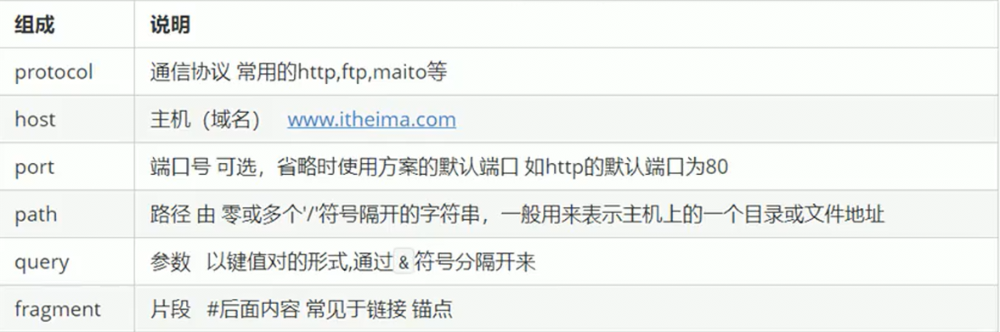
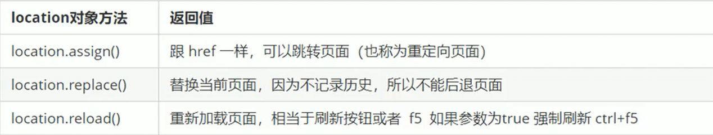

## 浏览器对象模型

浏览器对象模型（Browser Object Model）简称`BOM`，它提供了独立于内容的、可以与浏览器窗口进行互动(交互效果)的对象结构。其核心对象时 window，通过`BOM`可以操作浏览器窗口，如：弹出框、控制浏览器跳转、获取分辨率等

BOM 由一系列相关的对象构成，并且每个对象都提供了很多方法和属性

BOM 缺乏标准，JavaScript 语法的标准化组织时 ECMA，DOM 的标准化组织时 W3C，BOM 最初时 Netscape 浏览器标准的一部分

- BOM 将 浏览器当做一个对象来看待
- BOM 主要学习浏览器窗口交互的一些对象
- BOM 是浏览器厂商在各自浏览器上定义的，兼容性较差

## BOM 的构成

BOM 比 DOM 更大，它包含 DOM


- BOM 的顶级对象是 Window（即浏览器）

  + 它是 JS 访问浏览器窗口 的一个接口

  + 它是一个全局对象。定义在全局作用域中的变量、函数都会成为 window 对象的属性和方法，调用时可以省略 window

    ```js
    var num = 10;
    // 全局变量就是 window 对象的一个属性
    console.log(window.num);
    ```

  + window 下的一个特殊属性 window.name，所以定义变量时基本不使用 name 作为变量名

- document ：即 DOM 的顶级对象，用于控制页面内容

## window 对象常见事件

### 窗口加载事件

window.onload 是窗口（页面）加载事件，当文档内容完全加载完成会触发该事件（包括图像、脚本文件、CSS 文件等），就调用处理函数

使用此方法可以将 JS 代码写到页面元素的上方，因为 onload 是等页面内容加载完毕才去执行处理函数，传统注册事件方式只能写一次，多个对产生覆盖，使用事件监听注册方式没有限制

1. `window.onload = function(){}`
2. `window.addEventListener('load',function(){});`

**Tips：**和 DOM 中的 `DOMConteentLoaded`事件类似，但区别在等待加载的资源不同

### 调整窗口大小事件

`window.onresize`是调整窗口大小加载事件，当浏览器窗口大小发生改变时就调用处理函数

- 利用此事件完成响应式布局，`window.innerWidth`表示当前浏览器宽度

```js
var div = document.querySelector('div');
// 当浏览器窗口宽度小于 800 时，隐藏 div，大于 800 时显示 div
windows.addEventListener('resize',function(){
    if(window.innerWidth <= 800){
        div.style.display = 'none';
    }else{
        div.style.display = 'block';
    }
})
```

### location 对象

window 对象提供了一个**location 属性**用于**获取或设置窗体的 URL**，并且可以用于**解析 URL**。因为这个属性返回的是一个对象，所有也可以称为**location 对象**

URL 语法格式：`protocol://host[:port]/path/[?query]#fragment`



**location 对象的常用属性**：

在控制台输入`location`会返回当前页面`location`对象


**location对象常用方法**：



### navigator 对象

`navigator`对象包含有关浏览器的信息，它有很多属性，最常用的是`userAgent`，该属性返回由客户机发往服务器的`user-agent`头部的值，一般用于判断客户机是  PC 端还是移动端，以返回对应的页面

```js
if((navigator.userAgent.match(/(phone|pad|pod|iPhone|iPod|ios|iPad|Android||BlackBerry|IEMobile|JUC|Fennec|wOSBrowser|BrowserNG|WebOS|Symbian|Windows Phone)/i))){
    window.location.href= = ''; // 手机页面
}else{
    window.location.href = '';  // PC 端页面
}
```

### history 对象

window 对象提供了一个  history 对象，与浏览器历史记录进行交互。该对象包含用户（在浏览器窗口中）访问过的 URL（一般常见与 OA 系统）


## 定时器

`window.setTimeout(function（){}[, 0]`：用于设置一个定时器，该定时器在指定毫秒数到期后执行调用函数，默认 0 毫秒

`setTimeout()`也称为**回调函数 callback**，因为此函数需要等时间，时间到了才调用函数。之前的`element.addEventListener('event',function(){});`中的函数也是回调函数

```js
var btn = document.querySelector('button');
// 直接将函数写在定时器中
// 指定时间到期后，回调函数只会执行一次，就结束这个定时器
setTimeout(function(){
    conole.log(1000);
},1000);
// 将函数传入定时器中
function callback(){
    console.log('leon');
}
// 给定时器添加标识符，多个定时器方便分别
var timer1 = setTimeout(callback,1000);
setTimeout('callback()',2000);  // 不推荐

// 点击按钮停止定时器 window.clearTimeout(timeoutID);
btn.addEventListener('click',function(){
    clearTimeout(timer1);
})

```

`setInterval(function(){}[, 0])`：用于设置一个延时定时器，该定时器每隔一段时间就调用一次回调函数，默认 0 毫秒

```js
// 直接将函数写在延时定时器中
// 指定时间到期后，回调函数会执行，然后再等待指定时长，再执行...
setInterval(function(){
    conole.log(1000);
},1000);
// 将函数传入定时器中
function callback(){
    console.log('leon');
}
// 给定时器添加标识符，多个定时器方便分别
var timer1 = setInterval(callback,1000);
setInterval('callback()',2000); // 不推荐
```

清除`setInterval()`定时器

```js
var begin = document.querySelector('.begin');
var end = document.querySelector('.end');
// 定义一个全局的变量
var timer = null;
begin.addEventListener('click',function(){
    // 开启定时器后，并将定时器赋值给全局变量，方便关闭
  timer = setInterval(function(){
        console.log('1');
    },1000);
});
end.addEventListener('click',function(){
    // 关闭定时器
    clearInterval(timer);
})
```

## 元素偏移量

offset 系列相关属性可以动态获取该元素的位置(偏移)、大小等

- 获取元素距离带有定位的父元素的位置
- 获取元素自身的大小（宽度和高度）
- 注意：返回的数值都是**不带单位的**

**offset 系列常用 属性**：


offset 和 style 的区别


## 元素可视区

client 系列的相关属性用来获取元素可视区的相关信息。可以动态获取对应元素的边框大小、元素大小等

- 和 offset 系列中的 width 和 height 相比获取的不包含元素的边框


## 元素滚动

scroll 系列的相关属性可以动态获取该元素的大小、滚动距离等

- 实际大小是指元素中的内容大小

- 获取页面被卷去的上侧距离用`window.pageYOffset`

- 页面被卷去头部存在兼容问题

  1. 声明了 DTD,使用`document.documenntElement.scrollTop`

  2. 未声明 DTD,使用`document.body.scrollTop`

  3. 新方法`window.pageYOffset`和`window.pageXOffset`在 IE9 开始支持

     ```js
     function getScroll(){
         return{
             left:window.pageXOffset || document.documentElement.scrollLeft || document.body.scrollLeft || 0,
             top: window.pageYOffset || document.documentElement.scrollTop || document.body.scrollTop || 0
         };
     }
     // 使用时getScroll().left
     ```


### 三大系列对比

|      大小对比       |                               作用                                |
| :-----------------: | :---------------------------------------------------------------: |
| element.offsetWidth |    返回自身包括padding、边框、内容区的高度，返回的数值不带单位    |
| element.clientWidth | 返回自身包括padding、内容区的宽度，不包含边框，返回的数值不带单位 |
| element.scrollWidth |          返回自身实际宽度，不含边框，返回的数值不带单位           |


**主要用法：**

- `offset`系列经常用于获取元素位置：`offsetLeft`、`offsetTop`
- `client`系列经常用于获取元素大小：`clientWidth`、`clientHeight`
- `scroll`系列经常用于获取滚动距离：`scrollTop`、`scrollLeft`
- **注意：页面的滚动距离是通过`window.pageXOffset`获取的**

## 动画

核心原理：**通过定时器`setInterval()不断移动盒子位置**

**Tips：**

- 此元素必须添加定位，才能使用`element.style.left`进行移动
- 获取元素当前位置，在当前位置加一移动距离，利用定时器重复操作
- 给一个结束定时器的条件

```html
<!DOCTYPE html>
<html lang="en">
<head>
  <meta charset="UTF-8">
  <meta name="viewport" content="width=device-width, initial-scale=1.0">
  <title>Document</title>
  <style>
    div{
      // 必须使用定位
      position: absolute;
      left: 0px;
      width:100px;
      height:100px;
      background-color: wheat;
    }
  </style>
  <script>
    window.addEventListener('load',function(){
      var div = document.querySelector('div');
      var timer = setInterval(function(){
        // 移动到指定位置时清除定时器
        if(div.offsetLeft >= 400){
          clearInterval(timer);
        }
        // 获取元素当前位置 offsetLeft，在当前位置增加距离
        div.style.left = div.offsetLeft + 5 + 'px';
        // 每 30 毫秒执行一次
      },30)
    })
  </script>
</head>
<body>
  <div></div>
</body>
</html>
```

将动画封装为一个函数,方便多次调用

```js
// 将简单动画封装为函数
function animate(obj, target, callback) {
    // 防止出现定时器叠加,在每次执行前先清除定时器
    clearInterval(obj.timer);
    // 给不同函数指定不同定时器,防止当多个元素调用此函数时,混乱.也浪费了内存空间
    obj.timer = setInterval(function () {
        // 获取缓动动画的步长值: 目标值 - 当前值 / 10
        var step = (target - obj.offsetLeft) / 10;
        // 将步长值取整,如果往右走则向上取整,往左走则向下取整
        step = step > 0 ? Math.ceil(step) : Math.floor(step);
        if (obj.offsetLeft == target) {
            clearInterval(obj.timer);
            // 当定时器执行完毕才执行回调函数
            if (callback) {
                callback();
            }
        }
        // 当使用缓动动画时步长值是变化的,匀速动画,步长值是固定值
        obj.style.left = obj.offsetLeft + step + 'px';
    },30)
}
```

## JS 执行机制

JavaScript 语言的一大特点是**单线程**，即**同一时间只能做一件事**，所以 JS 中所有 认为都需要排队，前一个认为结束才会执行后一个任务，这会导致一个问题，如果前一个任务执行时间过长，就会造成阻塞（页面渲染不连贯，渲染加载阻塞）

为解决阻塞问题，利用  CPU 的计算能力，HTML5 提出 Web Worker 标准，允许 JavaScript 脚本创建多个**线程**，于是产生了**同步**和**异步**

**Tips：**同步和异步的本质区别是，各个流程的执行顺序不同


1. 先执行执行栈中的同步任务，同步任务中包含异步任务时，将异步任务提交给异步进程处理
2. 异步进程监听到触发事件就将对应的异步任务（回调函数）放入任务队列中
3. 一旦执行栈中的所有同步任务执行完毕，系统依次从任务队列中读取异步任务，被读取的异步任务结束等待状态，进入执行栈开始执行
4. 重复第三步（事件循环 event loop）

### 同步

在任务队列中的任务按顺序执行，前一个任务结束才能执行后一个任务，程序执行顺序和任务排列顺序是一致的、同步的

同步任务：都在主线程上执行，形成一条执行栈

### 异步

当前一个任务执行时间比较长，可以在这段时间执行其他任务

异步任务：JS 的异步是通过回调函数实现，一般来说，异步任务有三种类型。异步任务相关的**回调函数**添加到**任务队列**中（任务队列也称为消息队列）

- 普通事件：如`click、resize`等
- 资源加载：如`load、error`等
- 定时器：包括`setInterval、setTimeout`等

## 本地存储

特性：

- 数据存储在用户浏览器中
- 设置、读取方便，刷新页面也不会丢失数据
- 容量较大，`sessionStorage`约 5M，`localStorage`约 20M
- 只能存储字符串，可以将对象`JSON.stringify()`编码后存储

### window.sessionStorage

特点：

1. 生命周期为关闭浏览器窗口
2. 在同一窗口（页面）下数据可以共享
3. 以键值对形式存储使用数据

存储数据：`sessionStorage.setItem(key,value)`

获取数据：`sessionStorage.getItem(key)`

删除数据：`sessionStorage.removeItem(key)`

删除所有数据：`sessionStorage.clear()`

### window.localStorage

特点：

1. 生命周期永久生效，除非手动删除，否则关闭页面也会存在（浏览器设置中的站点数据）
2. 可以多窗口（页面）共享（同一浏览器可以共享）
3. 以键值对形式存储

存储数据：`localStorage.setItem(key,value)`

获取数据：`localStorage.getItem(key)`

删除数据：`localStorage.removeItem(key)`

删除所有数据：`localStorage.clear()`

```html
<!DOCTYPE html>
<html lang="en">
<head>
  <meta charset="UTF-8">
  <meta name="viewport" content="width=device-width, initial-scale=1.0">
  <title>Document</title>
</head>
<body>
  <input type="text">
  <button class="set">存储数据</button>
  <button class="get">获取数据</button>
  <button class="remove">删除数据</button>
  <button class="del">清空所有数据</button>
</body>
<script>
  var ipt = document.querySelector('input');
  var set = document.querySelector('.set');
  var get = document.querySelector('.get');
  var re = document.querySelector('.remove');
  var del = document.querySelector('.del');
  set.addEventListener('click',function(){
    sessionStorage.setItem('uname',ipt.value);
    localStorage.setItem('uname',ipt.value);
  })
  get.addEventListener('click',function(){
    alert(sessionStorage.getItem('uname'));
    alert(localStorage.getItem('uname'));
  })
  re.addEventListener('click',function(){
    sessionStorage.removeItem('uname');
    localStorage.removeItem('uname');
  })
  del.addEventListener('click',function(){
    sessionStorage.clear();
    localStorage.clear();
  })
</script>
</html>
```

## 输入输出

- `alert(msg)`：浏览器弹出警示框
- `console.log(msg)`：浏览器控制台打印输出信息
- `prompt(info)`：浏览器弹出输入框，用户可以输入，取到的值为字符型

## 常见示例写法

### 倒计时

```html
<!DOCTYPE html>
<html lang="en">
  <head>
    <meta charset="UTF-8" />
    <meta name="viewport" content="width=device-width, initial-scale=1.0" />
    <style>
      div{
        float: left;
      }
      div>div{
        width: 40px;
        height: 40px;
        margin: 5px;
        background-color: black;
        color: aliceblue;
        text-align: center;
        line-height: 40px;
        font-size: 20px;
      }
    </style>
    <title>Document</title>
  </head>
  <body>
    <div>
      <div class="hour">1</div>
      <div class="minute">2</div>
      <div class="second">3</div>
    </div>
    <script>
      var hour = document.querySelector('.hour');
      var minute = document.querySelector('.minute');
      var second = document.querySelector('.second');
      // 创建倒计时结束时间
      var inputTime = +new Date('2020-5-9 18:00:00');
      // 先执行一次函数，防止刷新时，因定时器延时导致显示不正常
      getTime();
      // 利用定时器，每隔 1 秒，更新一次时间
      setInterval(getTime,1000);
      function getTime(){
        // 获取当前系统时间，转换为毫秒数
        var nowTime = +new Date();
        // 利用当前时间减去结束时间为倒计时毫秒数，除以 1000 为秒数
        var timer = (inputTime - nowTime) / 1000;
       // 用倒计时总秒数计算倒计时小时数，取整
        var h = parseInt(timer / 60 / 60 % 60);
        // 如果小时数小于 10 在前面补 0
        h = h < 10 ? '0' + h : h;
        hour.innerHTML = h;
        var m = parseInt(timer / 60 % 60);
        m = m < 10 ? '0' + m : m;
        minute.innerHTML = m;
        var s = parseInt(timer % 60);
        s = s < 10 ?  '0' + s : s;
        second.innerHTML = s;
      }
    </script>
  </body>
</html>
```

### 验证码发送

```html
<!DOCTYPE html>
<html lang="en">
  <head>
    <meta charset="UTF-8" />
    <meta name="viewport" content="width=device-width, initial-scale=1.0" />
    <title>Document</title>
  </head>
  <body>
    <div>
      手机验证码：<input type="number"><button>发送</button>
    </div>
    <script>
      var btn = document.querySelector('button');
      // 定义倒计时时间
      var times = 3;
      btn.addEventListener('click',function(){
        // 点击后禁用按钮
        this.disabled = true;
        // 设置倒计时
        var timer = setInterval(function(){
           // 判断倒计时时间，为 0 就停止计时器，复原按钮内容、启用按钮和初始化倒计时时间
          if(times == 0){
            clearInterval(timer);
            btn.disabled = false;
            btn.innerHTML = '发送';
            times = 3;
          }else{
            // 按钮内容显示倒计时
            btn.innerHTML = '剩余时间'+times+'秒';
            times--;
          }
        },1000)
      })
    </script>
  </body>
</html>
```

### 自动跳转页面

```html
<!DOCTYPE html>
<html lang="en">
  <head>
    <meta charset="UTF-8" />
    <meta name="viewport" content="width=device-width, initial-scale=1.0" />
    <title>Document</title>
  </head>
  <body>
    <button>跳转</button>
    <div></div>
    <script>
      var btn = document.querySelector('button');
      var div = document.querySelector('div');
      var times = 10;
      btn.addEventListener('click',function(){
        location.href = 'https://www.baidu.com';
      })
      function timeout(){
        if(times == 0){
          // 必须带上协议，否则作为本地文件名处理
          location.href = 'http://www.baidu.com';
        }else{
          div.innerHTML = times + "秒后自动跳转到百度";
          times--;
        }
      }
      // 先调用一次，防止出现停顿感
      timeout();
      setInterval(timeout,1000);
    </script>
  </body>
</html>
```

### URL 参数传递

```html
<!-- login 页面用户输入 -->
<!DOCTYPE html>
<html lang="en">
<head>
    <meta charset="UTF-8">
    <meta name="viewport" content="width=device-width, initial-scale=1.0">
    <title>Document</title>
</head>
<body>
    <span>登录页面</span>
    <form action="index.html">
        用户名：<input type="text" name="uname">
        <input type="submit" value="提交">
    </form>
</body>
</html>
```

```html
<!-- index 页面获取传递过来的参数并处理 -->
<!DOCTYPE html>
<html lang="en">
  <head>
    <meta charset="UTF-8" />
    <meta name="viewport" content="width=device-width, initial-scale=1.0" />
    <title>Document</title>
  </head>
  <body>
    <div></div>
    <script>
      var div = document.querySelector('div');
      // substr()截取字符串，去掉传递过来参数的 ？，split() 按照 = 将字符串分割为数组
      div.innerHTML = location.search.substr(1).split('=')[1] + "欢迎您！";
    </script>
  </body>
</html>
```

### 实时显示鼠标在盒子中的坐标

```html
<!DOCTYPE html>
<html lang="en">
<head>
    <meta charset="UTF-8">
    <meta name="viewport" content="width=device-width, initial-scale=1.0">
    <title>Document</title>
    <style>
        .box{
            width: 200px;
            height: 200px;
            background-color: antiquewhite;
            margin: 100px;
        }
    </style>
</head>
<body>
    <div class="box"></div>
    <script>
        var box = document.querySelector(".box")
        box.addEventListener("mousemove",function(e){
            var mouseX = e.pageX - this.offsetLeft;
            var mouseY = e.pageY - this.offsetTop;
            this.innerHTML = "鼠标距离盒子左边："+mouseX+"px"+"鼠标距离盒子上边："+mouseY+"px";
        })
    </script>
</body>
</html>
```

### 模态框跟随鼠标移动

```html
<!DOCTYPE html>
<html lang="en">
<head>
    <meta charset="UTF-8">
    <meta name="viewport" content="width=device-width, initial-scale=1.0">
    <title>Document</title>
    <style>
        *{
            padding: 0px;
            margin: 0px;
        }
        .login-header{
            width: 100%;
            text-align: center;
            line-height: 40px;
            height: 40px;
            font-size: 24px;
        }
        .login{
            display: none;
            width: 512px;
            height: 280px;
            position: fixed;
            border: #ebebeb solid 1px;
            left: 50%;
            top: 50%;
            background: #ffffff;
            box-shadow: 0px 0px 20px #ddd;
            z-index: 9999;
            transform: translate(-50%,-50%);
        }
        .login-title{
            width: 100%;
            margin: 10px 0px 0px 0px;
            text-align: center;
            line-height: 40px;
            height: 40px;
            font-size: 18px;
            position: relative;
            cursor: move;
        }
        .login-input-content{
            margin-top: 20px;
        }
        .login-button{
            width: 50%;
            margin: 30pxp auto 0px auto;
            line-height: 40px;
            border: #ebebeb 1px solid;
            text-align: center;
        }
        .login-bg{
            display: none;
            width: 100%;
            height: 100%;
            position: fixed;
            top: 0px;
            left: 0px;
            background: rgba(0,0,0,0.3);
        }
        a{
            text-decoration: none;
            color: #000000;
        }
        login-button a{
            display: block;
        }
        .login-input input.list-input{
            float: left;
            line-height: 35px;
            height: 35px;
            width: 350px;
            border:#ebebeb 1px solid;
            text-indent: 5px;
        }
        .login-input{
            overflow: hidden;
            margin: 0px 0px 20px 0px;
        }
        .login-input label{
            float: left;
            width: 90px;
            padding-right: 10px;
            text-align: right;
            line-height: 35px;
            height: 35px;
            font-size: 14px;
        }
        .login-title span{
            position:absolute;
            font-size: 12px;
            right: -20px;
            top: -30px;
            background: #ffffff;
            border: #ebebeb  solid 1px;
            width: 40px;
            height: 40px;
            border-radius: 20px;
        }
    </style>
</head>
<body>
    <div class="login-header"><a id="link" href="javascript:;">点击,弹出登录框</a></div>
    <div class="login" id="login">
        <div id="title" class="login-title">登陆会员
            <span><a href="javascript:void(0);" id="closeBtn" class="close-login">关闭</a></span>
        </div>
        <div class="login-input-content">
            <div class="login-input">
                <label>用户名：</label>
                <input type="text" placeholder="请输入用户名" name="info[username]" id="username" class="list-input">
            </div>
            <div class="login-input">
                <label>登录密码：</label>
                <input type="password" placeholder="请输入密码" name="info[password]" id="password" class="list-input">
            </div>
        </div>
        <div id="loginBtn" class="login-button"><a href="javascript:void(0);" id="login-button-submite">登录会员</a></div>
    </div>
    <!-- 遮盖层 -->
    <div id="bg" class="login-bg"></div>
    <script>
        var login = document.querySelector('.login');
        var mask = document.querySelector('#bg');
        var link = document.querySelector('#link');
        var closeBtn = document.querySelector('#closeBtn');
        var title = document.querySelector('.login-title');
        link.addEventListener('click',function(){
            mask.style.display = 'block';
            login.style.display = 'block';
        })
        closeBtn.addEventListener('click',function(){
            mask.style.display = 'none';
            login.style.display = 'none';

        })
        title.addEventListener('mousedown',function(e){
            // 获取鼠标在盒子中的坐标，此坐标用于求盒子不断变化的坐标
            var x = e.pageX - login.offsetLeft;
            var y = e.pageY - login.offsetTop;
            document.addEventListener('mousemove',move)
            // 利用已知的鼠标在盒子内的坐标，求移动过程中盒子不断变化的坐标 ，记得加单位
            function move(e){
                login.style.left = e.pageX - x + 'px';
                login.style.top = e.pageY - y + 'px';
            }
            // 当鼠标松开时，移除移动事件
            document.addEventListener('mouseup',function(){
                document.removeEventListener('mousemove',move);
            })
        })
    </script>
</body>
</html>
```

### 京东放大镜效果

```html
<!-- HTML文件，用引入js文件方式 -->
<!DOCTYPE html>
<html lang="en">
<head>
    <meta charset="UTF-8">
    <meta name="viewport" content="width=device-width, initial-scale=1.0">
    <script src="js/test.js"></script>
    <title>Document</title>
    <style>
        .box{
            position: relative ;
            width: 500px;
            height: 500px;
            border: 1px solid red;
            left: 100px;
            top: 100px;
        }
        .box>img{
            position: absolute;
            width: 300px;
            height: 400px;
            top: 50px;
            left: 100px;
        }
        .bg{
            display: none;
            position: absolute;
            width: 200px;
            height: 200px;
            top:0p;
            left: 0px;
            background-color: yellowgreen;
            opacity: .5;
            cursor:move;
        }
        .big{
            display: none;
            position:absolute;
            width: 700px;
            height: 700px;
            top: 0px;
            left: 510px;
            overflow: hidden;
            z-index: 9999;
        }
        .big-img{
            width: 1400px;
            height: 1400px;
            position: absolute;
            top: 0px;
            left: 0px;
        }
    </style>
    <script type="test/javascript" src="js/test.js"></script>
</head>
<body>
    <div class="box">
        
        <div class="bg"></div>
        <div class="big">
            
        </div>
    </div>
</body>
</html>
```

```js
// 被引入的 JS 文件在 js文件夹下的 test.js
window.addEventListener('load', function() {
    this.console.log('123');
    var box = document.querySelector('.box');
    var bg = document.querySelector('.bg');
    var big = document.querySelector('.big');
    var bigImg = document.querySelector('.big-img');
    // 当鼠标移动到盒子上时显示遮盖层和大图片
    box.addEventListener('mouseover', function() {
        bg.style.display = 'block';
        big.style.display = 'block';
    })
    // 当鼠标离开盒子时隐藏遮盖层和大图片
    box.addEventListener('mouseout', function() {
        bg.style.display = 'none';
        big.style.display = 'none';
    })
    // 当鼠标在小盒子中移动时，遮盖层和大图片随之移动
    box.addEventListener('mousemove', function (e) {
        // 让遮盖层在盒子中跟随鼠标移动
        // 获取鼠标在盒子中的坐标，用鼠标在页面中的坐标 - 盒子在页面中的距离
        var y = e.pageY - box.offsetLeft;
        var x = e.pageX - box.offsetTop;
        // 获取鼠标在遮盖层中心时遮盖层在盒子中的坐标 用鼠标在盒子中的坐标 - 遮盖层一半的距离
        bgX = x - bg.offsetWidth / 2;
        bgY = y - bg.offsetHeight / 2;
       // 获取遮盖层最大移动距离，盒子的宽度或高度 - 遮盖层的宽度或高度
        var maxBgX = this.offsetWidth - bg.offsetWidth;
        var maxBgY = this.offsetHeight - bg.offsetHeight;
        // 让遮盖层不超过盒子，获取遮盖层的移动距离
        if (bgX <= 0) {
            bgX = 0;
        } else if (bgX >= maxBgX) {
            bgX = maxBgX;
        }
        if (bgY <= 0) {
            bgY = 0;
        } else if (bgY >= maxBgY) {
            bgY = maxBgY;
        }
        bg.style.top = bgY + 'px';
        bg.style.left = bgX + 'px';
        //让大图片跟着遮盖层的移动而移动
        // 大图片的最大移动距离 = 图片的高度或宽度 - 大盒子的高度或宽度
        var bigMaxX = bigImg.offsetWidth - big.offsetWidth;
        var bigMaxY = bigImg.offsetHeight - big.offsetHeight
        // 大图片移动距离 = 遮盖层移动距离 * 大图片最大移动距离 / 遮盖层最大移动距离
        var bigX = bgX * bigMaxX / maxBgX;
        var bigY = bgY * bigMaxY / maxBgY;
        bigImg.style.left = -bigX + 'px';
        bigImg.style.top = -bigY + 'px';
    })
}
```

### 盒子滑动和导航滑动

```html
<!DOCTYPE html>
<html lang="en">
<head>
  <meta charset="UTF-8">
  <meta name="viewport" content="width=device-width, initial-scale=1.0">
  // 引入封装好的动画函数文件
  <script src="js/animate.js"></script>
  <title>Document</title>
  <style>
    .box {
      position: absolute;
      top: 100px;
      left: 0px;
      width: 100px;
      height: 100px;
      background-color: wheat;
    }
    button {
      float: left;
      display: block;
      height: 30px;
    }
    .sliderbar {
      position: fixed;
      top: 200px;
      right: 0px;
      height: 40px;
    }
    span {
      position: absolute;
      left: -40px;
      display: block;
      width: 40px;
      height: 40px;
      text-align: center;
      line-height: 40px;
      background-color: purple;
      z-index: 999;
    }
    .con {
      position: absolute;
      left: 0px;
      width: 120px;
      height: 40px;
      text-align: center;
      line-height: 40px;
      background-color: purple;
    }
  </style>
</head>
<body>
  <button class="btn500">500</button>
  <button class="btn800">800</button>
  <div class=".box"></div>

  <div class="sliderbar">
    <span><-</span>
    <div class="con">问题反馈</div>
  </div>
</body>
<script>
  var div = document.querySelector('.box');
  var btn5 = document.querySelector('.btn500');
  var btn8 = document.querySelector('.btn800');
  btn5.addEventListener('click', function () {
    animate(div, 500);
  })
  btn8.addEventListener('click', function () {
    animate(div, 800);
  })
  var sliderbar = document.querySelector('.sliderbar');
  var con = document.querySelector('.con');
  var span = document.querySelector('span');
  sliderbar.addEventListener('mouseenter',function(){
    animate(con,-160,function(){
      span.innerHTML = "->";
    });
  })
  sliderbar.addEventListener('mouseleave',function(){
    animate(con,0,function(){
      span.innerHTML = "<-";
    });
  })
</script>
</html>
```

### PC 轮播图

html 文件

```html
<!DOCTYPE html>
<html lang="en">
<head>
  <meta charset="UTF-8">
  <meta name="viewport" content="width=device-width, initial-scale=1.0">
  <script src="js/animate.js"></script>
  <script src="js/index.js"></script>
  <title>Document</title>
  <style>
    * {
      margin: 0;
      padding: 0;
    }
    .main>a {
      display: block;
      width: 20px;
      height: 20px;
      text-decoration: none;
      color: oldlace;
      text-align: center;
      line-height: 20px;
      font-size: 18px;
    }
    img {
      width: 500px;
      height: 400px;
    }
    .main {
      position: relative;
      width: 500px;
      height: 400px;
      background-color: purple;
      overflow: hidden;
    }
    .arrow-l {
      display: none;
      position: absolute;
      top: 190px;
      left: 0;
      border-radius: 0px 10px 10px 0px;
      background-color: rgb(204, 204, 204, 0.5);
      z-index: 999;
    }
    .arrow-r {
      display: none;
      position: absolute;
      top: 190px;
      right: 0;
      border-radius: 10px 0px 0px 10px;
      background-color: rgb(204, 204, 204, 0.5);
      z-index: 999;
    }
    ul {
      position: absolute;
      top: 0px;
      left: 0px;
      width: 500%;
    }
    li {
      list-style: none;
      float: left;
    }
    ol {
      position: absolute;
      bottom: 10px;
      left: 20px;
    }
    ol>li {
      display: block;
      width: 10px;
      height: 10px;
      border: 1px solid #cccccc;
      border-radius: 50%;
      margin-left: 5px;
    }
    .current {
      background-color: aquamarine;
    }
  </style>
</head>
<body>
  <div class="main">
    <a href="javascript:;" class="arrow-l">&lt;</a>
    <a href="javascript:;" class="arrow-r">&gt;</a>
    <ul>
      <li><a href="javascript:;"></a></li>
      <li><a href="javascript:;"></a></li>
      <li><a href="javascript:;"></a></li>
      <li><a href="javascript:;"></a></li>
    </ul>
    <ol class="circle">
    </ol>
  </div>
</body>
</html>
```

js 文件

```js
window.addEventListener('load', function () {
    var main = document.querySelector('.main');
    var arrow_l = document.querySelector('.arrow-l');
    var arrow_r = document.querySelector('.arrow-r');
    // 当鼠标进入轮播图时箭头显示,离开时箭头隐藏
    main.addEventListener('mouseenter', function () {
        arrow_l.style.display = 'block';
        arrow_r.style.display = 'block';
        // 当鼠标进入时,清除定时器
        clearInterval(timer);
        // 将定时器置空
        timer = null;
    })
    main.addEventListener('mouseleave', function () {
        arrow_l.style.display = 'none';
        arrow_r.style.display = 'none';
        // 当鼠标离开时开启定时器
        timer = setInterval(function () {
            arrow_r.click();
        },3000)
    })
    var ul = document.querySelector('ul');
    var ol = document.querySelector('.circle');
    var mainWidth = main.offsetWidth;
    // 动态生成小圆圈
    for (var i = 0; i < ul.children.length; i++) {
        // 创建元素
        var li = document.createElement('li');
        // 给创建的元素添加索引属性
        li.setAttribute('index', i);
        // 将创建的元素添加到 ol 中
        ol.appendChild(li);
        // 给创建的元素监听点击事件
        li.addEventListener('click', function () {
            // 排他思想,设置背景
            for (var i = 0; i < ol.children.length; i++) {
                ol.children[i].className = '';
            }
            this.className = 'current';
            // 点击小圆圈显示对应的图片 小圆圈的索引号 * 盒子的宽度  向左移动所以是负值
            var index = this.getAttribute('index')
            animate(ul, -index * mainWidth);
            // 点击小圆圈时,图片索引和小圆圈索引同样发生变化
            num = circle = index;
        })
    }
    // 默认给第一个小圆圈设置背景
    ol.children[0].className = 'current';
    // 克隆第一张
    var first = ul.children[0].cloneNode(true);
    // 将克隆的节点添加到 ul 最后面
    ul.appendChild(first);
    // num 用于箭头点击时设定当前点击的第几个图片
    var num = 0;
    // circle 用于箭头点击时,设定当前图片对应的小圆圈
    var circle = 0;
    // 节流阀标志位
    var flag = true;
    // 给箭头监听点击事件
    arrow_l.addEventListener('click', function () {
        // 多次点击箭头会导致切换过快,使用节流阀当一次动画函数结束后才能进行下一次切换
        if (flag) {
            // 当开始执行动画时关闭节流阀
            flag = false;
            // num记录当前时第几张图片
            if (num == 0) {
                // 当第一张图片时,跳转到最后一张图片,同时将num设置为最后一张图片的标记
                num = ul.children.length - 1;
                ul.style.left = -num * mainWidth + 'px';
            }
            // 每次点击后 num 减一
            num--;
            // 执行切换动画
            animate(ul, -num * mainWidth, function () {
                // 利用回调函数,当一次动画结束后,开启节流阀
                flag = true;
            });
            // 小圆圈的索引
            circle--;
            // if (circle < 0) {
            //     circle = ol.children.length - 1;
            // }
            // 如果小圆圈的索引小于 0 ,表示小圆圈应显示最后一位
            circle = circle < 0 ? ol.children.length - 1 : circle;
            // 执行小圆圈背景切换
            circleChange();
        }
    })
    arrow_r.addEventListener('click', function () {
        // 节流阀，也称为互斥锁
        if (flag) {
            // 关闭节流阀
            flag = false;
            //  当最后一张图片时,跳转到第一张图片,同时将num设置为第一张图片的标记
            if (num == ul.children.length - 1) {
                ul.style.left = 0;
                num = 0;
            }
            // 每次点击后 num 加一
            num++;
            // 执行切换动画
            animate(ul, -num * mainWidth, function () {
                // 开启节流阀
                flag = true;
            });
            // 小圆圈的索引
            circle++;
            // if (circle == ol.children.length) {
            //     circle = 0;
            // }
            // 如果小圆圈的索引大于最后一位 ,表示小圆圈应显示第一位
            circle = circle == ol.children.length ? 0 : circle;
            // 执行小圆圈背景切换
            circleChange();
        }
    })
    // 设置一个每隔3秒自动切换的定时器
    var timer = setInterval(function () {
        // 手动调用点击事件
        arrow_r.click();
    },3000)
    // 每次点击箭头切换图片时,下方小圆圈的背景改变
    function circleChange() {
        for (var i = 0; i < ol.children.length; i++) {
            ol.children[i].className = '';
        }
        ol.children[circle].className = 'current';
    }
})
```

动画函数

```js
// 将简单动画封装为函数
function animate(obj, target, callback) {
    // 防止出现定时器叠加,在每次执行前先清除定时器
    clearInterval(obj.timer);
    // 给不同函数指定不同定时器,防止当多个元素调用此函数时,混乱.也浪费了内存空间
    obj.timer = setInterval(function () {
        // 获取缓动动画的步长值: 目标值 - 当前值 / 10
        var step = (target - obj.offsetLeft) / 10;
        // 将步长值取整,如果往右走则向上取整,往左走则向下取整
        step = step > 0 ? Math.ceil(step) : Math.floor(step);
        if (obj.offsetLeft == target) {
            clearInterval(obj.timer);
            // 当定时器执行完毕才执行回调函数
            // if (callback) {
            //     callback();
            // }
            // 短路运算,如果存在回调函数就执行,没有则不执行
            callback && callback();
        }
        // 当使用缓动动画时步长值是变化的,匀速动画,步长值是固定值
        obj.style.left = obj.offsetLeft + step + 'px';
    }, 30)
}
```

### 仿淘宝侧边导航

```html
<!DOCTYPE html>
<html lang="en">

<head>
  <meta charset="UTF-8">
  <meta name="viewport" content="width=device-width, initial-scale=1.0">
  <style>
    .content {

      width: 80%;
      height: 3000px;
      margin: 0 auto;
    }
    .header {
      height: 200px;
      width: 100%;
      background-color: blueviolet;
      margin-top: 5px;
    }
    .banner {
      height: 300px;
      width: 100%;
      background-color: cadetblue;
      margin-top: 5px;
    }
    .body {
      height: 100%;
      width: 100%;
      background-color: darkgoldenrod;
      margin-top: 5px;
    }
    .nav {
      position: absolute;
      top: 300px;
      right: 40px;
      width: 40px;
      height: 200px;
      background-color: darkolivegreen;
    }
    .go-back {
      width: 40px;
      height: 40px;
      text-align: center;
      font-size: 16px;
    }
    .go-back{
      display: none;
    }
  </style>
  <title>Document</title>
</head>

<body>
  <div class="content">
    <div class="header">头部位置</div>
    <div class="banner">banner位置</div>
    <div class="body">主体位置</div>
    <div class="nav">
      <div class="go-back">返回顶部</div>
    </div>
  </div>
</body>
<script>
  var nav = document.querySelector('.nav');
  var goBack = document.querySelector('.go-back');
  var banner  = document.querySelector('.banner');
  var body = document.querySelector('.body');
  var navTop = nav.offsetTop - banner.offsetTop;
  document.addEventListener('scroll',function(){
    if(window.pageYOffset >= banner.offsetTop){
      nav.style.top = navTop + 'px';
      nav.style.position = 'fixed';
    }else{
      nav.style.top = '300px';
      nav.style.position = 'absolute';
    }
    if(window.pageYOffset >= body.offsetTop){
      goBack.style.display = 'block';
    }else{
      goBack.style.display = 'none';
    }
  })
  goBack.addEventListener('click', function () {
    animate(window, 0);
  })
  // 将动画函数复制过来进行简单修改
  function animate(obj, target) {
    clearInterval(obj.timer);
    obj.timer = setInterval(function () {
      var step = (target - window.pageYOffset) / 10;
      step = step > 0 ? Math.ceil(step) : Math.floor(step);
      if (obj.offsetLeft == target) {
        clearInterval(obj.timer);
      }
      window.scroll(0, window.pageYOffset + step);
    }, 30)
  }
</script>
</html>
```
