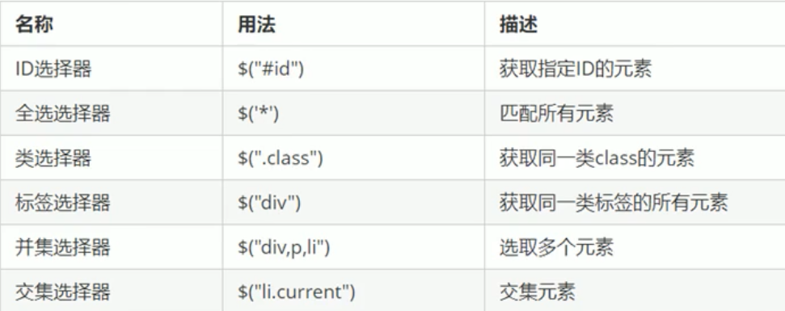
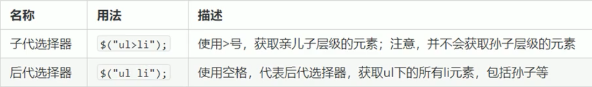
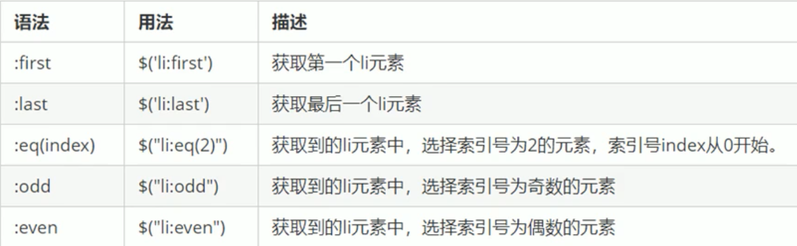
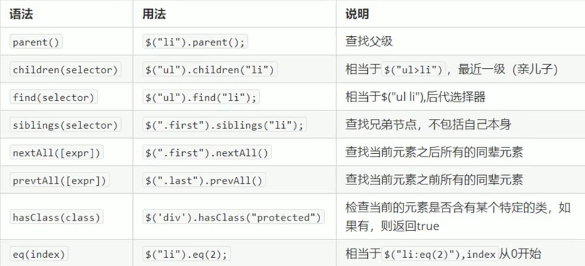
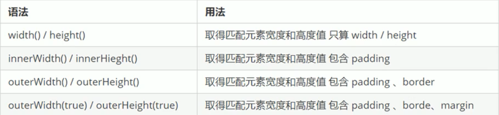

## 概述

[jQuery](https://jquery.com  "jQuery 官网") 是一个快速、简洁的 JavaScript 库，其设计宗旨是"write Less, Do More"，即倡导写更少的代码，做更多的事

jQuery 封装了 JavaScript 常用的功能代码，优化了 DOM 操作、事件处理、动画设计、Ajax 交互

学习 jQuery 就是学习调用其封装的函数（方法）

jQuery 的目的是加快前端人员的开发速度，方便调用和使用，提高开发效率

**优点：**

- 轻量级：核心文件只有几十 kb，不会影响页面加载速度
- 跨浏览器兼容：基本兼容现在主流的浏览器
- 链式编程、隐式迭代
- 对事件、样式、动画支持，简化 DOM 操作
- 支持插件扩展开发：有丰富的第三方插件，如树形菜单、日期控件、轮播图等
- 免费、开源

版本：

- 1x：兼容 IE 678 等低版本浏览器，官网不再更新
- 2x：不兼容 IE 678 等低版本浏览器，官网不再更新
- 3x：不兼容IE 678 等低版本浏览器，官网主要维护更新的版本

使用方法：将 jQuery 代码复制到本地文件，然后在要使用的文件中引入即可

## 入口函数

等 DOM 结构渲染完毕即可执行内部代码，不必等所有外部资源加载完成。相当于原生 JS 中的`DOMContentLoaded`，不同于原生 JS 中的`load`事件是等页面文档、外部 js 文件、css 文件、图片等加载完毕才执行内部代码

```js
$(function(){
   ... // 此处是页面 DOM 加载完成的入口
});
$(document).ready(function(){
    ... // 此处是页面 DOM 加载完成的入口
})
```

## jQuery 的顶级对象

`$`是`jQuery`的别称，也是`jQuery`中的顶级对象，相当于原生 JS 中的`window`。把元素利用`$`包装成`jQuery`对象，就可以调用`jQuery`的方法

## jQuery 对象和 DOM 对象

`jQuery`对象：使用 `jQuery`方式获取过来的对象是 jQuery 对象，本质是通过`$`把 DOM 元素进行了包装，只能使用 jQuery 方法

`DOM`对象：使用原生 JS 获取的对象就是 DOM 对象，只能使用原生 JS 的属性和方法

**jQuery 对象和 DOM 对象的互相转换**：因为原生 JS 比 jQuery 更大，原生的一些属性和方法 jQuery 并没有封装，要想使用这些属性和方法需要将 jQuery 对象转换为 DOM 对象才能使用

- DOM 对象转为 jQuery 对象：`$(DOM对象)`

- jQuery 对象转为 DOM 对象：

  + `$()[index]`
  + `$().get(index)`

  ```html
  <!DOCTYPE html>
  <html lang="en">
  <head>
    <meta charset="UTF-8">
    <meta name="viewport" content="width=device-width, initial-scale=1.0">
    <script src="js/jquery.min.js"></script>
    <title>Document</title>
  </head>
  <body>
    <!-- muted是因为chrome中自动播放必须静音 controls是显示控件-->
    <video src="video/1.mp4" muted controls></video>
  </body>
  <script>
    // DOM 对象
    var myvideo = document.querySelector('video');
    // 将 DOM 对象转为 jQuery 对象, hide()方法是 jQuery 方法,原生 DOM 对象没有此方法
    $(myvideo).hide();
    // 将 jQuery 对象转为 DOM 对象, play()方法是 DOM 对象的方法,jQuery 对象没有此方法
    $('video')[0].play();
    $('video').get(0).play();
  </script>
  </html>
  ```

## 选择器

### 隐式迭代

遍历内部 DOM 元素（以伪数组形式存储）的过程就叫**隐式迭代**

jQuery 选择器，获取到的元素是一个伪数组，当直接对这个伪数组进行操作时，会默认给这个伪数组中的所有元素进行循环遍历，执行相应的方法，而不用手动进行循环，简化了操作，方便调用

```html
<!DOCTYPE html>
<html lang="en">
<head>
  <meta charset="UTF-8">
  <meta name="viewport" content="width=device-width, initial-scale=1.0">
  <script src="js/jquery.min.js"></script>
  <title>Document</title>
</head>
<body>
  <div>第一</div>
  <div>第二</div>
  <div>第三</div>
</body>
  <script>
    $(function(){
      // 隐式迭代的存在,会将所有div背景设置为 pink
      $('div').css('background','pink');
      // 利用筛选选择器，选取特定的元素设置背景颜色
      $('div:first').css('background','blue');
      // 利用筛选，选取特定元素设置字体大小
      $('div').eq(2).css('fontSize',16);
      // 将 jquery 对象转为 DOM 对象设置单个背景颜色
      $('div')[1].style.backgroundColor = 'red';
    })
  </script>
</html>
```

### 基础选择器

`$('selectorName')`：直接写 CSS 选择器



### 层级选择器



### 筛选选择器



### 筛选方法



返回指定的祖先元素：`parents("selectorName")`

## 样式操作

jQuery 可以使用`css()`方法来获取、修改简单元素样式，也可以操作类，修改多个样式

获取属性值：`$(this).css('color');`参数只写属性名，则返回属性值

修改属性值：`$(this).css('color','red');`参数是属性名、属性值，用逗号隔开，值如果是数字可以不用跟单位（默认是 px）和引号

修改多个属性值：`$(this).css({width:400,backgroundColor:'red'});`当传递多个属性和值时，用大括号包裹，每组属性和属性值以键值对形式存放，用逗号隔开，属性名可以不加引号

### 类样式操作

作用等同于原生 JS 的`classList`对象

添加类：`addClass()`

删除类：`removeClass()`

切换类：`toggleClass()`

## 属性操作

### 固有属性值

元素固有属性是指，元素本身自带的属性。

获取：`prop("attributeName")`

设置：`prop("attributeName","attributeValue")`

### 自定义属性

开发者自己设置的属性，也可获取 H5 新增的自定义属性

获取：`attr("attributeName")`

设置：`attr("attributeName","attributeValue")`

## 数据缓存

不会在 DOM  上显示，将数据存放在内存中，相当于将元素作为对象名，将内容作为对象的属性进行存储

此方法还可以用于获取 H5 新增的自定义属性，此方法获取 H5 自定义属性，不需要添加`data-`头

获取：`data("attributeName")`

设置：`data("attributeName","attributeValue")`

## 内容文本值

### 普通元素内容

相当于原生的`innerHTML`

获取：`html()`

设置：`html("contents")`

### 普通元素的文本内容

相当于原生的`innerText`

获取：`text()`

设置：`text("contents")`

### 表单元素的值

获取：`val()`

设置：`val("contents")`

## 元素操作

### 遍历

jQuery 隐式迭代是对同一类元素做同样操作，如果要对同一类操作做不同操作，就需要遍历

`each(function(index,domEle){})`

- 回调函数的两个参数，第一个是索引号，第二个是**DOM 元素对象**
- 如果要对指定的对象进行操作，因为是**DOM 元素对象**，所以只能使用 DOM 元素的方法，要使用 jQuery 对象的方法，需要先使用`$()`转为 jQuery 对象

```js
$(function(){
    $('div').each(function(i,domEle){
        var arr = ["red",
"blue","green"];
        console.log(i); // 索引号
        // 先转为 jQuery 对象，再使用 jQuery 对象的方法
        $(domEle).css("color",arr[i]);
    })
})
```

`$.each(object,function(index,element){})`

- 也可以用于遍历同一类元素，但一般用于遍历数据，处理数据

```js
$(function(){
    $.each('div',function(index,ele){
        console.log(index);
        console.log(ele);
    });
    // 用于处理数据
    var arr = ['a','b','c'];
    $.each(arr,function(index,ele){
        console.log(index);
        console.log(ele);
    });
    $.each({uname:'leon',age:18},function(index,ele){
        console.log(index);
        console.log(ele);
    })
})
```

### 创建

`$("<li></li>")`：动态创建一个 li 标签，也可以在创建时给标签内添加内容

### 添加

### 内部添加

内部添加元素，生成后，它们是父子关系

`element.append("contents");`：将内容放入到指定元素内部的最后面，类似原生 JS 中的`appendChild`

`element.prepend("contents");`：将内容放入到指定元素内部的最前面

### 外部添加

外部添加元素，生成后，它们是兄弟关系

`element.after("contents");`：将内容放入到指定元素的后面

`element.before("contents");`：将内容放入到指定元素的前面

### 删除

`element.remove();`：删除元素本身

`element.empty();`：删除指定元素的子节点

`element.html("");`：利用空将指定元素里的内容清空

## 尺寸和位置操作

### 尺寸

不传值是获取,传值是修改,不用带单位



### 位置

设置或获取元素偏移

`offset()`：返回指定元素**相对于文档**的偏移坐标，跟父级没有关系

- 该方法有两个属性：`top`用于获取距离文档顶部的距离，`left`用于获取距离文档左侧的距离

`offset({top:num,left:num})`：设置指定元素**相对于文档**的偏移坐标，跟父级没有关系

`positionn()`：返回指定元素**相对于带有定位的父级元素**的偏移坐标，如果所有父级都没有定位，则返回相对于文档的偏移坐标。**此方法只能获取不能设置**

设置或获取元素被卷去的头部和被卷去的左侧

`scrollTop()`：获取被卷去的头部距离，如果传参则是滚动到指定元素头部被卷去的距离

`scrollLeft()`：获取被卷去的左侧距离，如果传参则是滚动到指定元素左侧被卷去的距离

```js
$(function(){
    var boxTop = $("div").offset().top;
    // 为窗口添加滚动事件
    $(window).scroll(function(){
        // 获取文档被卷去的头部的距离
        if(($document).scrollTop() >= boxTop){
            alert("你已经超过盒子了");
        }
    });
});
```

## jQuery 事件

### 事件注册

单个事件注册：`element.event(function(){});`

> 其他事件基本和原生一致：
>
> click、mouseenter、mouseleave、mouseover、mouseout、blur、focus、change、keydown、keyup、resize、scroll等

**Tips：**普通的单事件绑定无法给动态创建的元素进行绑定事件

### 事件处理

绑定多个事件：`element.on(events,[selector,]fn);`

- `events`：一个或多个用空格隔开的事件类型**用一对引号包裹**
- `selector`：元素的子元素选择器
- `fn`：回调函数，即绑定在元素上的侦听函数
- 也可以传入一个对象，对象中的 key 为事件类型，value 为事件处理函数。以此为同一个对象绑定多个事件类型，多个事件处理程序
- 利用子元素选择器可以实现事件委托（委派）
- on 可以给动态创建的元素进行绑定事件

```js
// 一个元素对象绑定多个事件类型和多个事件处理程序
$("div").on({
    click:function(){
        $(this).css("background","blue");
    },
    mouseenter:function(){
        $(this).css("background","red");
    },
    mouseleave:function(){
        alert("go");
    }
});
// 一个元素对象绑定多个事件类型触发同一个事件处理程序
$("div").on("mouseenter mouseleave",function(){
    $(this).toggleClass("current");
})
// 将事件绑定在父元素，触发对象设置为子元素，实现事件委托
// 利用子元素选择器将触发对象设置为 ul 中的子元素 li
$("ul").on("click","li",function(){
    alert("1");
})
// 给动态创建的元素绑定事件
$("ol").on("click","li",function(){
    alert("1");
})
var li = $("<li>动态创建的 li 标签</li>");
$("ol").append(li);
```

移除通过`on()`方法添加的事件处理程序：`off(events,[selector,]fn)`

- 如果`element.off()`中未传递参数，则默认解除指定元素身上绑定的所有事件，如果传递的参数是一个或多个事件类型，则解除指定元素绑定的指定事件类型
- 要解除事件委托，需要将委托的子元素也添加到参数中

绑定事件只能触发一次：`one(events,[selector,]fn)`

> 如果希望绑定的事件只能触发一次，jQuery 中可以使用`one()`方法来注册事件，不用进行绑定-解绑这么麻烦

事件的自动触发

1. `element.click();`：会触发元素的默认事件
2. `element.trigger("event")`：会触发元素的默认事件
3. `element.triggerHandler("event")`：不会触发元素的默认事件

```js
// 当输入框获取焦点后，输入框中的值自动输入为Hello
$("input").on("focus",function(){
    $(this).val("Hello");
})
// 自动触发事件
$("input").focus();
// 会触发元素默认事件，如输入框获取焦点后的光标闪烁
$("input").trigger("focus");
// 不会触发元素默认事件，输入框获取焦点后光标不会闪烁
$("input").triggerHandler("focus");
```

### 事件对象

和原生 JS 基本一致

- 阻止元素默认行为：`event.preventDefault();`或者`return false;`
- 阻止冒泡：`event.stopPropagation();`

## jQuery 效果

### 事件切换

`hover([over,]out)`

- `over`：鼠标移到元素上要触发的函数（相当于 mouseenter）
- `out`：鼠标移出元素要触发的函数（相当于 mouseleave）
- 如果只写一个函数则，鼠标经过和离开都会触发

```js
// 以示例中的鼠标经过显示下拉菜单为例
// 两个函数
$(function(){
    $('.nav>li').hover(function(){
        $(this).children('ul').slideDown(200);
    },function(){
        $(this).children('ul').slideUp(200);
    });
})
// 一个函数
$(function(){
    $('.nav>li').hover(function(){
        // 使用 stop() 停止动画排队
        $(this).children('ul').stop().slideToggle(200);
    });
})
```

### 元素值改变事件

此事件只适用于文本域、textarea、select元素，当用于 select元素时，选项发生变化就会触发（如checkbox的选中状态），当用于 textfield 和 textarea 时，元素失去焦点时会触发

`change([[data],fn])`

- `data`：传入 fn 函数处理的数据
- `fn`：事件处理函数

全选按钮和单选按钮

```js
$(function(){
    $('thead input').change(function(){
        $('tbody input').prop("checked",$(this).prop('checked'));
    })
    $('#s_box input').change(function(){
        // :checked 匹配被选中的元素，select元素的一种选择器
        if($('#s_box input:checked').length == $('#s_box input').length){
            $('thead input').prop("checked",true);
        }else{
            $('thead input').prop("checked",false);
        }
    })
})
```

### 动画队列及其停止排队方法

动画或效果队列：动画或效果一旦触发就会执行，如果多次触发，就造成多个动画或效果排队执行

停止排队：`stop()`，此方法必须写在效果或动画的前面，用于停止当前效果或动画的**前一个动画或效果**。如果写在后面会导致当前动画或效果不执行

### 显示隐藏

显示：`show([speed,[easing],[fn]])`，参数可以都省略，无动画直接显示。

- `speed`：三种预定速度之一的字符串`"slow"、"normal"、"fast"`，或者是表示动画时长的毫秒数，如：1000
- `easing`：用来指定切换效果，默认是`swing`，可选参数`linear`
- `fn`：回调函数，当动画完成时执行的函数，每个元素执行一次

隐藏：`hide([speed,[easing],[fn]])`，参数含义同上

切换：`toggle([speed,[easing],[fn]])`，参数含义同上

### 滑动显示隐藏

`slideDown([speed,[easing],[fn]])`，参数含义同上

`slideUp([speed,[easing],[fn]])`，参数含义同上

`slideToggle([speed,[easing],[fn]])`，参数含义同上

### 淡入淡出

`fadeIn([speed,[easing],[fn]])`，参数含义同上

`fadeOut([speed,[easing],[fn]])`，参数含义同上

`fadeTogle([speed,[easing],[fn]])`，参数含义同上

`fadeTo(speed,opacity[,[easing],[fn]])`，参数含义同上

- `opacity`：透明度，必须填写，取值在 0~1 之间
- `speed`：必须填写

### 自定义动画

`animate(params,[speed],[easing],[fn])`：动画不能针对`document`，只能是具体元素。如在设置窗口滚动是应使用`body,html`

- `params`：要修改的样式属性，以对象形式传递，必须填写，属性名可以不带引号，如果是复合属性则采取驼峰命名法，其余参数同上可省略

```html
<!DOCTYPE html>
<html lang="en">
<head>
  <meta charset="UTF-8">
  <meta name="viewport" content="width=device-width, initial-scale=1.0">
  <script src="js/jquery.min.js"></script>
  <style>
    div{
      position: absolute;
      width: 200px;
      height: 200px;
      background-color: aquamarine;
    }
  </style>
  <title>Document</title>
</head>
<body>
  <button>动画测试</button>
  <div></div>
  <script>
    $(function(){
      $('button').click(function(){
        $('div').animate({
          top:200,
          left:500,
          width:300,
          opacity:0.5
        },3000)
      })
    })
  </script>
</body>
</html>
```

## jQuery 其他方法

### 对象拷贝

将某个对象的值拷贝（合并）给另一个对象：`$.extend([deep,]target,object1[,objectN]);`

- `deep`：布尔值，true 为深拷贝，false 为浅拷贝，默认 false。

  + 如果被拷贝对象中有**复杂数据类型**，浅拷贝是将该**复杂数据类型的地址**拷贝给目标对象（要拷贝的对象），**修改目标对象中的复杂数据类型中的值会影响被拷贝对象中复杂数据类型的值**
  + 深拷贝是在堆中再开辟一片空间，将被拷贝对象的复杂数据类型的值复制一份放入新开辟的空间。此时目标对象中拷贝过来的复杂数据类型是指向一片新的内存空间，所以**修改目标对象中的复杂数据类型中的值不会影响被拷贝对象中复杂数据类型的值**
- `target`：目标对象，即要拷贝的对象
- `object`：被拷贝的对象，可以有多个，用逗号隔开
- 如果目标对象中存在和被拷贝对象中有一样的数据，被拷贝对象中的数据会覆盖目标对象中一样的数据，如果有多个被拷贝对象，后面的相同数据会覆盖前面的
- 如果目标对象和被拷贝对象存在 key 相同的复杂数据类型，但复杂数据类型中的值中的 key 不相同，浅拷贝也会直接覆盖目标对象中的复杂数据类型（因为它拷贝的是地址），但深拷贝会进行合并，复杂数据类型中的 key 相同的覆盖，不同的保留

```js
// 目标对象
var targetObj = {
    id:0,
    uname:"leon"
};
// 被拷贝对象
var obj1 = {
    id:1,
    uname:"bob",
    age:18,
    msg:{
        txt:"hello world"
    }
};
var obj2 = {
    id:2
};
// 浅拷贝，目标对象中的 id 和 uname 的值会被覆盖
$.extend(targetObj,obj1);
// 修改目标对象中复杂数据类型中的值，此时 obj1 中也会发生改变
targetObj.msg.txt = "fuck";
// 深拷贝，目标对象中的 id 和 uname 的值会被覆盖
$.extend(true,targetObj,obj1);
// 修改目标对象中复杂数据类型中的值，此时 obj1 中不会发生改变
targetObj.msg.txt = "fuck";
// 拷贝多个对象，后面相同的数据会覆盖前面的
$.extend(targetObj,obj1,obj2);

// 目标对象和被拷贝对象中存在 key 一样的复杂数据类型
var targetObj = {
    msg:{
        id:1,
        uname:"leon"
    }
};
var obj1 = {
    msg:{
        id:2
    }
};
// 浅拷贝，直接覆盖，目标对象中中复杂数据类型和被拷贝对象一样
$.extend(targetObj,obj1);
// 深拷贝，相同的覆盖，不同的合并
$.extend(true,targetObj,obj1);
```

### 多库共存

jQuery 使用`$`作为标识符，如果引入的其他 js 库也使用`$`作为标识符，就会引起冲突，要解决这种冲突，使 jQuery 和其他 js 库能同时存在就使**多库共存**

解决方法：

1. 将`$`符合统一改为`jQuery`
2. 使用`var char = $.noConflict();`释放 jQuery 对`$`符的控制权，由开发者指定的`char`进行代替。`$`也可以是`jQuery`

## 插件

jQuery 的功能有限，要实现复杂特效效果，可以借助插件完成

**Tips：jQuery 的插件也是依赖 jQuery 的，所以必须先引入 jQuery，再引入插件**。

常用 jQuery 插件网站：

1. [jQuery 插件库](http://www.jq22.com/ "需要会员和积分")：有部分收费，需登录
2. [jQuery之家](http://www.htmleaf.com/ "免费开源")：推荐使用
3. [一个个人博客](https://www.dowebok.com/  "一些插件和素材")：全屏滚动插件

常用插件：

1. 瀑布流图片展示
2. 图片懒加载：当页面滑动到可视区域再显示图片，图片使用延迟加载，提高网页加载速度，减轻服务器负载。必须在图片元素后面引入 js 文件和 js 调用
3. [全屏滚动](http://www.dowebok.com/  "fullpage")

## 示例

### 鼠标经过显示下拉菜单

```html
<!DOCTYPE html>
<html lang="en">
  <head>
    <meta charset="UTF-8" />
    <meta name="viewport" content="width=device-width, initial-scale=1.0" />
    <script src="js/jquery.min.js"></script>
    <style>
      * {
        margin: 0;
        padding: 0;
      }
      ul{
        list-style-type: none;
      }
      a{
        display: block;
        text-decoration: none;
        color: #000000;
        height: 30px;
        width: 60px;
      }
      .nav{
        width: 200px;
        height: auto;
        margin-top: 40px;
      }
      .nav>li{
        float: left;
        position: relative;
        top: 0;
        left: 100px;
        width: 60px;
        line-height: 30px;
        text-align: center;
      }
      .nav>li>a:hover{
        background-color: #eeeeee;
      }
      .nav ul{
        display: none;
        position:absolute;
        top: 30px;
        left: 0;
        width: 100%;
        border-left: 1px solid #FECC5B;
        border-right: 1px solid #FECC5B;
      }
      .nav ul li{
        border-bottom: 1px solid #FECC5B;
      }
      .nav ul li a:hover{
        background-color: #FFF5DA;
      }
    </style>
    <title>Document</title>
  </head>
  <body>
    <div>
      <div>
        <ul class="nav">
          <li>
            <a href="#">微博</a>
            <ul>
              <li>
                <a href="#">私信</a>
              </li>
              <li>
                <a href="#">评论</a>
              </li>
              <li>
                <a href="#">@我</a>
              </li>
            </ul>
          </li>
          <li>
            <a href="#">微博</a>
            <ul>
              <li>
                <a href="#">私信</a>
              </li>
              <li>
                <a href="#">评论</a>
              </li>
              <li>
                <a href="#">@我</a>
              </li>
            </ul>
          </li>
          <li>
            <a href="#">微博</a>
            <ul>
              <li>
                <a href="#">私信</a>
              </li>
              <li>
                <a href="#">评论</a>
              </li>
              <li>
                <a href="#">@我</a>
              </li>
            </ul>
          </li>
        </ul>
      </div>
    </div>
    <script>
      $(function(){
        // jQuery 的监听事件
        $('.nav>li').mousemove(function(){
          // $(this) 是 jQuery 中的当前对象
          $(this).children('ul').show();
        });
        $('.nav>li').mouseout(function(){
          $(this).children('ul').hide();
        })
      })
    </script>
  </body>
</html>
```

### 点击 Tab 栏切换显示

```html
<!DOCTYPE html>
<html lang="en">
  <head>
    <meta charset="UTF-8" />
    <meta name="viewport" content="width=device-width, initial-scale=1.0" />
    <script src="js/jquery.min.js"></script>
    <style>
      * {
        margin: 0;
        padding: 0;
      }
      .tab_list {
        height: 30px;
        width: 500px;
        border-bottom: 1px solid red;
        margin: 0 auto;
        margin-top: 100px;
        background-color: #cccccc;
      }
      ul {
        list-style-type: none;
      }
      li {
        float: left;
        height: 30px;
        width: 60px;
        line-height: 30px;
        padding: 0px 20px;
        cursor: pointer;
      }
      .tab_con {
        width: 500px;
        margin: 0 auto;
      }
      .item {
        display: none;
      }
      .current {
        background-color: red;
      }
    </style>
    <title>Document</title>
  </head>
  <body>
    <div class="tab">
      <div class="tab_list">
        <ul>
          <li class="current">商品介绍</li>
          <li>规格与包装</li>
          <li>售后保障</li>
          <li>商品评价</li>
          <li>手机社区</li>
        </ul>
      </div>
      <div class="tab_con">
        <div class="item" style="display: block;">
          商品介绍模块
        </div>
        <div class="item">
          规格包装模块
        </div>
        <div class="item">
          售后保障模块
        </div>
        <div class="item">
          商品评价模块
        </div>
        <div class="item">
          手机社区模块
        </div>
      </div>
    </div>
    <script>
      $(function(){
        $('.tab_list li').click(function(){
          //链式编程
          $(this).addClass('current').siblings('li').removeClass('current');
          var index = $(this).index();
          $('.item').eq(index).show().siblings('.item').hide();
        })
      })
    </script>
  </body>
</html>
```

### 表单数字加减

```html
<!DOCTYPE html>
<html lang="en">
<head>
  <meta charset="UTF-8">
  <meta name="viewport" content="width=device-width, initial-scale=1.0">
  <script src="js/jquery.min.js"></script>
  <style>
    .main{
      position: relative;
      width: 100px;
      height: 100px;
    }
    a{
      display: block;
      float: left;
      width: 14px;
      height: 19px;
      text-decoration: none;
      color: black;
      border: 1px solid #cccccc;
      text-align: center;
      line-height: 19px;
      font-size: 12;
      background-color: white;
      margin:0 2px;
      font-size: 16px;
    }
    .test{
      overflow: hidden;
      margin-top: 10px;
    }
    input{
      display: block;
      float: left;
      width: 20px;
      text-align: center;
    }
  </style>
  <title>Document</title>
</head>
<body>
  <div class="main">
    <div class="test">
      <a href="javascript:;" class="decrease">-</a>
      <input type="text" class="itxt" value="1">
      <a href="javascript:;" class="increment">+</a>
    </div>
    <div class="test">
      <a href="javascript:;" class="decrease">-</a>
      <input type="text" class="itxt" value="1">
      <a href="javascript:;" class="increment">+</a>
    </div>
    <div class="test">
      <a href="javascript:;" class="decrease">-</a>
      <input type="text" class="itxt" value="1">
      <a href="javascript:;" class="increment">+</a>
    </div>
  </div>
  <script>
    $(function(){
      $('.increment').click(function(){
        // 获取当前兄弟文本框的值
        var n = $(this).siblings('.itxt').val();
        n++;
        $(this).siblings('.itxt').val(n);
      })
      $('.decrease').click(function(){
        var n = $(this).siblings('.itxt').val();
        // 当文本框的值为 1 时，不再减少
        if(n == 1){
          return false;
        }
        n--;
        $(this).siblings('.itxt').val(n);
      })
    })
  </script>
</body>
</html>
```

### 留言添加删除

```html
<!DOCTYPE html>
<html lang="en">
<head>
  <meta charset="UTF-8">
  <meta name="viewport" content="width=device-width, initial-scale=1.0">
  <script src="js/jquery.min.js"></script>
  <title>Document</title>
  <style>
    .webo{
      width: 500px;
      height: auto;
      border: 1px solid #cccccc;
      margin: 100px auto;
    }
    span{
      display: block;
      float: left;
      margin: 5px;
    }
    .webo ul{
      display: block;
      list-style: none;
      margin-left: 30px;
      width:372px;
    }
    textarea{
      resize: none;
      outline: none;
    }
    .webo ul li{
      display: none;
      border-bottom: 1px dashed #cccccc;
    }
    ul li a{
      float: right;
      text-decoration: none;
      color: red;
    }
  </style>
</head>
<body>
  <div class="webo">
    <span>留言发布：</span>
    <textarea class="txt" cols="50" rows="10"></textarea>
    <button>发布</button>
    <ul>
    </ul>
  </div>
</body>
<script>
  $(function(){
    $("button").on("click",function(){
      var li = $("<li></li>");
      li.html($(".txt").val()+"<a href='javascript:;'>删除</a>");
      $('ul').prepend(li);
      li.slideDown();
      $(".txt").val("");
    });
    $('ul').on("click","a",function(){
      $(this).parent().slideUp(function(){
        $(this).remove();
      });
    })
  })
</script>
</html>
```
